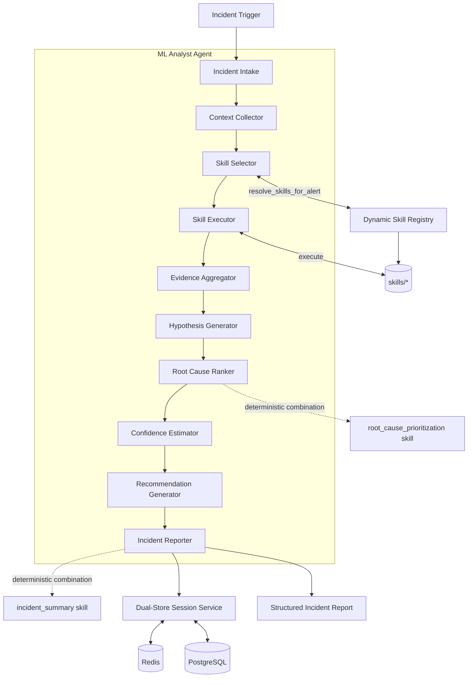
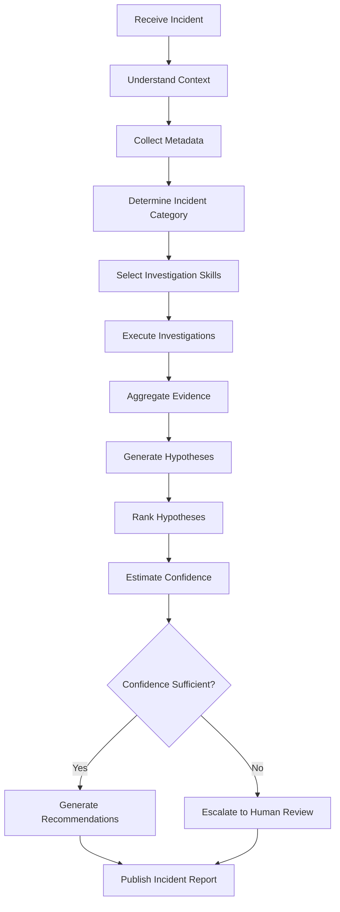

# Agent Specification: ML Analyst Agent

*   **Status**: Approved
*   **Owner**: ML Platform Architect
*   **Document Type**: Agent Behavioral Specification (implementation-independent)
*   **Companion To**: [`skill_contract.md`](../specifications/skill_contract.md), [`skill_selection_engine.md`](../specifications/skill_selection_engine.md), [`root_cause_analysis.md`](../specifications/root_cause_analysis.md), [`evidence_model.md`](../specifications/evidence_model.md), [`incident_schema.md`](../specifications/incident_schema.md)
*   **Related Documents**: [`SYSTEM_SPEC.md`](../specifications/SYSTEM_SPEC.md), [`SYSTEM_ARCHITECTURE.md`](../architecture/SYSTEM_ARCHITECTURE.md), [`ADR-001-dynamic-skills.md`](../decisions/ADR-001-dynamic-skills.md), [`ADR-002-mcp.md`](../decisions/ADR-002-mcp.md), [`ADR-003-confidence-scoring.md`](../decisions/ADR-003-confidence-scoring.md), [`DYNAMIC_DISCOVERY_DESIGN.md`](../design/DYNAMIC_DISCOVERY_DESIGN.md)

This document is the single source of truth for the **behavior, responsibilities, interfaces, reasoning process, and interactions** of the ML Analyst Agent within Pipeline Sentinel. It defines *what the agent is and does*, not how it is coded. Implementations must conform to this specification; any behavioral change to the agent must first be reflected here.

---

## 1. Overview

### 1.1 Purpose

The ML Analyst Agent is the central reasoning authority of Pipeline Sentinel. It converts a raw, ambiguous incident signal — an alert, a metric anomaly, a support ticket — into a structured, evidence-backed Root Cause Analysis (RCA) with ranked hypotheses, a calibrated confidence score, and concrete remediation guidance.

The agent is explicitly **an orchestrator, not an investigator**. It owns no domain-specific diagnostic logic of its own (no drift math, no log parsing, no DAG introspection). All domain expertise lives in independently maintained, dynamically discovered **Skills** (`skills/*`). The agent's expertise is in *deciding which skills to run, in what order, how to interpret what they return, and how to combine their findings into a single coherent diagnosis*.

### 1.2 Mission

> Given an incident of unknown shape, in an ML system of unknown internal structure, produce the same quality of root-cause diagnosis a senior ML Platform Staff Engineer would produce after manually correlating dashboards, logs, and deployment history — in minutes, not hours, and with a fully auditable chain of evidence.

### 1.3 Goals

*   **Correctly interpret** heterogeneous incident signatures (alerts, metric breaches, freeform tickets) and map them to an investigation strategy.
*   **Select the minimal sufficient set of skills** needed to reach a confident diagnosis — not run every skill on every incident.
*   **Coordinate multi-skill investigations**, including skills that depend on the outputs of other skills.
*   **Never assert a conclusion the evidence does not support.** Every root cause in the final report must be traceable to specific evidence records.
*   **Produce a calibrated confidence score** that reflects evidence quality, evidence agreement, and telemetry completeness — not model self-assessment.
*   **Escalate to a human** whenever confidence is low, evidence is contradictory, or the incident is unrecognized, rather than silently guessing.
*   **Remain stable as the skill catalog grows.** Adding skill #19 must not require touching the agent.

### 1.4 Non-Goals

*   The agent does **not** implement statistical tests, log parsers, or infrastructure clients itself — that is Skill territory.
*   The agent does **not** execute remediation actions directly; it *recommends* actions, which are executed by a separate remediation/HITL execution path (see [`SYSTEM_SPEC.md §5`](../specifications/SYSTEM_SPEC.md)).
*   The agent is **not conversational**. It is not designed to field open-ended chit-chat or general ML questions; its input surface is incident-shaped, not dialogue-shaped.
*   The agent does **not** train, retrain, or fine-tune models. It may recommend retraining as an action; it does not perform it.
*   The agent does **not** maintain its own copy of domain heuristics for a given failure mode (e.g. PSI thresholds for drift). Those heuristics are owned exclusively by the relevant skill and must not be duplicated in agent logic.

### 1.5 Business Value

*   **Reduced Mean Time to Diagnosis (MTTD)**: Collapses a manual, multi-dashboard triage process into a single automated investigation.
*   **Consistent diagnostic quality**: Every incident is investigated against the same evidentiary bar, independent of which engineer is on call.
*   **Lower operational toil**: SRE/MLE time shifts from evidence-gathering to judgment on the (already ranked, already cited) top hypotheses.
*   **Compounding leverage**: Because diagnostic logic lives in Skills rather than the agent, the organization's collective diagnostic knowledge grows every time a new Skill is added — with zero marginal cost to the orchestrator.

---

## 2. Responsibilities

The ML Analyst Agent owns the following responsibilities end-to-end. Anything not on this list belongs to a Skill, the Sentinel Core Engine, or the HITL execution layer.

| # | Responsibility | Description |
|---|---|---|
| 1 | **Receive Incidents** | Accept an incoming incident trigger (alert, metric breach, manual ticket) from the Sentinel Core Engine as the start of an investigation session. |
| 2 | **Interpret Alerts** | Normalize the incident's signal (alert type, affected system, severity, timestamp) into an internal incident classification usable for skill matching. |
| 3 | **Collect Context** | Gather the minimal supporting metadata needed to reason about the incident before selecting skills (affected model/pipeline identity, recent deployment history, active alert storm membership). |
| 4 | **Select Investigation Skills** | Query the Dynamic Skill Registry and choose the skill(s) whose `alert_triggers` and applicability match the incident signature. |
| 5 | **Coordinate Investigations** | Execute selected skills in the correct order (parallel where independent, sequential where dependent), respecting timeouts and skill unavailability. |
| 6 | **Merge Findings** | Aggregate the structured outputs of all executed skills into a single evidence ledger, deduplicating overlapping evidence. |
| 7 | **Produce Root Cause Analysis** | Synthesize candidate hypotheses from the evidence ledger and drive them through deterministic ranking (via the `root_cause_prioritization` skill) to produce an ordered causal explanation. |
| 8 | **Generate Recommendations** | Translate the top-ranked root cause(s) into concrete immediate, medium-term, and preventive actions, tagged with risk level for HITL routing. |
| 9 | **Estimate Confidence** | Compute an overall investigation confidence score from per-skill confidence, cross-skill agreement, and telemetry completeness. |
| 10 | **Escalate on Uncertainty** | Route the incident to human review whenever confidence falls below the escalation threshold, evidence is irreconcilably contradictory, or no skill claims relevance. |
| 11 | **Publish the Incident Report** | Emit the final structured `IncidentReport` (see §5) to the Sentinel Core Engine for delivery, storage, and (optionally) automated action execution. |

---

## 3. Architecture

The ML Analyst Agent is a pipeline of ten cooperating internal stages. Each stage has a single responsibility and a well-defined input/output contract; none of them contain domain diagnostic logic themselves.

### Component Responsibilities

*   **Incident Intake**: Validates the incoming trigger payload against a strict schema, assigns an `incident_id`, and opens an investigation session.
*   **Context Collector**: Pulls the minimal orienting metadata (affected system identity, recent deploys, concurrent alerts) needed to classify the incident. This is *not* deep investigation — it is enough context to route intelligently.
*   **Skill Selector**: Queries the Skill Registry with the normalized incident signature and receives a ranked candidate list of applicable skills. Implements the routing logic described in §7.
*   **Skill Executor**: Invokes selected skills through the Dynamic Tool Wrapper, in parallel or sequence as required, respecting per-skill timeout budgets. Owns retry/unavailability handling (§10).
*   **Evidence Aggregator**: Merges each skill's structured output into a single evidence ledger keyed by skill name and evidence fingerprint, deduplicating overlapping citations.
*   **Hypothesis Generator**: Reads the evidence ledger and enumerates every root-cause hypothesis that has at least one supporting evidence citation — including hypotheses that later turn out to be rejected.
*   **Root Cause Ranker**: Does **not** rank by free-form LLM judgment. It packages the hypothesis set and evidence ledger and delegates the ranking computation to the `root_cause_prioritization` skill — a deterministic tool per [`.agents/CONTEXT.md §6.3`](../../.agents/CONTEXT.md) — and receives back an ordered list with per-hypothesis scores.
*   **Confidence Estimator**: Computes the overall investigation confidence deterministically from the ranked output (see §9). This is a pure aggregation function, not a model self-rating.
*   **Recommendation Generator**: Maps the top-ranked cause(s) to immediate/medium-term/preventive actions and a risk tier (auto-executable vs. HITL-gated), per the recommendation guidance each contributing skill already supplies.
*   **Incident Reporter**: Delegates final report compilation to the `incident_summary` skill (same deterministic-combination rule as ranking), then publishes the resulting `IncidentReport` and persists the full audit trail to the Dual-Store Session Service.

---

## 4. Inputs

The agent accepts the following input categories. All inputs arrive through the Sentinel Core Engine's ingestion layer and are Pydantic-validated before reaching the agent (per [`.agents/CONTEXT.md §2.1`](../../.agents/CONTEXT.md)).

| Input Category | Examples | Purpose |
|---|---|---|
| **Alerts** | Threshold breaches (`DownstreamAccuracyDrop`, `PredictionDistributionShift`, `OOM_ERROR`), anomaly-detector triggers | Primary incident trigger; drives initial skill routing. |
| **Metrics** | Accuracy/F1/latency/resource-utilization time series | Supporting evidence for context collection and skill inputs. |
| **Logs** | Application logs, container logs, orchestrator (Airflow) task logs | Raw evidence consumed by individual skills (PII-scrubbed before reaching the agent or LLM). |
| **Pipeline Metadata** | DAG structure, task states, run history | Used by `task_state_monitoring`, `dag_execution_analysis`. |
| **Feature Metadata** | Feature schemas, null ratios, feature store versions | Used by `feature_pipeline_analysis`, `data_drift_analysis`. |
| **Model Metadata** | Model version, serving endpoint identity, baseline performance | Used to scope which skills and baselines apply. |
| **Deployment Metadata** | Git commit SHAs, deployment timestamps, rollout history | Used by `deployment_regression` to correlate failure onset with releases. |
| **Evaluation Reports** | Pre-deployment offline scorecards, bias-slice results | Used by `evaluation_analysis`. |
| **Infrastructure Events** | Pod restarts, OOM kills, autoscaling events, queue depth | Used by `resource_exhaustion`, `crash_loop_analysis`, `serving_analysis`. |

All inputs are treated as **untrusted** by default: the agent assumes log/metadata content may contain injected instructions and applies the prompt-injection escalation rule described in §10 before reasoning over any raw text field.

---

## 5. Outputs

> This section summarizes the `IncidentReport` shape at the agent level. The full, versioned field-by-field schema — including the Incident Signature and Raw Trigger objects that precede it in the lifecycle — is defined in [`incident_schema.md`](../specifications/incident_schema.md), which governs in case of any discrepancy.

The agent's terminal output is a single structured `IncidentReport` object. Its shape is fixed regardless of which skills participated in the investigation, so downstream consumers (dashboards, ticketing, HITL queue) never need to special-case incident type.

| Field | Description |
|---|---|
| **Incident Summary** | Plain-language description of the incident: what was observed, when, and on which system. |
| **Observed Symptoms** | The normalized signal(s) that triggered the investigation (alert types, breached thresholds). |
| **Collected Evidence** | The full, deduplicated evidence ledger: every citation from every executed skill, each traceable to its originating skill and raw data source. |
| **Selected Skills** | The list of skills the Skill Selector chose to run, and why (matched alert trigger, evidence-based follow-up, or fallback). |
| **Findings** | Per-skill structured findings, preserved individually (not flattened) so a reader can audit any single skill's contribution. |
| **Root Cause Ranking** | An ordered list of candidate root causes, each with a support/conflict evidence citation set and a per-hypothesis score from `root_cause_prioritization`. |
| **Confidence Score** | A single float in `[0.0, 1.0]` for the overall investigation, computed per §9. |
| **Recommended Actions** | Concrete next steps, each tagged with a risk tier (`auto-executable` / `requires-approval`) and the specific skill(s) whose evidence justifies it. |
| **Preventive Actions** | Longer-horizon suggestions to prevent recurrence (e.g., add a schema contract, add a dashboard alert). |
| **Supporting Evidence** | Cross-references linking each root cause and each recommendation back to specific entries in Collected Evidence — the explainability backbone of the report. |

This mirrors and extends the `IncidentReport` interface defined in [`SYSTEM_SPEC.md §5`](../specifications/SYSTEM_SPEC.md); this document is the authoritative source for its *semantics*, not just its field list.

---

## 6. Investigation Workflow

Every investigation follows the same fixed lifecycle, regardless of incident type. Skills change; the lifecycle does not.

1.  **Receive Incident** — Incident Intake validates and admits the trigger; a session is opened and an `incident_id` assigned.
2.  **Understand Context** — The agent identifies *what system* is affected and *what kind* of failure surface this is (data pipeline, serving, training, deployment, evaluation) before touching any Skill.
3.  **Collect Metadata** — The Context Collector gathers the minimal orienting facts: recent deploys, concurrent alerts, affected model/pipeline identity.
4.  **Determine Incident Category** — The normalized alert signature and context are mapped onto one or more investigation categories (data quality, model quality, infra, pipeline execution, deployment, evaluation).
5.  **Select Investigation Skills** — The Skill Selector queries the registry for skills whose `alert_triggers` match, per §7.
6.  **Execute Investigations** — The Skill Executor runs the selected skills, in parallel where they are independent, sequentially where one skill's output is a precondition for another's.
7.  **Aggregate Evidence** — Every skill's structured output is merged into one evidence ledger; duplicate or overlapping evidence is deduplicated by fingerprint.
8.  **Generate Hypotheses** — Every root cause proposed by any skill's `possible_root_causes` becomes a candidate hypothesis, carried forward even if only weakly supported.
9.  **Rank Hypotheses** — Hypotheses and their supporting/conflicting evidence are handed to the `root_cause_prioritization` skill for deterministic scoring and ordering.
10. **Estimate Confidence** — The Confidence Estimator computes the overall score from the ranked output (§9).
11. **Branch on confidence**: if confidence clears the escalation threshold, proceed to recommendations; otherwise route to human review (§9, §10) — the report is still published, but flagged `requires-human-review`.
12. **Generate Recommendations** — The Recommendation Generator derives immediate/medium-term/preventive actions from the top-ranked cause(s), tagged by risk tier.
13. **Publish Incident Report** — The Incident Reporter compiles and emits the final `IncidentReport` via the `incident_summary` skill, and the session, including the full evidence trail, is persisted.

---

## 7. Skill Selection Strategy

> This section summarizes the selection strategy at the agent level. The full behavioral specification of the component that implements it — decision funnel, wave assembly, evidence-trigger evaluation, redundancy avoidance, and fallback rules — is defined in [`skill_selection_engine.md`](../specifications/skill_selection_engine.md), which governs in case of any discrepancy.

The agent must run the *smallest sufficient* set of skills to reach a confident diagnosis — not the entire catalog. Skill selection is layered:

### 7.1 Signal-Based Routing (Primary)

Each skill declares the alert types it is relevant to (its `alert_triggers`). The Skill Selector's first pass is a direct lookup: given the incident's normalized alert type, which skills declare it as a trigger? This is the fast path and covers the majority of incidents (e.g., `DownstreamAccuracyDrop` → `data_drift_analysis`, `model_performance_analysis`).

### 7.2 Evidence-Based Routing (Secondary)

Signal-based routing selects the *first wave* of skills only. As those skills return findings, the agent may trigger a *second wave* based on what the evidence shows — not on the original alert alone. For example: if `model_performance_analysis` confirms a real accuracy regression but `data_drift_analysis` finds no significant input drift, the agent routes to `concept_drift_analysis` next, because the evidence — not the alert — indicates the feature-to-label mapping is the more likely culprit. This evidence-conditioned routing is what the `data_drift_analysis` and `concept_drift_analysis` skills' own "Collaboration With Other Skills" sections anticipate.

### 7.3 Multi-Skill Investigations

Most non-trivial incidents require more than one skill. The agent must be willing to run 2–5 skills per investigation when the evidence warrants it, but must stop adding skills once additional runs are unlikely to change the ranked hypothesis set (marginal-evidence cutoff) — running every skill "just in case" defeats the token-efficiency and hallucination-prevention goals of the dynamic registry (see [`ADR-001`](../decisions/ADR-001-dynamic-skills.md)).

### 7.4 Sequential vs. Parallel Execution

*   **Parallel**: Skills with no data dependency on one another (e.g., `data_drift_analysis` and `resource_exhaustion` responding to the same alert) execute concurrently to minimize MTTD, consistent with the platform's async-first design ([`SYSTEM_SPEC.md §6`](../specifications/SYSTEM_SPEC.md)).
*   **Sequential**: Skills whose invocation depends on a prior skill's findings (e.g., `concept_drift_analysis` only runs *after* `data_drift_analysis` returns "no significant drift") execute in evidence-dependency order.
*   `root_cause_prioritization` and `incident_summary` are always terminal — they only run after all investigation-wave skills have returned or timed out.

### 7.5 Fallback Behavior for Unknown Incidents

If the incident's alert type matches no skill's `alert_triggers`, the agent does not fail silently. It falls back to the two generalist skills designed for exactly this case: `anomaly_detection` (to independently verify a real anomaly exists) and `alert_correlation` (to check whether this is part of a known cascading pattern). If neither yields actionable evidence, the agent publishes a low-confidence report with `possible_root_causes: []` and escalates to human review rather than fabricating a plausible-sounding but unsupported explanation.

---

## 8. Reasoning Strategy

> This section summarizes the reasoning constraints at the agent level. The full specification of hypothesis generation, the deterministic ranking function, and rejection/tie-breaking rules is defined in [`root_cause_analysis.md`](../specifications/root_cause_analysis.md), which governs in case of any discrepancy.

The agent's reasoning process is deliberately constrained to prevent premature or unsupported conclusions. These constraints are non-negotiable behavioral requirements, not stylistic preferences:

1.  **Never jump to conclusions.** The agent may not emit a root cause that was not first proposed by a skill's `possible_root_causes` output backed by cited evidence.
2.  **Always collect evidence first.** Hypothesis generation (§6, step 8) strictly follows evidence aggregation (step 7); the agent must not reason about causes before it has evidence in hand.
3.  **Generate multiple competing hypotheses.** Every hypothesis with at least one supporting citation is carried into ranking, even ones the agent suspects are less likely — premature pruning hides information from the ranker and from human reviewers.
4.  **Reject hypotheses contradicted by evidence.** A hypothesis with a *conflicting* evidence citation (per a skill's own "Conflicting Evidence" criteria, as defined in each `SKILL.md`) is down-weighted or excluded rather than silently kept at equal standing.
5.  **Prefer evidence over assumptions.** In the absence of direct evidence for a plausible-sounding cause, the agent must not assert it; it reports it as a "possible but unverified" limitation instead.
6.  **Rank, don't just list, hypotheses.** The final report always presents an ordered ranking with per-hypothesis scores (delegated to `root_cause_prioritization`, §3, §9) — never an unordered bag of possibilities.
7.  **Explain every conclusion.** Each ranked root cause in the output must carry a `Supporting Evidence` cross-reference (§5). A conclusion with no traceable citation is a specification violation, not an acceptable output.

---

## 9. Confidence Estimation

> The decision to compute confidence this way — rather than via LLM self-rating or a learned model — is recorded, with alternatives considered and rejected, in [`ADR-003-confidence-scoring.md`](../decisions/ADR-003-confidence-scoring.md). This section remains the authoritative specification of the computation itself.

### 9.1 How Confidence Is Calculated

The overall investigation `confidence_score` is a **deterministic aggregation**, never a model self-rating, computed from three inputs:

1.  **Per-skill confidence**: each executed skill returns its own `confidence_score` computed under its own local heuristics (e.g., the sample-size/statistical-agreement matrix documented in `data_drift_analysis`'s SKILL.md §9). These are the raw ingredients, not the final answer.
2.  **Cross-skill agreement**: when two or more independently-executed skills' evidence corroborates the same hypothesis (e.g., `model_performance_analysis` confirms an accuracy drop *and* `data_drift_analysis` confirms input drift on the same features), the aggregate confidence is boosted above any single skill's own score. Independent corroboration is stronger evidence than one skill's internal certainty.
3.  **Telemetry completeness**: if any selected skill could not run to completion, returned degraded results, or explicitly reported a `limitations` entry (missing data source, insufficient sample size), the aggregate confidence is capped below what the available evidence alone would suggest.

### 9.2 How Conflicting Evidence Reduces Confidence

When two skills' findings support *different, mutually exclusive* root causes with comparable evidence strength, the aggregate confidence is reduced proportionally to how close the competing hypotheses are in the ranked output. A single dominant hypothesis with a wide margin over the runner-up yields high confidence; a near-tie between competing hypotheses caps confidence at Medium regardless of how strong either individual hypothesis's evidence looks in isolation — an unresolved disagreement is itself evidence of uncertainty.

### 9.3 How Missing Telemetry Affects Confidence

Missing or unavailable telemetry (an unreachable log source, an unavailable skill, a metric with insufficient sample size) never inflates confidence by omission. Every gap identified during execution (§10) is recorded as a `limitations` entry and mechanically lowers the confidence ceiling — the agent must never treat "no contradicting evidence found" as equivalent to "evidence confirms this."

### 9.4 Escalation Thresholds

| Confidence Band | Range | Behavior |
|---|---|---|
| **High** | ≥ 0.8 | Report published with recommended actions; auto-executable low-risk actions may proceed per HITL policy. |
| **Medium** | 0.5 – 0.79 | Report published with recommended actions, but all actions — regardless of individual risk tier — are routed through HITL approval. |
| **Low** | < 0.5 | Report published as a diagnostic aid only; no actions are proposed for execution. The report is flagged `requires-human-review` and routed to the HITL queue for manual investigation. |

Escalation is also **forced** irrespective of the numeric score whenever: no skill claims relevance to the incident (§7.5 fallback exhausted), two or more top hypotheses are within a negligible score margin of each other, or a prompt-injection attempt is detected in any ingested log/metadata field (§10) — this is a hard override.

---

## 10. Collaboration With Skills

> This section summarizes how findings are merged. The full specification of the Evidence Ledger — fingerprinting, deduplication, corroboration, and conflict detection across an entire investigation — is defined in [`evidence_model.md`](../specifications/evidence_model.md), which governs in case of any discrepancy.

### 10.1 Communication Contract

Skills are invoked through the Dynamic Tool Wrapper (see [`DYNAMIC_DISCOVERY_DESIGN.md §2`](../design/DYNAMIC_DISCOVERY_DESIGN.md)) and always return a structured object, never freeform text. Every skill's return payload conforms to the same shape, established by the SKILL.md output specification pattern:

*   `investigation_summary` — human-readable synopsis.
*   `evidence` — structured, citable data points.
*   `possible_root_causes` — ranked hypotheses local to that skill's scope.
*   `confidence_score` — the skill's own local confidence (§9.1).
*   `recommended_actions` / `preventive_actions` — local suggestions.
*   `limitations` — anything the skill could not verify.

The agent never accepts a skill result that does not conform to this contract; a malformed skill response is treated as a skill failure (§11), not parsed leniently.

### 10.2 How Findings Are Merged

The Evidence Aggregator writes each skill's `evidence` entries into a shared ledger, keyed by `(skill_name, evidence_fingerprint)`. The fingerprint is derived from the evidence's subject (feature name, metric name, log source) and its time window, so that two skills citing the same underlying signal (e.g., both `data_drift_analysis` and `feature_pipeline_analysis` flagging the same null-rate spike on `user_zipcode`) are recognized as reinforcing, not duplicated, evidence.

### 10.3 Conflict Resolution

Conflicts are never resolved by the agent reasoning informally over the raw numbers. Any time two skills' `possible_root_causes` disagree, both hypotheses — with their full evidence sets — are passed intact to `root_cause_prioritization`, which applies its own deterministic weighting (evidence specificity, sample size, corroboration count) to produce the final order. The agent's role is to ensure *nothing is dropped before ranking*, not to referee the conflict itself.

### 10.4 Duplicate Evidence Handling

Duplicate evidence (same fingerprint from the same skill, e.g., re-emitted across a retried execution) is collapsed to a single ledger entry. Duplicate evidence *from different skills* is preserved as separate entries but linked, since cross-skill corroboration is itself a confidence signal (§9.1) — it must remain visible in the final `Supporting Evidence` trail, not silently merged away.

---

## 11. Error Handling

| Condition | Agent Behavior |
|---|---|
| **Missing logs** | The affected skill reports the gap in its own `limitations` field; the agent records it, proceeds with whatever evidence remains, and lowers the confidence ceiling (§9.3). Investigation does not abort. |
| **Missing metrics** | Same as missing logs — treated as a completeness gap, not a fatal error, unless every selected skill depends on the missing metric (see "Unavailable skills" below). |
| **Unavailable skills** | If a skill's script fails, throws, or its process cannot be resolved by the registry, the agent marks that skill `unavailable` in `Selected Skills`, continues with the remaining skills, and flags the report as a **partial investigation** if the unavailable skill was load-bearing for the incident category. |
| **Contradictory evidence** | Never dropped or silently resolved by the agent. Passed whole into `root_cause_prioritization` for adjudication (§10.3); the resulting confidence is reduced per §9.2. |
| **Partial investigations** | Published with an explicit `partial_investigation: true` flag and a hard confidence ceiling (capped at Medium regardless of what the available evidence alone would compute), so downstream consumers never mistake a partial result for a complete one. |
| **Timeouts** | Each skill executes under a fixed per-skill timeout budget. A skill that exceeds its budget is cancelled and marked `unavailable` (timeout), exactly like a failed skill — it never blocks the remaining parallel skills or stalls the overall investigation. |
| **Prompt injection in ingested content** | Per [`.agents/CONTEXT.md §2.3`](../../.agents/CONTEXT.md) / [`SYSTEM_SPEC.md §3.3`](../specifications/SYSTEM_SPEC.md), any detected injection attempt inside log or metadata content is neutralized before it reaches agent reasoning, and the incident is force-escalated to human review (§9.4) regardless of any confidence computed from the remaining evidence. |

In all cases, the agent's guiding rule is: **degrade gracefully and say so explicitly.** A partial, honestly-labeled result is always preferable to a complete-looking result built on silently-dropped gaps.

---

## 12. Extensibility

The agent must remain byte-for-byte unchanged when a new skill is added to `skills/`. This is the core promise of the Dynamic Skill Architecture ([`ADR-001`](../decisions/ADR-001-dynamic-skills.md)):

*   A new skill is a new directory under `skills/` with a `SKILL.md` (metadata + heuristics) and its execution script. Nothing in the agent's code, prompts, or configuration references skills by name.
*   At registry refresh, the new skill's `alert_triggers` are automatically eligible for signal-based routing (§7.1) with no agent redeployment.
*   Skills that need to participate in evidence-based routing (§7.2) do so purely by documenting their relationship to other skills in their own `SKILL.md` "Collaboration With Other Skills" section — the agent's routing logic reads this relationship generically, it does not hardcode "if concept_drift then...".
*   Removing or disabling a skill degrades the *coverage* of investigations (some incident types may fall back to §7.5), but never breaks the agent's control flow, since every stage (§3) operates on whatever skill set the registry currently returns.
*   This plug-and-play property is what keeps the system's Open-Closed compliance: teams extend diagnostic coverage by publishing skills, never by modifying the orchestrator.

---

## 13. Design Principles

*   **Evidence-First Reasoning**: No claim without a citation (§8). This is the single most important invariant in the entire specification.
*   **Deterministic Orchestration**: Routing (§7), ranking (§9), and final combination (§3, §10) are pure, reproducible functions over structured inputs — never left to open-ended LLM judgment over raw numbers, per [`.agents/CONTEXT.md §6.3`](../../.agents/CONTEXT.md).
*   **Explainability**: Every element of the output (§5) is traceable back to the evidence that produced it. An engineer reading a report must be able to verify, not just trust, every conclusion.
*   **Modularity**: The agent and each skill are independently deployable, testable, and replaceable units connected only through the structured contract in §10.1.
*   **Extensibility (Open-Closed)**: New diagnostic capability is additive (§12), never a modification to existing, tested orchestration logic.
*   **Single Responsibility**: The agent orchestrates; skills diagnose. Neither layer duplicates the other's job (see [`.agents/CONTEXT.md §6.2`](../../.agents/CONTEXT.md), "One Tool, One Question").
*   **Vendor Neutrality**: The agent reasons over structured skill outputs, not any particular vendor's log format, metric API, or infrastructure SDK — those integration details are isolated behind the Skill/Adapter boundary (see [`SYSTEM_ARCHITECTURE.md §2.3`](../architecture/SYSTEM_ARCHITECTURE.md)).
*   **Observability**: Every stage of the lifecycle (§6) writes structured, session-scoped audit records to the Dual-Store Session Service, so any investigation can be fully replayed after the fact.
*   **Testability**: Because routing, ranking, and confidence aggregation are deterministic functions (not LLM prose), they are unit-testable against fixed evidence fixtures without invoking a model — qualitative behaviors (skill selection judgment, hypothesis phrasing) are evaluated separately via the LLM-as-judge EDD harness (see [`.agents/CONTEXT.md §4`](../../.agents/CONTEXT.md)).

---

## 14. Example Investigation

### Incident

Alert `DownstreamAccuracyDrop` fires for `Fraud_Detection_XGBoost`: F1-score has fallen from 0.92 to 0.78 over the last serving window. No deployment has occurred in the affected window.

### Skill Selection

Signal-based routing (§7.1) matches the alert to two first-wave skills, executed **in parallel** since neither depends on the other:
*   `model_performance_analysis` — confirm the regression is real and quantify it.
*   `data_drift_analysis` — check whether an input distribution shift is the driver.

### Evidence Collection

*   `model_performance_analysis` returns: F1 confirmed at 0.78 (baseline 0.92), regression is dataset-wide, not segment-isolated. Local confidence: 0.95.
*   `data_drift_analysis` returns: `user_zipcode` null rate spiked from 0.02% to 18.5%; `transaction_amount` shows KS-test p < 0.0001, PSI = 0.32; `device_type` shows no significant shift (p = 0.45). Local confidence: 0.92.

Because both skills independently corroborate a real, input-driven regression, the Skill Selector does **not** trigger `concept_drift_analysis` — that skill's routing condition (§7.2) is "performance regression *without* confirmed data drift," which does not hold here.

### Reasoning

The Hypothesis Generator carries forward two hypotheses, both evidence-backed: (a) upstream pipeline failure causing missing `user_zipcode` values, and (b) organic transaction-volume shift. Hypothesis (a) has stronger, more specific supporting evidence (a null-rate spike two orders of magnitude above baseline, on a feature the model weights heavily for regional heuristics); hypothesis (b) is supported but non-anomalous in isolation. No evidence contradicts either hypothesis, so both proceed to ranking rather than one being discarded outright.

### Root Cause Ranking

`root_cause_prioritization` scores hypothesis (a) above hypothesis (b): the null-rate spike is a higher-specificity, higher-magnitude signal directly tied to a known model dependency, while (b) is a weaker, secondary contributor. Final order: **(1) Upstream pipeline failure — missing `user_zipcode`; (2) Organic transaction-volume increase (contributing, not primary).**

### Confidence Estimation

Both contributing skills report high local confidence (0.95, 0.92); their findings corroborate one another (both point to input-side causes for the same regression window); no skill was unavailable and no telemetry gaps were recorded. Aggregate confidence: **0.92 (High)**.

### Recommendations

*   **Immediate** (auto-executable, low risk): Deploy default regional imputation for null `user_zipcode` values.
*   **Medium-term** (requires approval): File and fix the upstream payment-gateway logging defect causing the null spike.
*   **Preventive**: Add a Pydantic/Great-Expectations schema gate in the feature pipeline to reject inference batches with >1% missing values on high-importance features, before they reach serving.

The published `IncidentReport` carries all of the above with full evidence cross-references, and — because confidence is High — the imputation action is eligible for automatic execution while the pipeline-fix action is routed to HITL.

---

## 15. Future Improvements

*   **LLM Ensembles**: Cross-check hypothesis generation and phrasing across multiple model judges before finalizing the report, to catch single-model reasoning blind spots without weakening the deterministic ranking/confidence guarantees in §9 and §13.
*   **Long-Term Memory**: Persist embeddings of past incident reports so recurring failure signatures are recognized faster, independent of the per-investigation evidence ledger.
*   **Historical Incident Retrieval (RAG)**: Retrieve similar past incidents and their confirmed root causes as *supporting context* for hypothesis generation — never as a substitute for fresh evidence, preserving the evidence-first principle (§8).
*   **Self-Improving Skill Selection**: Track which skill selections led to high-confidence, human-confirmed diagnoses versus which required escalation, and use that signal to refine signal-based and evidence-based routing weights over time (the Quality Flywheel pattern).
*   **Human Feedback Loop**: Capture HITL approve/reject/correct decisions on recommended actions and root causes as structured feedback, feeding both routing refinement and skill-level heuristic tuning.
*   **Learning From Previous Incidents**: Use confirmed past root causes to recalibrate the confidence-aggregation weights in §9.1 (e.g., discovering that a particular skill's local confidence has historically been over- or under-calibrated relative to human-confirmed outcomes).
