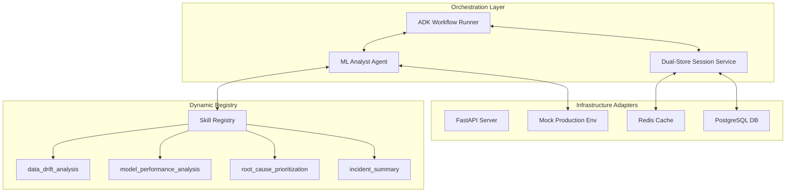
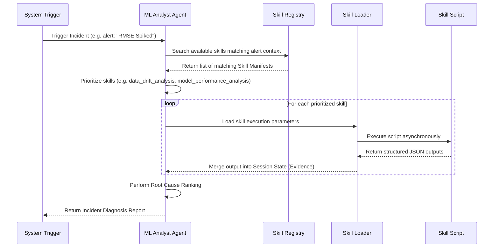

# System Architecture: Pipeline Sentinel

## 1. System Overview & Motivation (Why)

### Context
Modern ML production platforms require rapid, accurate diagnosis of failures. However, MLOps setups vary wildly. Hardcoding specialized scripts directly into an agent's reasoning loop or tools list leads to maintenance bottlenecks, bloat, and tool selection failure when scale increases.

### Architecture Motivation
Pipeline Sentinel implements a **Plugin-and-Play Dynamic Skill Architecture**. Instead of hardcoding tools, the core `ML Analyst Agent` is decoupled from the investigation tools. It dynamically discovers and runs self-contained "Skills" (directories containing structured schemas, logic, and heuristics) depending on the alert context. This makes the system scalable, robust, and highly extensible for any team adding new models or infrastructure checks.

---

## 2. Core Architecture Components (What)

The architecture splits into three main layers: **Orchestration**, **Registry (Skills)**, and **Infrastructure Interfaces (Adapters)**.

### Component Responsibilities

#### 1. Orchestration Layer
*   **ML Analyst Agent**: Formulates hypotheses, queries the registry, executes selected skills, and coordinates root cause ranking.
*   **Dual-Store Session Service**: Persists execution steps. Uses Redis for active, sub-second lock tracking and PostgreSQL for long-term audit trail storage.

#### 2. Dynamic Registry (Skills)
*   **Skill Registry**: Scans the `skills/` directory at startup. It registers capabilities, schemas, and script paths.
*   **Skill (e.g., `data_drift_analysis`)**: An independent folder containing `SKILL.md` (specification and heuristics) and a `scripts/` folder containing execution scripts.

#### 3. Infrastructure Adapters (MCP/Mocks)
*   **Ports & Adapters boundary**: Exposes standardized APIs to query metrics, logs, and Git deployments. These mock adapters are easily swappable for real GCP/AWS/Airflow/Git APIs later using MCP.

---

## 3. Dynamic Skill Selection and Execution (How)

### Skill Discovery & Loading Sequence
When an incident is triggered, the orchestrator does not know which tools are available beforehand. It resolves them dynamically:

### State Propagation
Every executed skill writes its results into a reserved output key in the session state. Since ADK session state is inherited and forwarded across turns, subsequent skills can read the output keys of previously executed skills, enabling cross-evidence correlation.

---

## 4. Design Decisions & Trade-offs
*   **Local Python Scripts vs. Networked Microservices**: Local python scripts executed dynamically are low-latency and easy to write. However, they must be isolated to prevent dependency conflicts or execution risks. The standard is managed via `uv` virtual environments, keeping the scripts separated.
*   **Model Context Protocol (MCP)**: Deferred to Phase 6/7 (ADR 008). Building MCP interfaces against mock data is inefficient. We use a Pydantic-validated Python wrapper interface that will act as the swap-out boundary when moving to actual MCP servers.

---

## 5. Future Architectural Extensions
*   **Containerized Skill Sandboxing**: Running third-party or custom SRE skill scripts inside ephemeral Docker containers to prevent malicious code execution.
*   **Dynamic Prompt Optimization (EDD)**: Integrating an automated evaluator that analyzes failed SRE traces and auto-tunes the orchestrator instructions to improve selection accuracy.
