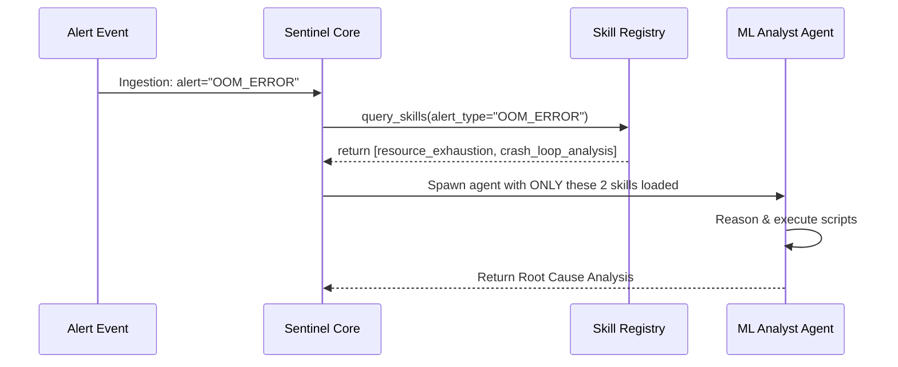

# Architectural Decision Record: ADR_001_DYNAMIC_SKILL_ARCHITECTURE

*   **Status**: Approved
*   **Owner**: ML Platform Architect
*   **Decided on**: 2026-07-04

---

## 1. Context & Motivation (Why)

### Problem Statement
In production incident management, the telemetry, structures, and schemas of the system components (e.g. databases, model endpoints, container environments) are constantly evolving. Putting all possible troubleshooting and analysis capabilities directly into the core `ML Analyst Agent` as hardcoded python tools creates several severe issues:
1.  **Context Rot & Cost**: The system prompt context window blooms as tool count increases, leading to higher token consumption and increased latency.
2.  **Tool Selection Hallucination**: LLMs frequently hallucinate when presented with a flat, monolithic list of 20+ specialized SRE tools.
3.  **Low Maintainability**: Every time a team adds a new model or infrastructure check, they must modify the core agent's codebase, violating the Open-Closed Principle (OCP).

### Motivation
We need a decoupled design where the core agent does not have hardcoded tool configurations. It should instead query a local repository registry to find and execute "Skills" dynamically based on the specific incident characteristics.

---

## 2. Options Evaluated (What)

### Option A: Monolithic Agent with Static Tools (Rejected)
All investigation methods (drift detection, log extraction, DAG restarting, etc.) are declared as direct `FunctionTool` objects on a single, static agent.
*   *Pros*: Simple to code initially; no custom discovery layer needed.
*   *Cons*: Fails at scale; high LLM token costs; frequent tool selection errors.

### Option B: Hardcoded Hierarchical Routing (Rejected)
A root coordinator routes to sub-agents (Data Quality, Pipeline Health, ML Analysis) whose tool lists are hardcoded.
*   *Pros*: Standard hierarchical structure, isolates tools into logical buckets.
*   *Cons*: Adding a new skill still requires updating the corresponding sub-agent code; no ability for dynamic plugin-based extensions.

### Option C: Dynamic Skill Discovery & Registry (Chosen)
Skills are packaged as self-contained directories under `skills/` (containing metadata schemas and run scripts). The core engine indexes this folder at startup. The agent queries this registry at runtime to load matching tools dynamically.
*   *Pros*: Highly modular and extensible (O(1) effort to add a skill); reduces active token count; prevents tool selection errors.
*   *Cons*: Higher engineering complexity to build the runtime discovery and loading mechanism.

---

## 3. Detailed Decision Specification (How)

### The Registry Implementation
At system initialization, the `SkillRegistry` scans the `/skills` root directory:
1.  It reads the YAML frontmatter in each `SKILL.md` to extract the `name`, `description`, `required_inputs`, and `alert_triggers`.
2.  It maintains a map of available capabilities.
3.  When an incident alert comes in, the agent invokes a discovery query: `find_matching_skills(alert_type: str)`.
4.  The matched skills are temporarily mapped into the agent's turn execution environment as tools.

### Example Sequence Flow

---

## 4. Consequences & Trade-offs

### Pros
*   **Decoupled Maintainability**: Teams can publish new skills simply by placing a folder under `skills/`. No orchestrator code changes needed.
*   **Optimized Prompt Context**: Only the skills relevant to the current alert signature are loaded, keeping the prompt clean and token usage low.
*   **hallucination Prevention**: The model chooses between 2-3 highly relevant tools instead of 20+ generic ones.

### Cons
*   **Dynamic Load Latency**: Slight startup/runtime cost to resolve and load skill schemas. Mitigated by caching the registry index in-memory.
*   **Security Risk**: Executing arbitrary script paths dynamically requires strict security shielding (PII redaction and command sanitation).

---

## 5. Future Improvements
*   **Distributed MCP Servers**: In Phase 6/7, convert the dynamic skill directories into separate Model Context Protocol (MCP) microservices. This allows skills to be hosted on different servers (e.g. directly on Kubernetes clusters or model-serving nodes) and resolved over RPC.
