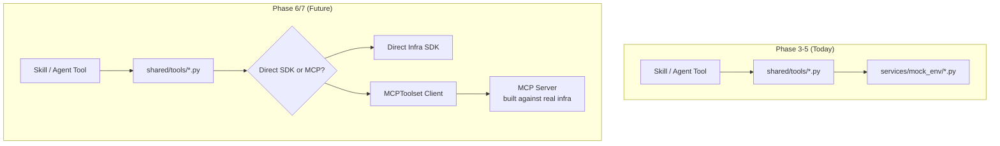

# ADR-002: Deferred MCP Adoption

*   **Status**: Approved
*   **Owner**: ML Platform Architect
*   **Decided on**: 2026-07-04
*   **Related Documents**: [`ADR-001-dynamic-skills.md`](ADR-001-dynamic-skills.md), [`../agents/skill_contract.md`](../specifications/skill_contract.md), [`../architecture/SYSTEM_ARCHITECTURE.md`](../architecture/SYSTEM_ARCHITECTURE.md)

---

## 1. Context & Motivation (Why)

### Problem Statement

Pipeline Sentinel's skills and agent tools need to reach real infrastructure eventually: Airflow, model-serving endpoints, Postgres, Git, cloud provider metric APIs. The Model Context Protocol (MCP) is an emerging open standard for connecting LLM-driven agents to external tools and data sources over a uniform, transport-agnostic RPC interface, and it is the platform's stated long-term integration mechanism (see [`ADR-001-dynamic-skills.md §5`](ADR-001-dynamic-skills.md)).

Today (Phase 3–5), the platform has no production infrastructure to connect to — `agents/`, `api/`, `services/`, and `shared/` are still empty, and the eighteen skills are specifications, not running code. The question this ADR resolves: **do we build MCP servers now, against simulated data, or defer MCP entirely until real infrastructure exists?**

### Motivation

Standing up MCP servers is real engineering investment: transport plumbing, authentication, schema publishing, versioning. Doing that work against `services/mock_env/*.py` fixtures — data that will be thrown away the moment real infrastructure is wired in — produces interfaces shaped by mock data's convenience rather than production infrastructure's actual constraints. That is effort spent solving the wrong problem, and it risks an MCP interface that has to be redesigned anyway once real systems are integrated.

---

## 2. Options Evaluated (What)

### Option A: Adopt MCP Immediately for All Infrastructure Adapters (Rejected)

Build MCP servers now for every mock adapter (Airflow, Postgres, Git, metrics) and have skills call them over the protocol from day one.

*   *Pros*: No later migration; the platform is "MCP-native" from the start.
*   *Cons*: MCP servers built against mock data encode assumptions about *simulated* data shapes and *simulated* failure modes, not real ones. Every one of those servers is likely to require a breaking redesign once real infrastructure is integrated in Phase 6/7 — this is effort spent twice, not once, and the first pass actively risks anchoring the team on the wrong interface.

### Option B: Direct SDK Integration Only, No Future MCP Plan (Rejected)

Build only direct, ad hoc integrations to each real system when the time comes (Phase 6/7), with no intermediate seam planned now.

*   *Pros*: Simplest possible code today; zero abstraction overhead.
*   *Cons*: Without a stable interface boundary established now, adding real infrastructure in Phase 6/7 forces a simultaneous rewrite of every skill and agent tool that touches external data — the exact "modify the orchestrator/skills to add infrastructure" problem [`ADR-001`](ADR-001-dynamic-skills.md) already rejected for skill discovery. It also forecloses MCP as an option later without an explicit decision to do so.

### Option C: Typed Python Wrapper Seam Now, MCP Later (Chosen)

Skills and agent tools call narrow, Pydantic-schema'd functions in `shared/tools/*.py`. Today, those functions call `services/mock_env/*.py` adapters. In Phase 6/7, the *same* `shared/tools/*.py` function signatures are re-implemented to call either a direct infrastructure SDK or an MCP client (`MCPToolset` or equivalent) — the swap happens entirely underneath the existing function signatures.

*   *Pros*: No wasted effort building protocol servers against data that will be discarded; the seam that will eventually host MCP already exists and is exercised by every skill from day one, so the Phase 6/7 swap touches only `shared/tools/*.py` internals, never skill or agent code.
*   *Cons*: Higher discipline required now to keep `shared/tools/*.py` signatures infrastructure-agnostic (see §3.2) — a signature leaking mock-specific concepts (e.g., a parameter that only makes sense for the fixture format) would still force a breaking change later.

---

## 3. Detailed Decision Specification (How)

### 3.1 The Boundary Contract

`shared/tools/*.py` is the **permanent interface** every skill and agent tool is written against. Its function signatures must describe *what infrastructure operation is being requested* (e.g., `get_dag_run_history(dag_id: str, window: TimeWindow) -> DagRunHistory`), never *how* that operation is currently fulfilled. `services/mock_env/*.py` is the **current, temporary implementation** of that interface — nothing in a skill or agent tool may import from `services/mock_env/*.py` directly; every access goes through `shared/tools/*.py`.

### 3.2 What Keeps the Seam Swap-Safe

*   Function signatures in `shared/tools/*.py` are typed in terms of domain concepts (`dag_id`, `time_window`, `model_version`), never mock-fixture concepts (no parameter like `fixture_file_path` or `mock_scenario_id`).
*   Return types are Pydantic models describing the *domain* shape of the answer (e.g., `DagRunHistory`), not whatever shape happens to be convenient to fabricate in a fixture.
*   `services/mock_env/*.py` may take shortcuts internally (in-memory fixtures, deterministic canned responses) as long as it satisfies the `shared/tools/*.py` signature it implements.

### 3.3 The Phase 6/7 Migration

When real infrastructure is integrated, each `shared/tools/*.py` function's implementation is replaced — either with a direct SDK call, or with a call through an MCP client (`MCPToolset`) to a now-justified MCP server built against real infrastructure's actual constraints. Because the function signature does not change, no skill, no agent tool, and no Pydantic schema needs to change. This is the same Open-Closed guarantee [`ADR-001`](ADR-001-dynamic-skills.md) establishes for skill addition, applied to the infrastructure-adapter boundary instead of the skill-registry boundary.

---

## 4. Consequences & Trade-offs

### Pros

*   Zero engineering effort spent building protocol servers against data that will be discarded.
*   The eventual MCP (or direct-SDK) migration is isolated to `shared/tools/*.py` internals — it never touches skills, agent code, or Pydantic schemas.
*   Every skill is already exercised against the permanent interface shape from day one, so the migration is a swap, not a rewrite.

### Cons

*   Until Phase 6/7, the platform gets none of MCP's cross-language/cross-team interoperability benefits — this is an explicit, accepted trade-off, not an oversight.
*   Discipline is required to keep `shared/tools/*.py` signatures infrastructure-agnostic; a violation (a mock-shaped parameter leaking into a signature) silently reintroduces the cost this ADR is meant to avoid. This should be caught in code review until (see §5) a mechanical check exists.

---

## 5. Future Improvements

*   **Signature Linter**: extend the Skill Certification Linter idea from [`skill_contract.md §15`](../specifications/skill_contract.md) to flag `shared/tools/*.py` signatures that reference mock-specific types or parameter names, catching seam violations before Phase 6/7 rather than during the migration.
*   **Phase 6/7 Migration Checklist**: once real infrastructure access is available, produce a per-adapter checklist (auth, error mapping, timeout semantics, PII boundary re-verification) to execute the swap described in §3.3 systematically rather than ad hoc, adapter by adapter.
