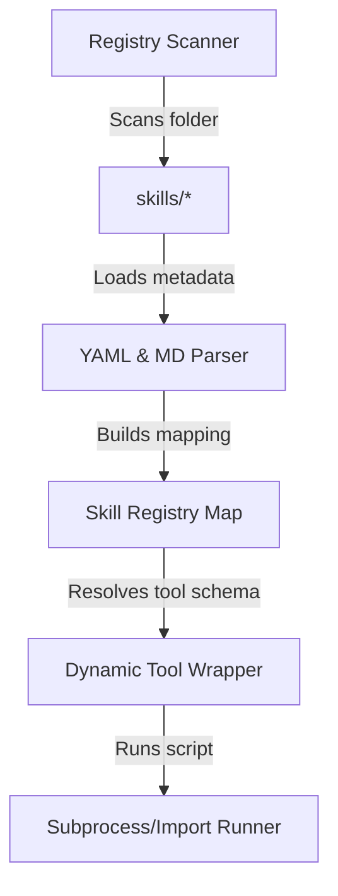

# Design Specification: Dynamic Skill Discovery & Execution Engine

## 1. Overview & Motivation (Why)

### Problem Statement
Standard LLM agent frameworks require tools to be statically declared in Python classes or modules before starting the runner. In a production MLOps context, SRE/ML Platform engineers continuously write new diagnostic scripts to investigate new failures. Requiring developer code changes and service redeployments to register a new diagnostic tool is unacceptable.

### Design Motivation
The `Dynamic Skill Discovery & Execution Engine` decouples the SRE logic from the runtime agent. It implements a file-based registry scanner that registers skill capabilities dynamically. This design allows new troubleshooting routines (written in Python/Bash) to be hot-swapped into the running system simply by adding them to the filesystem, mimicking a microkernel architecture.

---

## 2. Technical Component Architecture (What)

The engine consists of four primary software components:



### Component Details
1.  **Registry Scanner**: Scans `/skills/` at initialization. It identifies folders containing a `SKILL.md` file.
2.  **YAML & Markdown Parser**: Extracts metadata and schemas from the skill header frontmatter.
3.  **Skill Registry Map**: An in-memory, thread-safe cache containing mapping information (`skill_name -> schema & execution_path`).
4.  **Dynamic Tool Wrapper**: An adapter that conforms to the ADK `FunctionTool` API, allowing dynamically resolved scripts to be called by the LLM runner.

---

## 3. Detailed Implementation Design (How)

### 3.1 Metadata Specification (`SKILL.md` frontmatter)
Every skill directory must contain a `SKILL.md` file with a YAML frontmatter specifying its input schemas and execution rules:

```yaml
---
name: data_drift_analysis
description: Analyzes statistical drift in inference datasets using Evidently AI.
required_inputs:
  current_csv_path: str
  reference_csv_path: str
  target_column: str
alert_triggers:
  - accuracy_degradation
  - prediction_skew
script_path: scripts/run_drift.py
---
```

### 3.2 Python Classes and Interfaces

```python
from pathlib import Path
from pydantic import BaseModel, Field
import yaml

class SkillMetadata(BaseModel):
    name: str
    description: str
    required_inputs: dict[str, str] = Field(default_factory=dict)
    alert_triggers: list[str] = Field(default_factory=list)
    script_path: str

class SkillRegistry:
    def __init__(self, skills_dir: Path):
        self.skills_dir = skills_dir
        self.registry: dict[str, SkillMetadata] = {}

    def scan_skills(self) -> None:
        """Scan skills folder and populate registry."""
        for skill_dir in self.skills_dir.iterdir():
            if not skill_dir.is_dir():
                continue
            skill_md = skill_dir / "SKILL.md"
            if not skill_md.is_file():
                continue
            self._load_skill(skill_md)

    def _load_skill(self, file_path: Path) -> None:
        content = file_path.read_text()
        # Parse YAML frontmatter
        if content.startswith("---"):
            parts = content.split("---", 2)
            if len(parts) >= 3:
                data = yaml.safe_load(parts[1])
                skill_meta = SkillMetadata(**data)
                self.registry[skill_meta.name] = skill_meta

    def resolve_skills_for_alert(self, alert_type: str) -> list[SkillMetadata]:
        """Filter and return skills that match the incoming alert type."""
        return [
            meta for meta in self.registry.values()
            if alert_type in meta.alert_triggers
        ]
```

### 3.3 Dynamic Tool Execution Adapter
To execute the skill's Python script securely and return the structured JSON data:

```python
import sys
import importlib.util
from typing import Any

class DynamicSkillExecutor:
    @staticmethod
    async def execute_skill(meta: SkillMetadata, params: dict[str, Any]) -> dict[str, Any]:
        """Loads and executes the skill's Python script in a sandboxed module."""
        script_full_path = Path("skills") / meta.name / meta.script_path
        if not script_full_path.is_file():
            raise FileNotFoundError(f"Execution script not found: {script_full_path}")

        # Parameter validation against Pydantic schema is done at the wrapper layer
        # Load and run the script as a module
        spec = importlib.util.spec_from_file_location(meta.name, script_full_path)
        if spec is None or spec.loader is None:
            raise ImportError(f"Cannot load spec for {meta.name}")
            
        module = importlib.util.module_from_spec(spec)
        spec.loader.exec_module(module)

        # Call the standard run entrypoint
        if not hasattr(module, "run"):
            raise AttributeError(f"Script {meta.script_path} lacks a 'run()' entrypoint function.")

        # Run asynchronous execution
        result = await module.run(**params)
        return result
```

---

## 4. Design Decisions & Trade-offs

### Sandboxed Execution vs. Standard Python Execution
*   *Option 1: Subprocess invocation*: Run scripts as standalone processes (`python scripts/run.py`). This offers the highest isolation but introduces overhead and makes returning complex Python objects more difficult.
*   *Option 2: Dynamic Module Import (Chosen)*: Load scripts as dynamic Python modules using `importlib`. Highly performant and allows passing rich Pydantic validation models directly, though it requires strict coding standards to avoid dependency pollution.

---

## 5. Security & Isolation Considerations
1.  **PII Isolation**: Run telemetry logs through a deterministic regex filter before passing parameters to the execution engine.
2.  **No Shell Execution**: The dynamic scripts themselves must never invoke raw `subprocess` or `os.system` functions. Pre-commit hooks will enforce this constraint via Semgrep.
