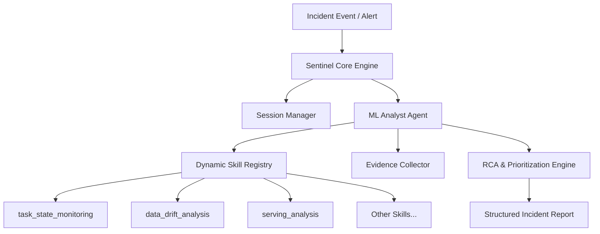
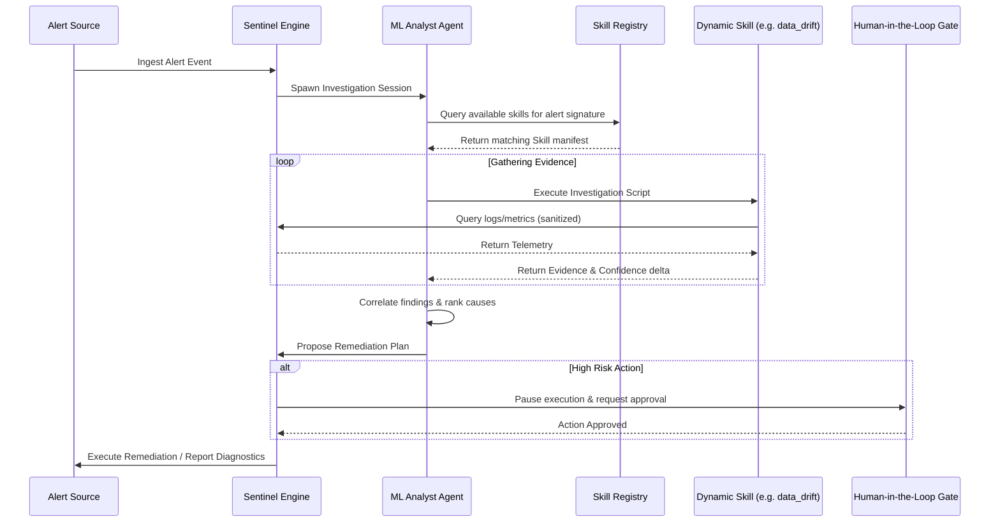

# System Specification: Pipeline Sentinel (ML Analyst Agent Platform)

## 1. Overview & Motivation (Why)

### Problem Statement
In production Machine Learning operations (MLOps) and Site Reliability Engineering (SRE), incidents are complex, multi-dimensional, and rarely isolated. When an alert fires (e.g., accuracy degradation, out-of-memory error, API latency spike), SRE and MLOps teams are inundated with disconnected telemetry: raw logs, pipeline metadata, database queries, and data drift calculations. 

Traditional monitoring approaches rely on hardcoded, heuristic-based alerts. This leads to:
1.  **Alert Fatigue**: Floods of redundant, context-barren alerts with high false-positive rates.
2.  **Triage Overhead**: SRE engineers manually logging into different dashboards (Airflow, Grafana, Evidently, Git) to piece together a root cause.
3.  **Slow Time to Resolution (MTTR)**: High latency in identifying the actual break point (e.g., upstream schema drift propagating into feature pipelines and leading to downstream model accuracy drops).

### Motivation
Pipeline Sentinel solves this by introducing a **Generic, Dynamic-Skill-Based AI Multi-Agent System**. Instead of rigid alerting rules, the platform behaves like an experienced Staff ML Platform Engineer: it consumes alerts, dynamically selects investigation skills based on the context of the incident, correlates raw evidence, diagnoses root causes, and recommends remediation actions.

---

## 2. Goals & Non-Goals

### Goals
*   **Generic Applicability**: Support any production ML system (Fraud Detection, Forecasting, NLP, CV, LLM/Generative AI, tabular batch/online models).
*   **Dynamic Skill Selection**: Avoid hardcoding investigation logic; discover and execute investigation skills dynamically.
*   **Structured Diagnostics**: Produce explainable root-cause reports showing the complete chain of evidence (Incident $\rightarrow$ Observed Symptoms $\rightarrow$ Evidence $\rightarrow$ Ranked Causes $\rightarrow$ Recommendations).
*   **Safe Remediation**: Differentiate low-risk actions (restart job, scale workers) for auto-execution and queue high-risk actions (rollback code, patch DB) for human approval.
*   **High Engineering Quality**: Guarantee strict type safety, modular design, full testability, and PPI/injection-proof execution boundaries.

### Non-Goals
*   **Conversational Assistant**: This is not a chatbot. It is an automated, event-driven SRE system.
*   **Model Training Engine**: The platform recommends retraining, but does not manage the internal hyperparameter tuning or training loop itself.
*   **Real-time Inline Gateway**: It operates asynchronously (out-of-the-loop) rather than intercepting production predictions inline (which would introduce latency).

---

## 3. Functional Requirements

### 3.1 Input / Output Requirements
The system must expose interfaces to:
*   **Ingest telemetry**: Alerts, metrics, application logs, database query records, and Git/deployment metadata.
*   **Output structured diagnostics**: Root Cause Analysis reports, confidence scores, evidence citations, executive summaries, and recommended actions.

### 3.2 Dynamic Skills Discovery & Execution
*   The `ML Analyst Agent` must dynamically discover available skills from the `skills/` directory without hardcoding references.
*   Each skill must follow a standard specification structure (`SKILL.md` + helper scripts).

### 3.3 Security & Boundaries
*   Deterministic masking of PII (credit cards, SSNs, emails) in error logs before sending content to LLM.
*   Prompt injection detection: automatically escalate log/metadata manipulation attempts straight to human review.
*   Pydantic schema validation for all tool inputs.

---

## 4. Architecture & Component Diagram (What)

The architecture is composed of a decoupled multi-agent topology coordinating with dynamic investigation skills.



### Key Component Responsibilities
*   **ML Analyst Agent**: The orchestrator. Decides which skills to search, calls them, and merges outputs.
*   **Dynamic Skill Registry**: Automatically indexes directories under `skills/` at startup, reading metadata and capabilities. Registered skills include:
    1.  `task_state_monitoring` (Audits orchestrator DAG and task statuses)
    2.  `dag_execution_analysis` (Measures historical runs and critical path durations)
    3.  `latency_analysis` (Decomposes end-to-end latency percentiles)
    4.  `resource_exhaustion` (Diagnoses CPU/Memory/GPU VRAM limits and OOMs)
    5.  `crash_loop_analysis` (Troubleshoots container CrashLoopBackOff startup errors)
    6.  `feature_pipeline_analysis` (Validates schema drift, nulls, and duplicate values)
    7.  `data_drift_analysis` (Measures input feature distribution shifts using KS/PSI tests)
    8.  `concept_drift_analysis` (Identifies shifts in the feature-to-label mapping P(Y|X))
    9.  `safety_metric_distribution_analysis` (Measures rolling distributions of Recall, Precision, FPR, and FNR)
    10. `model_performance_analysis` (Tracks Accuracy/Precision/Recall/F1 against baselines)
    11. `training_pipeline_analysis` (Audits retraining job logs, metrics, and loss curves)
    12. `serving_analysis` (Monitors HTTP 5xx errors, cuda OOMs, and server queue depth)
    13. `deployment_regression` (Correlates git deployment timestamps with failure start times)
    14. `evaluation_analysis` (Checks pre-deployment offline test scorecards and bias slices)
    15. `alert_correlation` (Groups cascading alert storm sequences topologically)
    16. `root_cause_prioritization` (Ranks and prioritizes multiple candidate causes)
    17. `anomaly_detection` (Flags time-series metric outliers violating confidence bands)
    18. `incident_summary` (Compiles structured post-mortem markdown summaries)
*   **Evidence Collector**: Structured interface to query mock or production environments (Airflow, logs, git, DB).
*   **RCA & Prioritization Engine**: Uses deterministic heuristics and models to rank root causes.

---

## 5. Interface & Sequence Flow (How)

### Core Session Execution Interface
```python
class IncidentReport(BaseModel):
    incident_id: str
    summary: str
    root_cause: str
    confidence_score: float
    evidence: list[str]
    recommended_actions: list[dict[str, str]]
    preventive_actions: list[str]

async def analyze_incident(trigger: dict[str, str]) -> IncidentReport:
    """Invokes the ML Analyst Agent to dynamically investigate an incident."""
```

### Sequence Flow of Investigation



---

## 6. Design Decisions & Trade-offs
*   **Dynamic Discovery vs. Hardcoded Tools**: Dynamic discovery increases configuration flexibility (adding a skill requires no code changes to the orchestrator agent), but increases complexity in checking prompt compatibility and tool schemas. We chose dynamic registry indexation (ADR 001).
*   **Async first**: All agent operations and telemetry ingestion are async to prevent timeouts during extensive logs parsing or drift runs.

---

## 7. Success Criteria & Acceptance Criteria

### Success Criteria
*   Reduce Mean Time to Diagnosis (MTTD) for SRE operations.
*   Dynamic skills can be added and registered with zero orchestrator code modifications.

### Acceptance Criteria
*   Unit test coverage of at least 80% across all modules.
*   Zero PII leaked into LLM prompts (validated via automated security unit tests).
*   Mock incidents correctly resolved with accurate root-cause classification and confidence scores.
