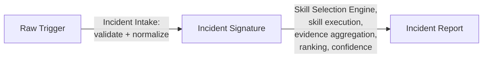

# Specification: Incident Schema

*   **Status**: Approved
*   **Owner**: ML Platform Architect
*   **Document Type**: Data Model Specification (implementation-independent)
*   **Companion To**: [`../agents/ml_analyst_agent.md`](../agents/ml_analyst_agent.md), [`skill_selection_engine.md`](skill_selection_engine.md), [`evidence_model.md`](evidence_model.md)
*   **Related Documents**: [`SYSTEM_SPEC.md`](SYSTEM_SPEC.md), [`root_cause_analysis.md`](root_cause_analysis.md)

This document is the single source of truth for the shape of an **Incident** as it moves through Pipeline Sentinel — from raw trigger, to the normalized signature the Skill Selection Engine reasons over, to the final published `IncidentReport`. Where `SYSTEM_SPEC.md §5` gives an illustrative preview of the `IncidentReport` interface, this document is the authoritative, field-by-field specification; if the two ever disagree, this document governs.

---

## 1. Overview

### 1.1 Purpose

Every component in Pipeline Sentinel — Incident Intake, the Skill Selection Engine, individual skills, the Evidence Aggregator, the Root Cause Ranker, the Confidence Estimator, and every downstream consumer (dashboards, ticketing systems, the HITL queue) — must agree on exactly one shape for "an incident" at each stage of its lifecycle. This document fixes that shape so no component ever needs to guess at, coerce, or defensively re-parse another component's notion of an incident.

### 1.2 Three Distinct Objects, One Lifecycle

An incident is not one object — it is three, each with a distinct owner and a distinct purpose, connected by a single `incident_id`:

| Object | Owned By | Purpose |
|---|---|---|
| **Raw Trigger** | Whatever upstream system fired the alert | The unprocessed input as it arrives at the platform boundary. |
| **Incident Signature** | Incident Intake / Context Collector | The normalized, validated representation every downstream component (Skill Selection Engine, skills) reasons over. |
| **Incident Report** | Incident Reporter (via `incident_summary`) | The final, published diagnostic artifact. |

---

## 2. The Raw Trigger

### 2.1 Purpose

The Raw Trigger is whatever payload arrives from an upstream alerting or monitoring system (a threshold breach, an anomaly-detector event, a manually filed ticket). It is treated as **untrusted input** in its entirety.

### 2.2 Fields

| Field | Type | Required | Description |
|---|---|---|---|
| `raw_alert_type` | `str` | Yes | The upstream system's own label for what fired (may not match any Pipeline Sentinel alert taxonomy entry). |
| `raw_payload` | `dict` | Yes | The unprocessed body of the alert exactly as received. |
| `received_at` | `datetime` | Yes | When the platform boundary received the trigger. |
| `source_system` | `str` | Yes | Identifies which upstream system produced this trigger (e.g., a specific alerting tool, a manual-ticket intake). |

### 2.3 Handling Rule

The Raw Trigger is never passed, in this shape, to any component beyond Incident Intake. It is validated and normalized into an Incident Signature (§3) before any other component — including the Skill Selection Engine — ever sees it. Any text field within `raw_payload` is subject to the platform's prompt-injection detection pass before any of its content can influence normalization (per [`ml_analyst_agent.md §10`](../agents/ml_analyst_agent.md#11-error-handling)).

---

## 3. The Incident Signature

### 3.1 Purpose

The Incident Signature is the normalized, validated representation of an incident that every downstream component — most importantly the Skill Selection Engine (see [`skill_selection_engine.md §2`](skill_selection_engine.md)) — is entitled to rely on. It is produced once, by Incident Intake and the Context Collector, and is immutable for the life of the investigation.

### 3.2 Fields

| Field | Type | Required | Description |
|---|---|---|---|
| `incident_id` | `str` (UUID) | Yes | Unique identifier assigned at intake; the join key across every object in this document and the Evidence Ledger (see [`evidence_model.md`](evidence_model.md)). |
| `alert_type` | `str` | Yes | The normalized alert type, drawn from the platform's alert taxonomy — this is the value matched against skills' `alert_triggers` (per [`skill_contract.md §3`](skill_contract.md)). |
| `severity` | `enum {low, medium, high, critical}` | Yes | Normalized severity, used for prioritization and for the corroboration policy in [`skill_selection_engine.md §4`](skill_selection_engine.md#4-selection-criteria-one-skill-vs-multiple-skills). |
| `affected_system` | `AffectedSystem` (§3.3) | Yes | Identifies what the incident is about. |
| `detected_at` | `datetime` | Yes | When the underlying condition was first observed (may precede `received_at` on the Raw Trigger). |
| `context_metadata` | `ContextMetadata` (§3.4) | Yes | The minimal orienting facts gathered before skill selection. |
| `raw_trigger_ref` | `str` | Yes | A reference (not an inline copy) to the originating Raw Trigger, for audit purposes — never re-embedded inline to avoid re-exposing unvalidated content downstream. |

### 3.3 `AffectedSystem`

| Field | Type | Description |
|---|---|---|
| `system_type` | `enum {model_serving, feature_pipeline, training_pipeline, deployment, evaluation, infrastructure}` | Which of Pipeline Sentinel's monitored domains this incident concerns — mirrors the categories in [`SYSTEM_SPEC.md §1`](SYSTEM_SPEC.md). |
| `identifier` | `str` | The specific model, pipeline, or service name affected. |
| `environment` | `str` | Deployment environment (e.g., production, staging), where applicable. |

### 3.4 `ContextMetadata`

| Field | Type | Description |
|---|---|---|
| `recent_deployments` | `list[DeploymentEvent]` | Deployments to the affected system within a configurable lookback window — feeds `deployment_regression`'s trigger condition. |
| `concurrent_alerts` | `list[str]` | `incident_id`s of other currently-open incidents whose `affected_system` overlaps or whose timing suggests correlation — feeds `alert_correlation`. |
| `model_metadata` | `ModelMetadata \| null` | Model version, serving endpoint identity, baseline performance, where the affected system is a model. |

### 3.5 Validation Rules

*   An Incident Signature is rejected at construction (not silently defaulted) if `alert_type`, `affected_system`, or `detected_at` cannot be resolved from the Raw Trigger.
*   `alert_type` must be a value drawn from the platform's alert taxonomy; a Raw Trigger whose `raw_alert_type` cannot be mapped to a known taxonomy entry still produces a valid Incident Signature, with `alert_type` set to a reserved `unclassified` value — this is what drives the Skill Selection Engine's fallback path (per [`skill_selection_engine.md §8`](skill_selection_engine.md#8-fallback-behavior)), rather than a construction failure.

---

## 4. The Incident Report

### 4.1 Purpose

The Incident Report is the terminal, published artifact of an investigation — the object every downstream consumer (dashboards, ticketing, the HITL queue) reads. Its shape is fixed regardless of which skills participated, per [`ml_analyst_agent.md §5`](../agents/ml_analyst_agent.md#5-outputs).

### 4.2 Fields

| Field | Type | Required | Description |
|---|---|---|---|
| `incident_id` | `str` (UUID) | Yes | Matches the originating Incident Signature's `incident_id`. |
| `schema_version` | `str` | Yes | Semantic version of this Incident Report shape (§6) — every consumer must check this before parsing. |
| `incident_summary` | `str` | Yes | Plain-language description of what was observed, when, and on which system. |
| `observed_symptoms` | `list[str]` | Yes | The normalized signal(s) that triggered the investigation. |
| `selected_skills` | `list[SkillSelectionRecord]` | Yes | Every skill considered, selected, or excluded, with rationale — the published form of the Skill Selection Engine's plan (§3.6 of [`skill_selection_engine.md`](skill_selection_engine.md)). |
| `findings` | `list[Finding]` | Yes | Per-skill structured findings, preserved individually — see [`skill_contract.md §5`](skill_contract.md) for the `Finding` shape. |
| `root_cause_ranking` | `list[RankedCause]` | Yes | Ordered candidate root causes — see [`root_cause_analysis.md`](root_cause_analysis.md) for how this is produced. |
| `confidence_score` | `float [0.0, 1.0]` | Yes | Overall investigation confidence — see [`ADR-003-confidence-scoring.md`](../decisions/ADR-003-confidence-scoring.md). |
| `partial_investigation` | `bool` | Yes | `true` if any selected skill was unavailable or timed out (per [`ml_analyst_agent.md §11`](../agents/ml_analyst_agent.md#11-error-handling)). |
| `requires_human_review` | `bool` | Yes | Set whenever confidence is Low, hypotheses are tied, or a fallback path was exhausted with no actionable evidence. |
| `recommended_actions` | `list[ActionItem]` | Yes | Concrete next steps, each tagged with a risk tier. |
| `preventive_actions` | `list[str]` | Yes | Longer-horizon suggestions to prevent recurrence. |
| `supporting_evidence` | `list[EvidenceReference]` | Yes | Cross-references linking every root cause and recommendation back to specific `Finding` evidence entries — the explainability backbone (see [`evidence_model.md`](evidence_model.md)). |
| `published_at` | `datetime` | Yes | When this report was finalized and emitted. |

### 4.3 `ActionItem`

| Field | Type | Description |
|---|---|---|
| `description` | `str` | The concrete action. |
| `risk_tier` | `enum {auto_executable, requires_approval}` | Determines HITL routing, per [`ml_analyst_agent.md §9.4`](../agents/ml_analyst_agent.md#9-confidence-estimation). |
| `justifying_finding_refs` | `list[str]` | References into `findings` that justify this action. |
| `time_horizon` | `enum {immediate, medium_term}` | Matches the immediate/medium-term distinction used throughout every skill's `SKILL.md`. |

---

## 5. Lifecycle Summary

The Raw Trigger is discarded from active reasoning immediately after normalization (§2.3); the Incident Signature is immutable and is what every intermediate component consumes; the Incident Report is the only object ever exposed outside the investigation session.

---

## 6. Schema Versioning

*   `IncidentReport.schema_version` follows semantic versioning. Additive fields (new optional field) bump the minor version; removing or repurposing a field bumps the major version.
*   A downstream consumer must reject, not best-effort-parse, an `IncidentReport` whose major version it does not recognize — silently misinterpreting a repurposed field is worse than a hard failure.
*   The Incident Signature (§3) and Raw Trigger (§2) are internal-only objects and are not independently versioned; they may evolve alongside Incident Intake without a compatibility contract, since no component outside the agent's own pipeline ever receives them directly.

---

## 7. Design Principles

*   **One Shape Per Stage**: exactly one canonical schema per lifecycle stage — no component invents its own partial view of an incident.
*   **Untrusted at the Boundary**: the Raw Trigger is never trusted and never propagated past normalization (§2.3).
*   **Immutable Mid-Flight**: the Incident Signature does not change once constructed — evidence and findings accumulate around it, they never rewrite it.
*   **Stable Terminal Contract**: the Incident Report's shape is fixed and versioned (§6) specifically so downstream consumers (dashboards, ticketing, HITL) never need to special-case incident type or investigation path.
*   **Explainability by Reference**: every conclusion in the Incident Report links back to specific `findings`/evidence entries (§4.2, `supporting_evidence`) rather than restating conclusions as free text.

---

## 8. Future Improvements

*   **Formal JSON Schema Publication**: publish `IncidentSignature` and `IncidentReport` as versioned JSON Schema artifacts consumable by non-Python downstream systems (dashboards, ticketing integrations) without hand-transcribing this document.
*   **Alert Taxonomy Registry**: formalize the `alert_type` enumeration referenced in §3.2 as its own governed registry (today it is implicitly defined by the union of all skills' `alert_triggers`), so new alert types can be reasoned about before any skill claims them.
*   **Raw Trigger Replay Store**: retain `raw_trigger_ref` payloads (redacted per PII rules) long enough to support post-incident debugging of normalization failures, without ever re-exposing them to live investigation components.
