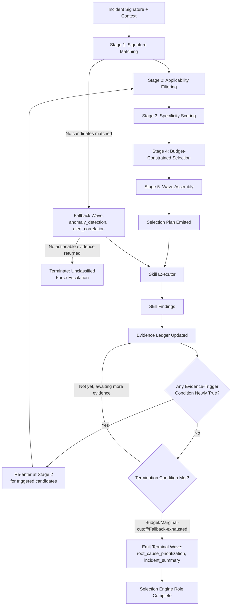

# Specification: Skill Selection Engine

*   **Status**: Approved
*   **Owner**: ML Platform Architect
*   **Document Type**: Component Behavioral Specification (implementation-independent)
*   **Companion To**: [`ml_analyst_agent.md`](../agents/ml_analyst_agent.md), [`skill_contract.md`](skill_contract.md), [`incident_schema.md`](incident_schema.md), [`evidence_model.md`](evidence_model.md)
*   **Related Documents**: [`SYSTEM_SPEC.md`](SYSTEM_SPEC.md), [`../architecture/SYSTEM_ARCHITECTURE.md`](../architecture/SYSTEM_ARCHITECTURE.md), [`../decisions/ADR-001-dynamic-skills.md`](../decisions/ADR-001-dynamic-skills.md), [`root_cause_analysis.md`](root_cause_analysis.md), [`../design/DYNAMIC_DISCOVERY_DESIGN.md`](../design/DYNAMIC_DISCOVERY_DESIGN.md)

This document is the single source of truth for the **Skill Selection Engine**: the component of Pipeline Sentinel responsible for deciding *which* investigation skills to invoke, *in what order*, and *why*, for a given incident. It formalizes and supersedes the summary given in [`ml_analyst_agent.md §7`](../agents/ml_analyst_agent.md#7-skill-selection-strategy) as the authoritative, implementable specification of that behavior.

This is an architecture and behavior specification. It defines decision rules, interfaces, and contracts — not code, classes, or algorithms in a particular programming language.

---

## 1. Overview

### 1.1 Purpose

Pipeline Sentinel's diagnostic power comes from up to eighteen (and growing) independently authored Skills, each an expert in one narrow investigative question. No incident should ever require a human, or the agent itself, to reason informally over "which of these eighteen tools do I run." That decision must be made by a dedicated, deterministic, auditable component: the **Skill Selection Engine**.

The engine exists to answer exactly one question, repeatedly, over the life of an investigation:

> *Given everything known about this incident so far, which skill(s) — if any — should run next, and what is the reason for choosing them?*

### 1.2 Responsibilities

The Skill Selection Engine owns:

*   **Candidate identification**: matching an incident's normalized signature against the Skill Registry to produce an initial candidate set.
*   **Applicability filtering**: excluding candidates whose required inputs cannot be satisfied or whose declared scope does not actually cover the incident at hand.
*   **Selection among candidates**: deciding, when multiple skills could plausibly apply, which ones actually should run (§4).
*   **Execution grouping**: partitioning the selected skills into parallel and sequential groups — "waves" (§5) — based on their declared data and evidence dependencies.
*   **Evidence-triggered re-selection**: evaluating intermediate findings after each wave to decide whether additional skills should run (§6).
*   **Redundancy avoidance**: preventing the same or overlapping investigative ground from being covered twice (§7).
*   **Fallback determination**: deciding what happens when no skill matches, or when a matched skill cannot actually run (§8).
*   **Rationale generation**: producing a human-auditable reason for every skill it selects, excludes, or defers — this rationale is what ultimately populates the `Selected Skills` field of the final `IncidentReport` (see [`ml_analyst_agent.md §5`](../agents/ml_analyst_agent.md#5-outputs)).
*   **Termination**: deciding when to stop selecting — i.e., recognizing that no further skill invocation will materially change the investigation's outcome.

### 1.3 Explicit Non-Responsibilities

The engine does **not**:

*   **Execute skills.** It produces a plan; the Skill Executor (a distinct component owned by the ML Analyst Agent, see [`ml_analyst_agent.md §3`](../agents/ml_analyst_agent.md#3-architecture)) is the only component that actually invokes a skill's entrypoint.
*   **Aggregate or interpret evidence.** It reads skill *outputs* only insofar as needed to decide on the next wave (§6); interpreting what the evidence means is the Evidence Aggregator's and Hypothesis Generator's job.
*   **Rank hypotheses or compute confidence.** Those are owned exclusively by `root_cause_prioritization` and the agent's Confidence Estimator, per the platform-wide rule that combination across skills is deterministic computation, never informal judgment ([`.agents/CONTEXT.md §6.3`](../../.agents/CONTEXT.md)). The Selection Engine decides *whether to run* `root_cause_prioritization`, never what it should conclude.
*   **Recommend remediation actions.** That is the Recommendation Generator's job, downstream of ranking.

This strict separation is what makes the engine independently specifiable, testable, and replaceable — it depends only on the Skill Registry and skill outputs' declared shape (per [`skill_contract.md`](skill_contract.md)), never on any other component's internals.

---

## 2. Inputs

The engine's decisions are a pure function of the following inputs — nothing else. Any input not on this list must not influence a selection decision, or the decision is not reproducible.

| Input | Source | Used For |
|---|---|---|
| **Incident Signature** | Incident Intake (normalized alert type, severity, affected system identity, timestamp) | Primary key for signal-based candidate matching (§3.1). |
| **Context Metadata** | Context Collector (recent deployments, concurrent/correlated alerts, affected model or pipeline identity) | Applicability filtering (§3.2) and tie-breaking among ambiguous candidates. |
| **Skill Registry Snapshot** | Dynamic Skill Registry | The full set of registered skills and their declared metadata: `alert_triggers`, `required_inputs`, `scope_boundary`, and collaboration declarations (per [`skill_contract.md §3, §8`](skill_contract.md)). |
| **Evidence Ledger (so far)** | Evidence Aggregator | The accumulated `Finding` outputs of all skills executed in prior waves of this same investigation — the sole basis for evidence-triggered re-selection (§6). |
| **Session History** | Session Manager | The set of skills already executed in this session, with their inputs, so the engine never re-selects a skill redundantly (§7). |
| **Operational Configuration** | Platform configuration | Bounds that constrain — but never override — the decision logic: maximum skills per wave, maximum number of waves, per-wave time budget. |

The engine is never handed raw logs, raw metrics, or raw telemetry directly — only the structured signature, metadata, and prior `Finding` objects above. Raw evidence collection is exclusively a skill's job (per [`skill_contract.md §4`](skill_contract.md)); the Selection Engine reasons about *what kind* of evidence exists, never the evidence's raw content.

---

## 3. Decision-Making Process

Candidate identification is a five-stage funnel, executed identically on every invocation of the engine (initial selection and every subsequent wave alike).

### 3.1 Stage 1 — Signature Matching

The engine queries the Skill Registry Snapshot for every skill whose `alert_triggers` includes the incident's normalized alert type. This produces the raw candidate set for the current wave. On the first wave, this is driven by the Incident Signature; on later waves, this stage is skipped in favor of evidence-triggered matching (§6), since the original alert has already been accounted for.

### 3.2 Stage 2 — Applicability Filtering

Each raw candidate is checked against two gates:

*   **Input satisfiability**: can every entry in the skill's `required_inputs` actually be resolved from Context Metadata, the Evidence Ledger, or platform configuration? A skill whose required input cannot be resolved (e.g., it requires a reference dataset path that does not exist for this pipeline) is excluded, not silently deferred.
*   **Scope applicability**: does the skill's declared `scope_boundary` actually cover this incident, or does the incident's context contradict it (e.g., a skill scoped to batch pipelines is excluded for an incident on a real-time serving endpoint)?

Candidates failing either gate are removed from the set and recorded with an explicit exclusion reason (§7, §9) — exclusions are never silent.

### 3.3 Stage 3 — Specificity Scoring

Surviving candidates are ordered by how *specifically* they match the incident, not merely whether they match. A skill whose `alert_triggers` entry exactly matches the incident's alert type, and whose `description` scope is narrow and directly on-point, ranks above a broad generalist skill that also happens to declare the same trigger. This prevents the engine from defaulting to broad, low-precision skills when a precise one is available, and is what makes the fallback skills (`anomaly_detection`, `alert_correlation`, §8) a last resort rather than a default.

### 3.4 Stage 4 — Budget-Constrained Selection

The ranked candidate list is truncated to the configured maximum skills-per-wave budget. This budget exists to enforce the platform's token-efficiency and hallucination-prevention goals ([`ADR-001`](../decisions/ADR-001-dynamic-skills.md)): even when many skills are theoretically applicable, only the most specific, evidence-justified subset is actually selected in a single wave. Candidates cut for budget reasons are not discarded permanently — they remain visible as documented, unselected candidates in the plan's rationale, and may be picked up in a later wave if evidence subsequently justifies them (§6).

### 3.5 Stage 5 — Wave Assembly

Selected candidates are grouped into execution waves per §5, and the result is emitted as a **Selection Plan** — the engine's sole output artifact.

### 3.6 The Selection Plan

Every invocation of the engine (initial or subsequent) produces one Selection Plan increment, with the following structure:

| Field | Description |
|---|---|
| `wave_id` | Sequential identifier for this wave within the investigation. |
| `execution_mode` | `parallel` or `sequential` (§5). |
| `selected_skills` | List of skills to invoke this wave, each with its resolved input parameters and a `trigger_reason` (`signal_match`, `evidence_triggered`, or `fallback`). |
| `excluded_candidates` | List of skills considered but not selected this wave, each with an explicit exclusion reason (unsatisfiable input, out of scope, budget-cut, redundant). |
| `rationale` | A human-readable explanation tying the wave's selections back to the specific alert or evidence condition that justified them. |
| `continuation_signal` | Whether the engine expects to be invoked again after this wave's findings return (`awaiting_evidence`) or whether this is a terminal wave (`terminate`, with a stated reason, §6.3). |

This plan is the only channel through which the engine communicates with the rest of the system — it never calls a skill, never reads a raw evidence value, and never emits a diagnosis.

---

## 4. Selection Criteria: One Skill vs. Multiple Skills

A single skill is sufficient when the incident signature maps unambiguously to one skill whose `scope_boundary` fully covers the suspected failure surface, and no context signal suggests a second, independent failure domain. Example: a `CrashLoopBackOff` alert with no accompanying resource-pressure metrics maps cleanly to `crash_loop_analysis` alone.

Multiple skills are required whenever any of the following hold:

*   **Ambiguous failure surface**: the observed symptom (e.g., an accuracy or F1 drop) could plausibly originate in more than one layer — input data, model behavior, or infrastructure — and no single skill's scope covers all plausible origins. The engine selects one skill per plausible origin in the same wave (e.g., `data_drift_analysis` and `model_performance_analysis` together, per the worked example in [`ml_analyst_agent.md §14`](../agents/ml_analyst_agent.md#14-example-investigation)).
*   **Alert storm membership**: Context Metadata indicates the triggering alert is part of a correlated cluster of concurrent alerts. `alert_correlation` is selected alongside the primary signal-matched skill(s) to establish whether they share a common upstream cause.
*   **Corroboration requirement for high-stakes categories**: for incident categories the platform configuration flags as high-stakes (e.g., categories whose recommendations could be auto-executed), the engine requires at least two independent, corroborating skills before a hypothesis is allowed to reach High confidence eligibility — a single skill's finding, however strong, is never treated as sufficient in isolation for these categories. This is a selection-time policy, not a confidence-computation rule: it manifests as the engine deliberately including a second, independent-angle skill in Wave 0 rather than waiting for a low-confidence result to trigger it reactively.

Conversely, the engine must **not** select multiple skills merely because multiple skills' `alert_triggers` happen to list the same alert type loosely — Stage 3 (Specificity Scoring, §3.3) and Stage 4 (Budget, §3.4) exist precisely to prevent that kind of low-precision, "run everything that might apply" behavior.

---

## 5. Sequential vs. Parallel Execution

### 5.1 Parallel by Default

Skills within the same wave that have no declared data or evidence dependency on one another execute in parallel. This is the default for Wave 0 (signal-matched skills), since signature matching alone rarely implies an ordering constraint, and parallel execution directly serves the platform's Mean-Time-to-Diagnosis goal.

### 5.2 Sequential When Dependency Exists

A skill is placed in a *later*, sequentially-ordered wave — never the same wave — when either:

*   Its own invocation is conditioned on another skill's finding (an **evidence-triggered** skill, §6) — it cannot be selected before that finding exists.
*   Its `required_inputs` cannot be resolved without a value produced by another skill's `Finding` (a genuine data dependency, not merely a topical relationship).

### 5.3 Terminal Wave

`root_cause_prioritization` and `incident_summary` are always assigned to a final, terminal wave that runs only after every investigative wave has concluded (returned or been marked unavailable/timed out, per [`ml_analyst_agent.md §11`](../agents/ml_analyst_agent.md#11-error-handling)). The Selection Engine is responsible for recognizing that investigative waves are exhausted (§6.3) and emitting this terminal wave — but, consistent with §1.3, it is not responsible for what these two skills conclude.

### 5.4 Waves Are the Unit of Sequencing

The engine never expresses ordering at the level of individual skill pairs ("run A before B"); it expresses ordering only at the level of waves. All skills within a wave are, by construction, mutually independent and safe to run concurrently — if two skills would need to be sequenced relative to each other, they belong in different waves by definition.

---

## 6. Evidence-Triggered Additional Skill Invocation

### 6.1 When the Engine Is Re-Invoked

The engine is called again after every wave's findings become available (or time out). It is never called on a fixed schedule or a fixed number of times — the number of waves is itself a decision the engine makes wave by wave.

### 6.2 Evidence Trigger Conditions

Each skill's `SKILL.md` declares, in its Collaboration section (per [`skill_contract.md §8`](skill_contract.md)), the specific finding-level condition under which it should be pulled into a later wave — expressed against another skill's `Finding` fields (e.g., "select this skill if the prior wave's `data_drift_analysis` reports `dataset_drift_detected = false` while `model_performance_analysis` reports a confirmed regression"). At each re-invocation, the engine evaluates every registered skill's declared trigger conditions against the current Evidence Ledger; any skill whose condition newly evaluates true — and which has not already run this session (§7) — becomes a candidate for the next wave, subject to the same Stage 2–4 filtering as any other candidate.

### 6.3 Termination Conditions

The engine emits `continuation_signal = terminate` — i.e., selects the empty set for the next investigative wave — when any of the following hold:

*   **No unresolved trigger conditions remain**: every registered skill's evidence-trigger condition has either already fired (and been acted on) or evaluates false against the current ledger.
*   **Marginal evidence cutoff**: the previous wave's findings did not introduce any new hypothesis or newly satisfy any trigger condition — running further skills is judged unlikely to change the ranked outcome.
*   **Budget exhaustion**: the configured maximum number of waves or maximum total skills for this investigation has been reached.
*   **Fallback exhausted**: the generalist fallback wave (§8) has already run and produced no actionable evidence.

Whichever condition applies is recorded as the plan's termination reason and surfaces in the final report's rationale — a silent stop is not permitted.

---

## 7. Avoiding Redundant or Unnecessary Execution

*   **Session-scoped de-duplication**: the engine never selects a skill that has already executed successfully in this session with equivalent resolved inputs, regardless of whether a later trigger condition would otherwise select it again. Session History (§2) is checked before a skill is added to any wave.
*   **Overlapping scope detection**: if two surviving candidates' `scope_boundary` declarations claim the same evidence domain, the engine selects only the more specific one (per Specificity Scoring, §3.3) and records the other as excluded for redundancy — this is the selection-time enforcement of the platform-wide "One Tool, One Question" principle ([`.agents/CONTEXT.md §6.2`](../../.agents/CONTEXT.md)).
*   **Budget discipline over breadth**: the engine favors the smallest sufficient skill set at every wave (§3.4) rather than maximizing coverage; broader coverage is only pursued when a specific trigger condition or corroboration policy (§4) justifies it, never by default.
*   **Idempotent replay handling**: if the same incident signature is re-ingested while an investigation for it is already active or recently completed (e.g., a duplicate or retried alert), the engine recognizes the existing session and does not spawn a redundant parallel investigation or re-select skills already executed for it.

---

## 8. Fallback Behavior

| Situation | Engine Behavior |
|---|---|
| **No candidate matches the incident signature** (Stage 1 yields an empty set) | Select the generalist fallback wave: `anomaly_detection` (verify a real anomaly exists) and `alert_correlation` (check for a known cascading pattern), per [`ml_analyst_agent.md §7.5`](../agents/ml_analyst_agent.md#7-skill-selection-strategy). |
| **Fallback wave also yields no actionable evidence** | Terminate with an empty selection, mark the incident `unclassified` in the plan rationale, and rely on the agent's forced-escalation rule ([`ml_analyst_agent.md §9.4`](../agents/ml_analyst_agent.md#9-confidence-estimation)) to route it to human review. |
| **A matched skill's required input is unsatisfiable** (Stage 2 exclusion) | Exclude the skill with an explicit, documented reason; do not silently drop it from the rationale, and do not substitute a different skill in its place unless another candidate independently satisfies Stage 1–3. |
| **The Skill Registry is empty or unreachable** | Treat as a hard platform fault, not an ordinary "no match" case: emit no plan and force immediate escalation, since no automated investigation is possible without the registry at all. |

In every fallback case, the engine's output must make the *reason* for the fallback path explicit — "no skill declared this alert as a trigger" is a materially different, and differently actionable, situation from "the registry could not be reached," even though both may ultimately route to a human.

---

## 9. Interaction With the ML Analyst Agent and the Skill Contract

### 9.1 Position in the Agent's Architecture

The Skill Selection Engine implements the **Skill Selector** stage of the ML Analyst Agent's internal architecture (see [`ml_analyst_agent.md §3`](../agents/ml_analyst_agent.md#3-architecture)). It sits between the Context Collector and the Skill Executor, and is re-entered after the Evidence Aggregator updates the ledger following each wave:

*   **Upstream**: the agent's Context Collector supplies the Incident Signature and Context Metadata (§2) that seed Wave 0.
*   **Downstream**: the engine hands its Selection Plan (§3.6) to the Skill Executor, which is the only component authorized to actually invoke a skill's entrypoint, per [`skill_contract.md §4`](skill_contract.md).
*   **Feedback loop**: after the Executor returns each wave's `Finding` objects and the Evidence Aggregator merges them into the ledger, the agent re-invokes the engine (§6.1) with the updated ledger to obtain the next Selection Plan increment, until the engine signals `terminate`.

### 9.2 Dependence on the Skill Contract, Not on Skill Internals

The engine's every decision is made against metadata defined by [`skill_contract.md`](skill_contract.md) — `alert_triggers`, `required_inputs`, `scope_boundary`, `version`, and the Collaboration declarations — and against the *shape* of `Finding` objects (§6.2), never against a skill's internal implementation. This is what allows the engine to be:

*   **Implemented and tested independently** of any specific skill's logic, using only registry fixtures and synthetic `Finding` objects.
*   **Unaffected by skill additions or removals** beyond the registry snapshot changing — adding skill #19 requires no change to the engine, exactly as [`ml_analyst_agent.md §12`](../agents/ml_analyst_agent.md#12-extensibility) requires of the agent as a whole.

### 9.3 What the Engine Must Never Assume

The engine must never assume a skill will actually produce a usable `Finding` — a selected skill may still become `unavailable` (timeout, error, per [`ml_analyst_agent.md §11`](../agents/ml_analyst_agent.md#11-error-handling)) after the plan is handed off. Handling that outcome is the Skill Executor's and Evidence Aggregator's responsibility; the engine's only obligation is to make a well-reasoned selection given what it knew at plan time, and to correctly re-evaluate trigger conditions on the next wave given whatever evidence (or lack thereof) actually came back.

---

## 10. End-to-End Investigation Workflow

The complete lifecycle the engine participates in, from incident detection through final skill selection:

1.  **Incident received** by the agent's Incident Intake; a session is opened.
2.  **Context collected**: affected system identity, recent deployments, concurrent alerts.
3.  **Engine invoked for Wave 0**: Stage 1–5 (§3) run against the Incident Signature and Context Metadata; a Selection Plan for Wave 0 is emitted.
4.  **Wave 0 executed** by the Skill Executor (parallel, per §5.1); findings return to the Evidence Aggregator.
5.  **Engine re-invoked for Wave 1**: evidence-trigger conditions (§6.2) are evaluated against the updated ledger; if any newly hold, Stage 2–5 run again for the newly triggered candidates, respecting redundancy rules (§7).
6.  **Steps 4–5 repeat** for as many waves as evidence-trigger conditions continue to fire, bounded by the configured wave/skill budget.
7.  **Engine determines investigative waves are exhausted** (§6.3) and emits the terminal wave: `root_cause_prioritization` followed by `incident_summary`.
8.  **Terminal wave executed**; the agent's Root Cause Ranker, Confidence Estimator, and Recommendation Generator take over — the Selection Engine's role in this investigation is complete.
9.  **Incident Report published**, carrying the full multi-wave selection rationale (§3.6) as its `Selected Skills` field.

If, at any point, Stage 1 yields no candidates and no fallback (§8) produces actionable evidence, the workflow short-circuits directly from step 3 or 5 to a `terminate` plan with an `unclassified` reason, skipping straight to escalation rather than proceeding through further waves.

---

## 11. Orchestration Diagram

---

## 12. Design Principles

*   **Evidence-Driven Reasoning**: every selection, exclusion, and termination decision is traceable to a specific alert match, evidence-trigger condition, or budget rule — never to informal judgment over raw telemetry (which the engine, by design, never even receives — see §2).
*   **Determinism**: given the same Incident Signature, Context Metadata, Registry Snapshot, and Evidence Ledger, the engine always produces the same Selection Plan. This is what makes the engine unit-testable against fixed fixtures without invoking any model.
*   **Explainability**: every plan carries a rationale (§3.6); nothing is selected, excluded, or terminated silently.
*   **Modularity & Separation of Concerns**: the engine decides; it never executes, aggregates, ranks, or recommends (§1.3). Each of those is a separately specified component with its own contract.
*   **Extensibility**: the engine's behavior is entirely driven by registry metadata and declared collaboration conditions (§9.2) — adding, removing, or versioning a skill (per [`skill_contract.md §10`](skill_contract.md)) never requires a change to the engine itself.
*   **Cost-Awareness**: the engine actively minimizes the number of skills invoked per investigation (§3.4, §7) as a first-class objective, not an afterthought — this is what keeps the platform's token cost and tool-selection precision in line with the goals of [`ADR-001`](../decisions/ADR-001-dynamic-skills.md).
*   **Safety-by-Default for High-Stakes Categories**: for incident categories eligible for auto-executed remediation, the engine's selection criteria (§4) require independent corroboration before a single skill's finding is allowed to stand alone — a policy enforced at selection time, not left to be caught later.
*   **Idempotency**: re-ingestion of a duplicate or retried incident signature never causes redundant skill re-selection (§7).

---

## 13. End-to-End Example

### Incident

Alert `ServingLatencyP99Spike` fires for `Recommendation_Ranking_Service`. Context Metadata shows a model deployment occurred 42 minutes before the latency onset, and no other alerts are currently active (no storm membership).

### Wave 0 — Signature Matching (Parallel)

*   **Stage 1**: `alert_triggers` lookup for `ServingLatencyP99Spike` returns two candidates: `serving_analysis` and `latency_analysis`.
*   **Stage 2**: both candidates' required inputs (service identity, metrics window) are satisfiable; both are in scope for a real-time serving endpoint.
*   **Stage 3**: both are equally specific to this alert type; no generalist competes at this stage.
*   **Stage 4**: both fit within the wave budget.
*   **Stage 5**: no dependency exists between them (they inspect different evidence domains — infra-level serving health vs. latency decomposition) → assigned to the same parallel wave.
*   **Plan**: Wave 0 = `{serving_analysis, latency_analysis}`, parallel, `trigger_reason = signal_match` for both.

### Wave 0 Findings

*   `serving_analysis`: queue depth normal, no 5xx error spike, no CUDA OOM signals. Local confidence: 0.9 that infra-level resource exhaustion is *not* the cause.
*   `latency_analysis`: P99 latency increase is concentrated entirely in the model-inference stage of the request lifecycle, not network or queueing stages. Local confidence: 0.88.

### Wave 1 — Evidence-Triggered (Sequential)

The engine is re-invoked. `deployment_regression`'s declared trigger condition — "select if latency/perf regression is confirmed and infra-level causes are ruled out, and a deployment occurred within the recent window" — now evaluates true against the updated ledger and the Context Metadata deployment timestamp. Session History confirms `deployment_regression` has not already run this session (§7). It passes Stage 2–4 and is assigned to its own sequential wave, since its selection was itself conditioned on Wave 0's findings.

*   **Plan**: Wave 1 = `{deployment_regression}`, sequential, `trigger_reason = evidence_triggered`, citing the specific Wave 0 findings that satisfied its trigger condition.

### Wave 1 Finding

`deployment_regression`: confirms a new model version was deployed 42 minutes before onset; the deployed model is a larger ensemble than its predecessor, with no corresponding serving infrastructure scale-up recorded. Local confidence: 0.91.

### Termination

The engine is re-invoked once more. No other registered skill's evidence-trigger condition evaluates true against the now-updated ledger: resource exhaustion has been actively ruled out (not merely unaddressed), no crash-loop symptoms exist, and no drift-related alert is present to justify `data_drift_analysis` or `concept_drift_analysis`. Per §6.3, this is a marginal-evidence cutoff — the engine emits `continuation_signal = terminate` with that reason, and selects the terminal wave.

### Terminal Wave

`root_cause_prioritization` and `incident_summary` are selected as the final, terminal wave. The Selection Engine's involvement ends here; the resulting root cause ranking, confidence score, and recommendations are produced by the agent's downstream components as specified in [`ml_analyst_agent.md §3, §9, §14`](../agents/ml_analyst_agent.md).

### Resulting `Selected Skills` Rationale (as published in the Incident Report)

> Wave 0 (parallel, signal-matched): `serving_analysis`, `latency_analysis` — both directly triggered by `ServingLatencyP99Spike`.
> Wave 1 (sequential, evidence-triggered): `deployment_regression` — selected because Wave 0 ruled out infra-level causes while confirming an inference-stage-specific regression, and a recent deployment fell within the incident's onset window.
> Terminal wave: `root_cause_prioritization`, `incident_summary` — investigative waves exhausted; no further trigger conditions remained (marginal-evidence cutoff).

---

## 14. Future Improvements

*   **Learned Specificity Scoring**: replace the static specificity heuristic (§3.3) with weights calibrated from historical investigation outcomes — which skills, when selected first, most often led to a high-confidence, human-confirmed diagnosis.
*   **Cost-Latency-Aware Budgeting**: extend the wave budget (§3.4, Operational Configuration) to account for each skill's historical execution latency, so time-sensitive incidents can prefer faster corroborating skills when multiple equally specific candidates exist.
*   **Cross-Incident Trigger Learning**: mine historical Selection Plans to discover evidence-trigger conditions that were never explicitly declared by any skill's `SKILL.md` but empirically predicted a productive next-wave selection, and surface them as candidate additions to skill authors.
*   **Simulation-Based Plan Validation**: a pre-merge tool that replays a new or modified skill's declared `alert_triggers` and collaboration conditions against historical incident fixtures, to catch unintended overlap or dead-trigger conditions before the skill reaches production.
