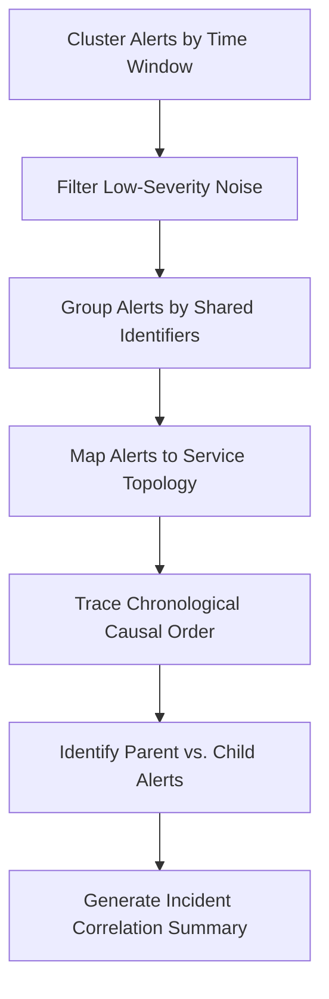

# Alert Correlation Skill

## 1. Overview (Why)

### Purpose & Motivation
When a major incident occurs in a production Machine Learning system, it rarely generates a single alert. A single root-cause failure (e.g., database connection pool exhaustion) can trigger a cascade of secondary symptoms and alerts across multiple systems: database alerts, feature pipeline timeout alerts, model serving latency warnings, and downstream business KPI alerts. This "alert storm" confuses SRE on-call engineers and increases MTTR.

This skill exists to cluster, filter, and correlate disparate alerts occurring within a common time window. It allows the `ML Analyst Agent` to differentiate between the **root cause trigger** (parent alert) and downstream **symptoms** (child alerts), reducing noise and directing the investigation to the correct component.

### Production Incidents Investigated
*   **Alert Storms**: Dozens of simultaneous alerts firing during a system outage.
*   **Cascading Failures**: Upstream infrastructure alerts leading to downstream model serving performance degradation alerts.
*   **Duplicate / Redundant Alerts**: Multiple alert definitions capturing the same underlying problem.

### Placement in ML Analyst Workflow
This skill is the **Initial Ingestion Gate**. When a batch of alerts arrives, this skill is run first to group them into a single unified incident before invoking specialized investigation skills.

```
[Incoming Alert Stream] ──> [Alert Correlation] ──> [Single Unified Incident] ──> [Detailed Diagnostics]
```

---

## 2. Responsibilities (What)

### What This Skill MUST Do:
*   Cluster alerts firing within a parameterized time window (e.g., $\Delta t \le 10$ minutes).
*   Parse alert metadata (source, service, labels, severity) to identify logical dependencies.
*   Establish causal parent-child relationships using time-series ordering and system topology rules.
*   Filter out redundant or low-severity alert noise.

### What This Skill MUST NOT Do:
*   Perform statistical calculations on raw datasets or logs — this is delegated to specific analysis skills.
*   Acknowledge, mute, or close alerts in PagerDuty or Alertmanager directly.

---

## 3. When This Skill Is Selected

### Alerts and Triggers

| Alert Type | Symptom / Signal | Selection Relevance |
| :--- | :--- | :--- |
| `MultipleFires` | More than 3 alerts from different services fire within a 15-minute window. | Critical (Correlate alert storm immediately). |
| `CascadingAlertWarning` | An infrastructure warning is immediately followed by an application accuracy drop. | High (Trace causal correlation). |

---

## 4. Required Inputs

*   **Alert Stream / List**: Array of active alert events, each containing `alert_name`, `source_service`, `severity`, `timestamp`, and `metadata` labels.
*   **Service Topology Map**: Definitions of service dependencies (e.g. `Inference API` depends on `Feature Store` which depends on `Database`).
*   **Correlation Configuration**:
    *   `time_window_seconds`: The maximum time delta to consider alerts as part of the same incident (default: 600s).

---

## 5. Expected Evidence

*   **Timestamp Order**: Precise microsecond ordering of alert activation events.
*   **Shared Keys / Tags**: Common identifiers across alerts (e.g., `model_name`, `session_id`, `database_instance`).
*   **Causal Topology**: Matches between service dependencies and firing sources.

---

## 6. Investigation Workflow (How)



### Steps of the Workflow:
1.  **Temporal Clustering**: Group all alerts that fired within `time_window_seconds` of each other.
2.  **Filter Noise**: Remove informational or low-severity warnings if high-severity alerts are present in the cluster.
3.  **Entity Grouping**: Group alerts by common attributes (e.g., same model, host, or database name).
4.  **Topological Mapping**: Check the dependency map to trace if service A (firing alert) is upstream of service B (firing alert).
5.  **Chronological Ordering**: Sort the cluster chronologically to find the earliest event.
6.  **Parent-Child Classification**: Classify the earliest, topologically upstream alert as the **Parent Alert** and subsequent alerts as **Child Symptoms**.
7.  **Output Incident Group**: Compile the unified incident report for the agent.

---

## 7. Root Cause Heuristics

### Heuristic 1: Infrastructure-Driven Application Failure
*   **Symptoms**: Simultaneous alerts on database memory and inference latency.
*   **Supporting Evidence**:
    *   `DB_Memory_Exceeded` fires at 10:00:00.
    *   `Inference_Latency_Spike` fires at 10:01:05.
    *   `DownstreamTimeout` fires at 10:02:10.
*   **Causal Link**: DB degradation slows down feature extraction, increasing API latency, which causes client timeouts.
*   **Confidence Signal**: High confidence if topological mapping confirms direct database dependence.

---

## 8. Outputs

Returns a structured dictionary containing:
*   `investigation_summary`: Human-readable summary of the correlation findings.
*   `correlated_incident_detected`: Boolean flag indicating if correlation was successful.
*   `parent_alert`: The primary trigger alert details.
*   `symptom_alerts`: List of child alerts grouped under the parent.
*   `possible_root_causes`: Top level systems to investigate.
*   `confidence_score`: Score between $0.0$ and $1.0$.
*   `recommended_actions`: Short-term operational suggestions.

---

## 9. Confidence Scoring

| Confidence Level | Criteria |
| :--- | :--- |
| **High ($\ge 0.8$)** | Chronological order and topological paths match perfectly ($N > 3$ alerts correlated). |
| **Medium ($0.5$ - $0.79$)** | Alerts share the same temporal cluster and shared keys, but topological dependency is indirect or missing. |
| **Low ($< 0.5$)** | Alerts have no shared keys and occurred near the edge of the time window, or multiple competing parents are present. |

---

## 10. Recommended Actions

*   **Immediate Remediation (Short-Term)**:
    *   Acknowledge the parent alert and temporarily mute child warnings to suppress duplicate notifications.
    *   Redirect investigation focus directly to the parent service.
*   **Medium-Term Fixes**:
    *   Tune alert thresholds to reduce false-positive alarms on symptom-level alerts.
*   **Long-Term Prevention**:
    *   Implement alert grouping rules at the alerting gateway (e.g. Prometheus Alertmanager grouping).

---

## 11. Limitations
*   **Topology Completeness**: Dependent on having an accurate, up-to-date service dependency map.
*   **Clock Skew**: Highly sensitive to clock drift across system nodes if timestamps are not synchronized (NTP sync required).
