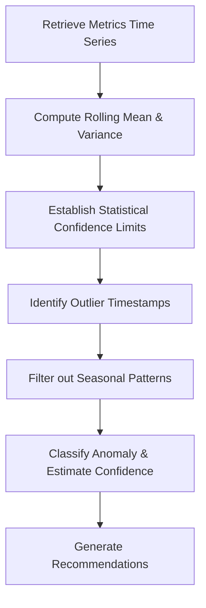

# Anomaly Detection Skill

## 1. Overview (Why)

### Purpose & Motivation
Production systems generate large volumes of metrics (e.g. QPS, CPU utilization, request latencies). A sudden shift or spike in these metrics can indicate system failures, software regressions, or external load changes. Detecting these changes manually is impossible at scale, and hardcoded threshold alerts fail to adapt to seasonal variations.

This skill exists to run statistical anomaly detection on time-series metrics. It compares current values against historical baselines to identify statistically significant spikes, drops, or pattern deviations, providing early warning signals to the `ML Analyst Agent`.

### Production Incidents Investigated
*   **Request Volume Spike / Drop**: Abrupt changes in QPS.
*   **Latency Spikes**: Sudden increases in p95/p99 latency.
*   **System Resource Anomalies**: Spikes in CPU or memory usage.

---

## 2. Responsibilities (What)

### What This Skill MUST Do:
*   Retrieve time-series metric vectors from the monitoring repository.
*   Calculate rolling historical means, variances, and confidence bands (e.g. using Z-score or rolling IQR).
*   Identify observations that fall outside the confidence limits.

### What This Skill MUST NOT Do:
*   Acknowledge alerts or scale servers.
*   Isolate the root cause of the anomaly — this is delegated to specific analysis skills.

---

## 3. When This Skill Is Selected

### Alerts and Triggers
*   **Continuous Monitoring / Cron**: Running scheduled checks on key operational metrics to detect silent anomalies.

---

## 4. Required Inputs

*   **Metric Vector**: Time-series list of observations.
*   **Target Metric Name**: E.g. `inference_latency_p95`.
*   **Threshold Settings**: Multiplier for standard deviation (default: 3).

---

## 5. Expected Evidence

*   **Anomaly Flag**: Binary indicators for timestamps violating confidence limits.
*   **Metric Statistics**: rolling mean, standard deviation, and current observation values.

---

## 6. Investigation Workflow (How)

### Steps:
1.  **Retrieve History**: Fetch metrics for the preceding 7 days.
2.  **Calculate Limits**: Compute rolling average and standard deviation.
3.  **Detect Outliers**: Flag any point where $|x - \mu| > 3\sigma$.
4.  **Audit Seasonality**: Verify if the anomaly is recurrent (e.g. daily peak load).
5.  **Report**: Compile findings.

---

## 7. Root Cause Heuristics

### Heuristic 1: Non-Seasonal Volumetric Spike
*   **Symptoms**: Sudden QPS spike that does not match historical daily/weekly patterns.
*   **Supporting Evidence**:
    *   QPS exceeds $+4$ standard deviations of the 7-day average.
    *   No corresponding holiday or promotional campaign is registered.
*   **Confidence Signal**: High confidence.

---

## 8. Outputs

Returns a structured dictionary:
*   `investigation_summary`: Human-readable summary of the anomaly.
*   `anomaly_detected`: Boolean flag.
*   `outliers`: List of timestamps violating limits.
*   `possible_root_causes`: Ranked hypotheses.
*   `confidence_score`: Score between $0.0$ and $1.0$.
*   `recommended_actions`: Short-term actions.

---

## 9. Confidence Scoring

*   **High ($\ge 0.8$)**: Observations deviate significantly ($>3\sigma$) and do not match seasonal history.
*   **Low ($< 0.5$)**: Insufficient history to calculate statistical limits.
