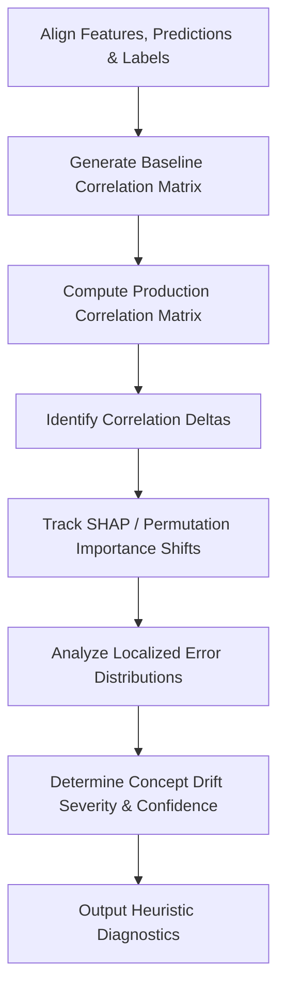

# Concept Drift Analysis Skill

## 1. Overview (Why)

### Purpose & Motivation
In production Machine Learning, model predictions depend on a mapping from feature space ($X$) to target space ($Y$). Over time, this mapping can change (i.e., the conditional probability distribution $P(Y \mid X)$ shifts), even if the input feature distribution $P(X)$ remains completely stable. This phenomenon is known as **Concept Drift**.

This skill exists to identify shifts in the relationship between input features and target labels. It helps the `ML Analyst Agent` diagnose cases where the model has become outdated or misaligned with changing environment dynamics (e.g., changing patterns of fraud, evolving macroeconomic conditions), indicating that a retraining loop or a new model architecture is required.

### Production Incidents Investigated
*   **Silent Accuracy Degradation**: Model performance falls below SLA thresholds despite zero changes in input data quality or feature distributions.
*   **Concept Shift Anomaly**: Specific features that previously correlated with the target label are no longer predictive, or their correlation has inverted.
*   **Model Decision Threshold Misalignment**: The distribution of optimal decision thresholds (e.g. classification cut-offs) changes over time.

### Placement in ML Analyst Workflow
This skill is invoked during the **Root Cause Investigation** phase, typically after both `model_performance_analysis` and `data_drift_analysis` have executed. If performance has dropped but input feature drift is absent, this skill is run to verify if the feature-to-label relationship itself has shifted.

```
[Performance Drop Detected] ──> [Data Drift: None] ──> [Invokes Concept Drift Analysis] ──> [Confirm Concept Shift]
```

---

## 2. Responsibilities (What)

### What This Skill MUST Do:
*   Measure statistical shifts in the conditional probability $P(Y \mid X)$ over time.
*   Track changes in feature correlation matrices and feature importance (e.g. SHAP or permutation importance) relative to the target label.
*   Compare prediction error distributions across feature segments to localize where the relationship broke.
*   Provide a quantitative confidence score regarding the presence of concept drift.

### What This Skill MUST NOT Do:
*   Evaluate dataset-level input feature drift ($P(X)$) — this is delegated to the `data_drift_analysis` skill.
*   Trigger retraining or automated hyperparameter optimization directly.
*   Modify inference logs or label mappings in the database.

### Scope
Evaluating shifts in the feature-to-label mappings ($P(Y \mid X)$) and changes in predictive correlations.

---

## 3. When This Skill Is Selected

This skill is selected by the `ML Analyst Agent` when performance drops cannot be explained by data quality issues or data drift.

### Alerts and Triggers

| Alert Type | Symptom / Signal | Selection Relevance |
| :--- | :--- | :--- |
| `UnexplainedAccuracyDrop` | Global performance metrics drop, but data drift metrics are below threshold. | Critical (High probability of concept drift). |
| `FeatureCorrelationShift` | Telemetry logs report changes in covariance or correlation matrices. | High (Inspect if the predictive relationship is changing). |
| `SHAPImportanceAnomaly` | Permutation feature importance rankings in production diverge from training. | High (Identify which relationships have degraded). |

---

## 4. Required Inputs

*   **Prediction Logs Path**: Logs containing predictions, features, and timestamps.
*   **Ground Truth / Labels Path**: Matched label records.
*   **Operational Configuration**:
    *   Target task type (classification/regression).
    *   Statistical threshold for correlation shifts (e.g., Cramer's V or Pearson correlation changes $\ge 0.15$).

---

## 5. Expected Evidence

*   **Correlation Matrix Telemetry**: Pairwise correlation coefficients between features and targets (reference vs. current).
*   **Error Distribution Mapping**: Residual distributions mapped against input features to check for localized error spikes.
*   **Feature Importance Shifts**: SHAP value distribution changes or permutation importance ranking deltas.

---

## 6. Investigation Workflow (How)



### Steps of the Workflow:
1.  **Context Alignment**: Create a unified dataset containing features, prediction outputs, and ground-truth labels for both reference and current windows.
2.  **Calculate Feature-Target Correlations**: Calculate Pearson/Spearman coefficients for continuous features, and Cramer's V for categorical features against the target.
3.  **Identify Deltas**: Flag any feature whose correlation with the target has shifted significantly.
4.  **Analyze Feature Importance**: Compute changes in feature importance rankings compared to the baseline training configuration.
5.  **Examine Residuals**: Group prediction errors (residuals) by feature ranges to see if errors are concentrated in specific feature regions.
6.  **Calculate Confidence & Output**: Rank hypotheses and output structured findings.

---

## 7. Root Cause Heuristics

### Heuristic 1: True Structural Concept Shift (External Dynamics Change)
*   **Symptoms**: Core features lose their predictive correlation with the target.
*   **Supporting Evidence**:
    *   Primary feature correlation drops significantly (e.g., Pearson $r$ shifts from $0.7$ to $0.2$).
    *   SHAP importance for the primary feature drops to near-zero.
*   **Conflicting Evidence**: Correlation changes are within statistical limits ($< 0.05$ delta).
*   **Confidence Signal**: High confidence if multiple features show simultaneous correlation degradation.

### Heuristic 2: Subpopulation Shift (Faux Concept Drift)
*   **Symptoms**: Overall correlation drops, but is driven by a change in input volumes for a specific cohort.
*   **Supporting Evidence**:
    *   The feature-to-label correlation remains stable within individual segments, but the segment mixture ratio has changed.
*   **Conflicting Evidence**: Segment mixture ratios are identical to the baseline.
*   **Confidence Signal**: Low confidence in true concept drift; indicates input data drift.

---

## 8. Outputs

Returns a structured dictionary containing:
*   `investigation_summary`: Human-readable summary of the concept drift status.
*   `concept_drift_detected`: Boolean flag indicating if significant concept shift occurred.
*   `shifted_relationships`: List of features showing significant correlation shifts.
*   `shap_importance_deltas`: Map of feature importance ranking changes.
*   `possible_root_causes`: Ranked hypotheses (e.g., Structural Concept Shift, Covariate Shift).
*   `confidence_score`: Score between $0.0$ and $1.0$.
*   `recommended_actions`: Short-term and long-term mitigation steps.

---

## 9. Confidence Scoring

| Confidence Level | Criteria |
| :--- | :--- |
| **High ($\ge 0.8$)** | Global performance metrics show significant drops, input data drift is absent, and multiple features show significant correlation changes ($>0.2$ delta) with high sample sizes ($N > 1000$). |
| **Medium ($0.5$ - $0.79$)** | Performance drops are present, but correlation shifts are marginal, or sample sizes are modest ($100 < N < 1000$). |
| **Low ($< 0.5$)** | Small sample sizes ($N < 100$), or correlation shifts cannot be separated from statistical noise. |

---

## 10. Recommended Actions

*   **Immediate Remediation (Short-Term)**:
    *   Bypass predictions for highly impacted segments.
    *   Update classification confidence thresholds to prevent false positives/negatives.
*   **Medium-Term Fixes**:
    *   Trigger model retraining using recent data to adapt the decision boundary.
    *   Re-calibrate model outputs using isotonic regression or Platt scaling.
*   **Long-Term Prevention**:
    *   Integrate continuous shadow evaluation processes to detect correlation shifts before they affect live users.

---

## 11. Limitations
*   **Label Delay dependency**: Requires ground-truth labels. Cannot detect concept drift in real-time if labels are delayed.
*   **Attribution Complexity**: Cannot determine the underlying real-world cause (e.g. why user preferences changed).

---

## 12. Collaboration With Other Skills

*   **Invoked Before**:
    *   `model_performance_analysis`: Provides accuracy drop signals.
    *   `data_drift_analysis`: Rules out input distribution shifts.
*   **Invoked After**:
    *   `training_pipeline_analysis`: Initiated to check if retraining can resolve the shift.

---

## 13. Example Investigation

### Observed Symptoms
An SRE alert (`UnexplainedAccuracyDrop`) was triggered for a Fraud Detection model:
*   Precision dropped from $0.85$ to $0.55$.
*   Data drift metrics on all features remained below threshold.

### Collected Evidence
*   Current batch: $10,000$ transactions.
*   **Correlation Analysis**:
    *   Correlation between `transaction_frequency` and `is_fraud` dropped from $0.68$ (Baseline) to $0.12$ (Current).
    *   SHAP importance of `transaction_frequency` dropped from rank 1 to rank 8.

### Reasoning
Since input distributions are stable, the drop in precision is driven by a change in feature-to-label relationships. Fraudsters modified their tactics, making transaction frequency no longer predictive of fraud.

### Root Cause
True Concept Drift due to changing adversarial tactics.

### Confidence Score
*   **0.88 (High)**: Clear correlation drops on high-importance features.

### Recommendations
1.  *Immediate*: Adjust model decision thresholds to increase precision.
2.  *Medium-term*: Retrain the model on recent transaction logs to capture the new patterns.

---

## 14. Future Improvements
*   **Target-Free Concept Drift Estimation**: Implement proxy-based shift detection to predict concept drift when labels are delayed.
