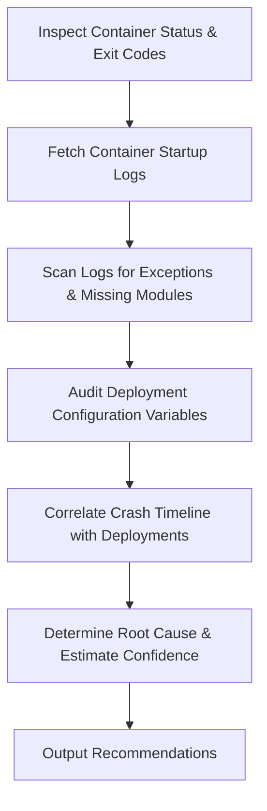

# Crash Loop Analysis Skill

## 1. Overview (Why)

### Purpose & Motivation
Model serving and data preprocessing services are typically deployed as containerized microservices (e.g. inside Kubernetes or Docker pools). A misconfigured parameter, missing dependency, or unexpected environment change can cause a container to crash immediately upon launch. If the orchestrator keeps restarting the container, it enters a **CrashLoopBackOff** state, causing prolonged downtime.

This skill exists to diagnose recursive container crashes. It allows the `ML Analyst Agent` to parse container startup logs, system calls, and infrastructure configurations to identify the cause of the loop (e.g. missing environment variables, syntax errors, incompatible Python packages, or corrupted configuration files) and recommend immediate fixes.

### Production Incidents Investigated
*   **Kubernetes CrashLoopBackOff**: Pods failing startup checks and restarting recursively.
*   **Dependency Resolution Errors**: Containers crashing due to missing Python libraries or broken requirements.
*   **Incompatible Runtime Configuration**: App failure due to missing or invalid environment variables.

---

## 2. Responsibilities (What)

### What This Skill MUST Do:
*   Retrieve container startup logs (stderr/stdout) and deployment specifications.
*   Scan logs for fatal exceptions (e.g. `ModuleNotFoundError`, `SyntaxError`, `KeyError`).
*   Extract exit codes and reason fields from the container orchestrator (e.g., `OOMKilled`, `Error`).
*   Correlate the start of the crash loop with recent git commits or deployment updates.

### What This Skill MUST NOT Do:
*   Edit application source code or build new Docker images.
*   Scale up deployment replicas — this is managed by infrastructure services.

---

## 3. When This Skill Is Selected

### Alerts and Triggers

| Alert Type | Symptom / Signal | Selection Relevance |
| :--- | :--- | :--- |
| `PodCrashLoopBackOff` | Kubernetes pod state transitions to `CrashLoopBackOff`. | Critical (Investigate startup logs immediately). |
| `ServiceUnavailable_503` | API gateway returns 503 errors because no serving pods are ready. | High (Inspect for container crashes). |

---

## 4. Required Inputs

*   **Container Logs Source**: Direct access to stdout/stderr logs of the crashing pod.
*   **Container Metadata**: Exit codes, termination reason, restart counts.
*   **Deployment Configuration**: Environmental variables, volumes, and command settings.
*   **Git Deployment Logs**: Recent commit history and deployment timestamps.

---

## 5. Expected Evidence

*   **Fatal Log Tracebacks**: Standard Python/C++ exception stack traces in logs.
*   **Restart Frequencies**: Quick sequence of restarts (e.g., 5 restarts in 2 minutes).
*   **Exit Status**: Explicit codes like `1` (general error), `137` (OOM), or `139` (segmentation fault).

---

## 6. Investigation Workflow (How)

### Steps:
1.  **Read Container Exit Code**: Query the orchestrator for the exit code and reason of the crashing pod.
2.  **Examine Startup Logs**: Fetch logs from the current and previous terminated instances.
3.  **Trace Exceptions**: Search the log text for common Python error keywords (`Traceback`, `ImportError`, `SyntaxError`, `ModuleNotFoundError`).
4.  **Audit Configuration**: Check if all environment variables specified in `.env.example` are present in the active pod env.
5.  **Correlate Deployment Time**: Check if a deployment occurred within 15 minutes of the first crash.
6.  **Report**: Compile findings.

---

## 7. Root Cause Heuristics

### Heuristic 1: Missing Environment Variable (KeyError)
*   **Symptoms**: Container starts and crashes within seconds, throwing an environment key error.
*   **Supporting Evidence**:
    *   Logs contain `KeyError: 'GEMINI_API_KEY'`.
    *   Deployment configuration shows the variable is unset.
*   **Confidence Signal**: High confidence (direct correlation).

### Heuristic 2: Broken Dependency / Package Mismatch
*   **Symptoms**: Container fails during import stages.
*   **Supporting Evidence**:
    *   Logs contain `ModuleNotFoundError: No module named 'google.adk'`.
*   **Confidence Signal**: High confidence.

---

## 8. Outputs

Returns a structured dictionary:
*   `investigation_summary`: Human-readable summary of the crash loop.
*   `exit_code`: The observed container exit code.
*   `error_type`: Class of error identified (e.g., `Missing Dependency`, `Config Error`).
*   `possible_root_causes`: Ranked hypotheses.
*   `confidence_score`: Score between $0.0$ and $1.0$.
*   `recommended_actions`: Short-term and long-term actions.

---

## 9. Confidence Scoring

*   **High ($\ge 0.8$)**: Startup logs show explicit error tracebacks and exit codes align with the traceback.
*   **Low ($< 0.5$)**: Logs are completely empty, or container exits silently without error messages.

---

## 10. Recommended Actions

*   **Immediate Remediation**:
    *   If recent deployment caused the crash: Rollback to the previous stable release.
    *   If config is missing: Add the missing environment variable and trigger a rolling update.
*   **Long-Term Prevention**:
    *   Add validation tests in CI/CD pipelines to verify that the container builds and starts up successfully before pushing it to production.
