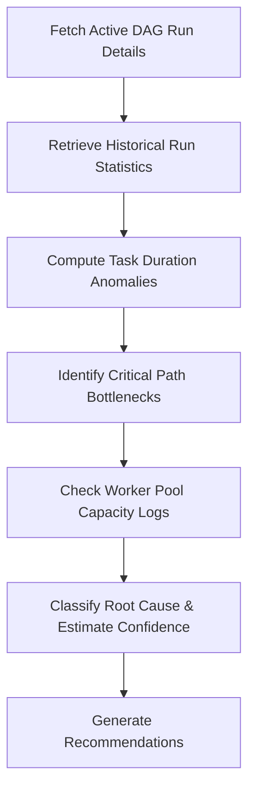

# DAG Execution Analysis Skill

## 1. Overview (Why)

### Purpose & Motivation
Data ingestion and ML pipelines are scheduled workflows. A delay in upstream stages (e.g. daily transactional data loading) propagates downstream, causing training schedules to slip or batch predictions to be missed entirely, violating service SLAs.

This skill exists to analyze historical execution times and runtime trends of DAG (Directed Acyclic Graph) runs. It allows the `ML Analyst Agent` to compare current runtimes against historical baselines, identify slow execution nodes, detect schedule slips, and determine if an incident is driven by resource queuing, data volume increases, or network latency.

### Production Incidents Investigated
*   **DAG Run Delay / Timeout**: A workflow run takes significantly longer than its scheduled duration.
*   **Slipping Schedule**: Tasks start execution later than scheduled due to worker pool exhaustion or scheduling locks.
*   **Step Runtime Anomalies**: A specific task inside a DAG runs $3\times$ slower than its historical average.

---

## 2. Responsibilities (What)

### What This Skill MUST Do:
*   Retrieve DAG execution times and individual task runtimes from the orchestrator database or API.
*   Compute historical runtime distributions (means, standard deviations) for the target DAG.
*   Identify tasks showing statistically significant runtime increases (runtimes exceeding $+3$ standard deviations).
*   Trace dependency paths to identify the critical path bottleneck in the DAG.

### What This Skill MUST NOT Do:
*   Restart or clear DAG runs — this is managed by remediation tools.
*   Edit DAG definition files or python code.

---

## 3. When This Skill Is Selected

### Alerts and Triggers

| Alert Type | Symptom / Signal | Selection Relevance |
| :--- | :--- | :--- |
| `DagRunTimeoutAlert` | A DAG execution run fails to complete within the allocated timeout. | Critical (Inspect task durations). |
| `DownstreamDataDelay` | Target prediction tables are empty or stale. | High (Trace execution path). |

---

## 4. Required Inputs

*   **DAG Run History**: Execution times of previous runs (minimum 10 runs).
*   **Active DAG Run ID**: The ID of the current delayed/failed run.
*   **Target Identifier**: `dag_id`.

---

## 5. Expected Evidence

*   **Task Duration Timeline**: Durations of all tasks in the active run.
*   **Historical Baselines**: Standard deviations and average runtimes for each task node.
*   **Worker Pool Queue Metrics**: Active task slots and queue depth in the worker pool.

---

## 6. Investigation Workflow (How)

### Steps:
1.  **Retrieve DAG Logs**: Fetch the active DAG run task duration list.
2.  **Generate Baselines**: Calculate the historical mean and standard deviation of each task over the last 30 executions.
3.  **Flag Anomalies**: Identify tasks where $\text{duration} > \text{mean} + 3\sigma$.
4.  **Trace Critical Path**: Identify the sequence of dependent tasks that represents the longest path to completion.
5.  **Examine Worker Queues**: Audit worker scheduling delays to see if tasks were delayed in `queued` state due to lack of worker capacity.
6.  **Report**: Compile findings.

---

## 7. Root Cause Heuristics

### Heuristic 1: Critical Path Task Slowness (Code/Data Driven)
*   **Symptoms**: A single task on the critical path runs significantly slower than normal, keeping the DAG running.
*   **Supporting Evidence**:
    *   `preprocess_data` duration is $5\sigma$ above mean.
    *   The task transitioned from `running` to `success` but took 4 hours instead of 10 minutes.
*   **Confidence Signal**: High confidence.

### Heuristic 2: Worker Pool Starvation (Scheduling Lock)
*   **Symptoms**: Tasks remain in `queued` state for long periods before running.
*   **Supporting Evidence**:
    *   `queued_duration` for tasks is $>30$ minutes (Baseline: $<10$ seconds).
    *   Orchestrator queue depth metrics are high.
*   **Confidence Signal**: High confidence (indicates resource constraints in the worker pool).

---

## 8. Outputs

Returns a structured dictionary:
*   `investigation_summary`: Human-readable summary of the runtimes.
*   `dag_id`: The ID of the investigated DAG.
*   `anomalous_tasks`: List of slow tasks.
*   `critical_path_bottleneck`: The primary bottleneck task.
*   `possible_root_causes`: Ranked hypotheses.
*   `confidence_score`: Score between $0.0$ and $1.0$.
*   `recommended_actions`: Corrective actions.

---

## 9. Confidence Scoring

*   **High ($\ge 0.8$)**: DAG history is complete, showing a clear, statistically significant duration spike on the critical path or clear worker queue delays.
*   **Low ($< 0.5$)**: Insufficient historical runs to compute reliable standard deviations.

---

## 10. Recommended Actions

*   **Immediate Remediation**:
    *   If a task is hung: Terminate and restart the container.
    *   If worker pool is starved: Scale up the number of celery/Kubernetes task workers.
*   **Long-Term Prevention**:
    *   Optimize slow SQL/Python queries in the identified bottleneck task.
