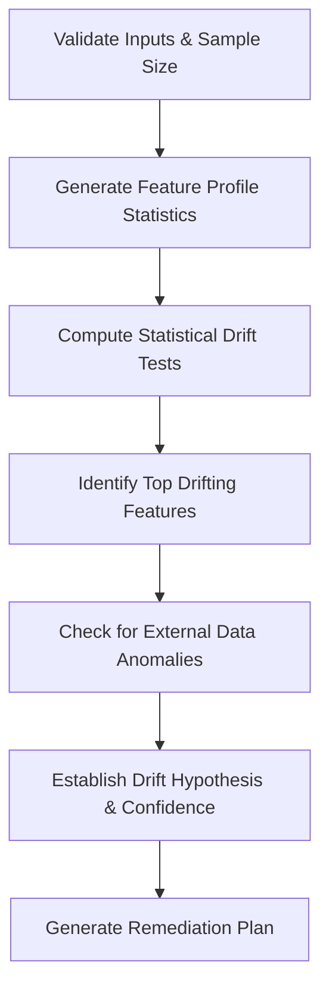

# Data Drift Analysis Skill

## 1. Overview (Why)

### Purpose & Motivation
Machine Learning models are built on the fundamental assumption that the statistical distribution of the serving data remains consistent with the training dataset. In real-world production environments, this assumption is frequently violated due to changing user behavior, shifting environmental factors, or upstream pipeline modifications. This phenomenon is known as **Data Drift**.

This skill exists to systematically identify, quantify, and localize changes in the statistical properties of input features. It prevents model performance degradation by allowing the `ML Analyst Agent` to diagnose drift-induced failures early, before they propagate to downstream business metrics.

### Production Incidents Investigated
*   **Accuracy / F1 Score Degradation**: Downstream model prediction quality drops without any change in model code or architecture.
*   **Prediction Distribution Shift**: The ratio of predicted classes or regression ranges diverges from historical baselines.
*   **Inference Failures / Outlier Ingestion**: Ingestion of unexpected values that the model was not trained to handle.

### Placement in ML Analyst Workflow
This skill sits at the interface between **Incident Detection** and **Root Cause Investigation**. It is dynamically invoked when the platform detects performance degradation or prediction distribution anomalies to determine if changes in the raw inputs are the primary driver of the failure.

```
[Incident Alert] ──> [ML Analyst Agent] ──> [Invokes Data Drift Analysis] ──> [RCA Report]
```

---

## 2. Responsibilities (What)

### What This Skill MUST Do:
*   Calculate statistical drift distances (e.g., Kolmogorov-Smirnov, Wasserstein distance, Population Stability Index) across input features.
*   Differentiate between transient noise and statistically significant distribution shifts.
*   Identify which specific features or feature cohorts contribute most to the overall dataset drift.
*   Provide a quantitative confidence score regarding the presence of data drift.

### What This Skill MUST NOT Do:
*   Perform model retraining or trigger pipeline runs directly.
*   Compute model performance metrics (e.g., Accuracy, Precision, Recall) — this is delegated to the `model_performance_analysis` skill.
*   Modify upstream data tables or clean invalid values.

### Scope
The boundary of this skill is strictly statistical evaluation of input dataset features (inference data vs. baseline reference data).

---

## 3. When This Skill Is Selected

This skill is dynamically selected by the `ML Analyst Agent` when the incident signature points to changes in the data landscape.

### Alerts and Triggers

| Alert Type | Symptom / Signal | Selection Relevance |
| :--- | :--- | :--- |
| `DownstreamAccuracyDrop` | Model precision or recall falls below acceptable operational thresholds. | High (Verify if input drift is causing the drop). |
| `PredictionDistributionShift` | The ratio of positive fraud labels or forecast ranges spikes anomaly flags. | Critical (Determines if label distribution shift is input-driven). |
| `FeatureValueOutOfRange` | Upstream telemetry logs report out-of-bounds feature values. | High (Quantify the extent of the distribution change). |
| `UpstreamSchemaChange` | Columns added, deleted, or data types modified in the feature store. | Medium (Evaluate statistical impact of the change). |

---

## 4. Required Inputs

The skill requires reference and current data windows along with metadata mappings:

*   **Reference Dataset Path / Connection**: Historical batch or training dataset representing the baseline distribution.
*   **Current Dataset Path / Connection**: Production inference dataset representing the active evaluation window.
*   **Feature Schema Metadata**:
    *   List of numerical features.
    *   List of categorical features.
    *   Target column name (optional).
*   **Operational Thresholds**:
    *   `drift_threshold`: Significance level (e.g., $p$-value limit or PSI threshold).
    *   `min_sample_size`: Minimum number of records required in both windows to run validation.

---

## 5. Expected Evidence

Before reaching diagnostic conclusions, the skill collects and analyzes the following evidence:

*   **Statistical Metrics**:
    *   Kolmogorov-Smirnov (KS) $p$-values for numerical features.
    *   Population Stability Index (PSI) values for categorical/numerical features.
    *   Wasserstein Distance (Earth Mover's Distance) for continuous features.
*   **Dataset Profiles**:
    *   Missing value percentages per feature in reference vs. current datasets.
    *   Mean, variance, and quantile metrics for numerical features.
    *   Category frequency distributions for categorical features.
*   **Infrastructure Context**:
    *   Timestamps of inference logging.
    *   Version metadata of the feature pipeline code.

---

## 6. Investigation Workflow (How)



### Steps of the Workflow:
1.  **Validate Incident Data**: Check if the current and reference datasets meet the minimum row limit (`min_sample_size`). Exit if data is insufficient.
2.  **Profile Features**: Compute summary statistics (mean, quantiles, null counts) for both datasets.
3.  **Run Statistical Tests**:
    *   Apply the KS-test to numerical features (flag drift if $p < 0.05$).
    *   Apply Chi-Square tests to categorical features.
    *   Calculate the Population Stability Index (PSI) (flag moderate drift if $\text{PSI} \ge 0.1$, severe if $\text{PSI} \ge 0.25$).
4.  **Localize Drift**: Rank features by statistical significance to pinpoint the exact columns that have shifted.
5.  **Examine Confounding Factors**: Verify if the drift is caused by data quality errors (e.g., null insertion spikes) rather than organic distribution changes.
6.  **Assess Confidence**: Calculate the confidence score based on sample sizes and the proportion of drifting features.
7.  **Formulate Recommendations**: Map findings to targeted corrective suggestions.

---

## 7. Root Cause Heuristics

The skill evaluates the gathered evidence against established SRE/ML heuristics to pinpoint the cause:

### Heuristic 1: Upstream Pipeline Schema Shift (Data Quality Induced)
*   **Symptoms**: High null counts, default value spikes, or structural format changes.
*   **Supporting Evidence**:
    *   Null ratio increases from $<0.1\%$ in reference to $>10\%$ in current window.
    *   Statistical test indicates $100\%$ drift on a specific feature, accompanied by a single repeated constant value.
*   **Conflicting Evidence**: Baseline statistics and null ratios remain unchanged between reference and current windows.
*   **Confidence Signal**: High confidence if schema logs match data quality failures.

### Heuristic 2: Organic User Behavior Shift
*   **Symptoms**: Gradual shift in continuous features over weeks/months.
*   **Supporting Evidence**:
    *   PSI increases incrementally over consecutive days.
    *   No change in data pipeline deployment history.
*   **Conflicting Evidence**: Abrupt, step-change drop in feature values coinciding with an upstream software release.
*   **Confidence Signal**: Medium confidence (requires correlation with time-series trends).

### Heuristic 3: Temporary External Event (Seasonality/Holidays)
*   **Symptoms**: Sudden spike in transactional features that returns to baseline quickly.
*   **Supporting Evidence**:
    *   Drift detected on specific event-driven features (e.g., transaction volume, search keywords).
    *   Matches holiday or promotional calendar dates.
*   **Conflicting Evidence**: Drift persists long after the event window closes.
*   **Confidence Signal**: Medium/Low (requires external context).

---

## 8. Outputs

The skill returns a structured dictionary containing:

*   **`investigation_summary`**: High-level, human-readable summary of the statistical drift findings.
*   **`dataset_drift_detected`**: Boolean flag indicating if overall dataset drift exceeds the threshold.
*   **`drifted_feature_ratio`**: Fraction of features that show statistically significant drift.
*   **`evidence`**: Detailed map of features with their corresponding test statistics, $p$-values, and PSI scores.
*   **`possible_root_causes`**: List of ranked hypotheses (e.g., Upstream Pipeline Issue, True Behavior Drift).
*   **`confidence_score`**: Value between $0.0$ and $1.0$.
*   **`recommended_actions`**: Operational steps to mitigate the drift.
*   **`preventive_actions`**: Suggestions to prevent recurring failures.
*   **`limitations`**: Limitations encountered during the run (e.g., small sample sizes).

---

## 9. Confidence Scoring

Confidence estimation is determined using a deterministic evaluation matrix:

| Confidence Level | Criteria |
| :--- | :--- |
| **High ($\ge 0.8$)** | Sufficient sample size ($N > 1000$ in both windows), statistical tests agree ($p < 0.01$ and $\text{PSI} \ge 0.25$), and there are no confounding data-quality anomalies. |
| **Medium ($0.5$ - $0.79$)** | Sufficient sample size, but mild statistical indicators ($0.1 \le \text{PSI} < 0.25$) or small conflicting patterns in some feature groups. |
| **Low ($< 0.5$)** | Small sample sizes ($N < 100$), missing feature columns in the current window, or multiple competing hypotheses cannot be statistically separated. |

---

## 10. Recommended Actions

*   **Immediate Remediation (Short-Term)**:
    *   If drift is severe: Route traffic to a fallback rule-based engine or a simpler baseline model.
    *   Trigger automated fallback data imputation if the drift is caused by a missing value spike.
*   **Medium-Term Fixes**:
    *   Schedule an immediate model retraining run using the newly drifted dataset window as part of the training set.
    *   Re-calibrate decision thresholds to align with the new distribution.
*   **Long-Term Prevention**:
    *   Implement upstream schema contract validation (e.g., Great Expectations or Pydantic gates) in feature engineering pipelines to prevent silent data alterations.

---

## 11. Limitations
*   **Concept Drift Isolation**: This skill cannot verify if the relationship between features and labels has changed (**Concept Drift**) — it only analyzes feature distribution shifts. Concept drift requires target labels, which are often delayed.
*   **Small Sample Sizes**: Under-represents drift on small batch slices ($N < 50$), as statistical tests lose statistical power.
*   **Causality**: Identifies *correlation* of distribution changes, but cannot determine *why* users changed their behavior.

---

## 12. Collaboration With Other Skills

*   **Invoked Before**: None in the current skill catalog. A future anomaly-verification skill, if added, would typically run before this one to confirm the alert reflects a real out-of-range observation.
*   **Invoked After / In Parallel**:
    *   `model_performance_analysis`: Invoked in parallel to correlate whether the detected data drift is actually causing performance loss (see [`skill_selection_engine.md §13`](../../docs/specifications/skill_selection_engine.md) for the worked example).
    *   `root_cause_prioritization`: Uses the output of this skill, alongside `model_performance_analysis`, to rank input shifts against other candidate causes.

    A future concept-drift skill — triggered when performance drops but this skill finds no significant input drift — is not yet part of the catalog; see [`root_cause_analysis.md`](../../docs/specifications/root_cause_analysis.md) for how such an evidence-triggered second wave would work once added.

---

## 13. Example Investigation

### Observed Symptoms
An alert (`DownstreamAccuracyDrop`) was triggered for the `Fraud_Detection_XGBoost` model serving credit transactions:
*   F1-score dropped from $0.92$ to $0.78$ dataset-wide.
*   No deployment or pipeline version changes were recorded.

### Collected Evidence
*   Current inference batch: $15,000$ transactions; Baseline reference: $50,000$ transactions.
*   **Feature Analysis**:
    *   `user_zipcode`: Null values spiked to $18.5\%$ in current batch (Baseline: $0.02\%$).
    *   `transaction_amount`: Mean value increased from $\$45.00$ to $\$120.00$ (KS-test $p < 0.0001$, $\text{PSI} = 0.32$).
    *   `device_type`: Chi-Square test indicated no significant distribution changes ($p = 0.45$).

### Reasoning
The statistical tests indicate high dataset drift driven primarily by `user_zipcode` (null spike) and `transaction_amount` (substantial shift). Since `user_zipcode` is a high-importance categorical feature for regional fraud heuristics, its missing values cause the XGBoost model to fallback to sub-optimal default path branches, directly explaining the F1-score drop.

### Root Cause
Upstream pipeline failure resulting in missing location data (`user_zipcode`) coupled with organic increases in transaction volume.

### Confidence Score
*   **0.92 (High)**: Large sample sizes, clear statistical metrics, and logical link between missing inputs and model degradation.

### Recommendations
1.  *Immediate*: Deploy default regional imputation rules for null zip codes.
2.  *Medium-term*: Fix upstream service logging issue in the payment gateway api.
3.  *Long-term*: Add Pydantic schema validation to block inference batches containing $>1\%$ missing values.

---

## 14. Future Improvements
*   **Adversarial Shift Detection**: Integrate auto-encoder reconstruction error tracking to detect out-of-distribution drift for high-dimensional images and unstructured texts.
*   **Real-time Feature Drift Estimation**: Implement streaming window algorithms (e.g., ADWIN) to estimate drift metrics on streaming features with low latency.
