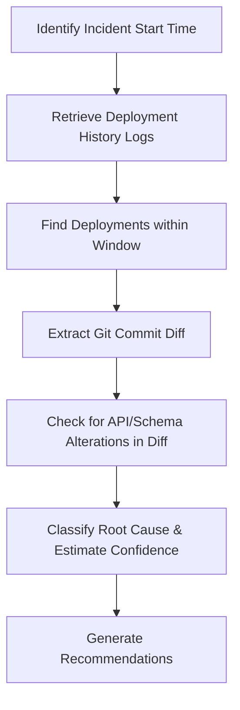

# Deployment Regression Skill

## 1. Overview (Why)

### Purpose & Motivation
Production systems are continuously updated with new model versions, software patches, or configuration changes. A regression can occur immediately after a release due to incompatible model weights, library version updates, or incorrect environmental configurations, causing downstream prediction errors.

This skill exists to identify and analyze regressions associated with deployments. It correlates the timeline of incident occurrences with Git and deployment histories, helping the `ML Analyst Agent` determine if a recent deployment caused the failure, identifying the exact commit or version that introduced the regression, and recommending rollback options.

### Production Incidents Investigated
*   **Post-Deployment Accuracy Drop**: Model performance metrics degrade immediately after a model swap.
*   **Inference API Outage**: Prediction service crashes after a code deployment.
*   **Schema Validation Failures**: Upstream pipeline updates break downstream API contracts.

---

## 2. Responsibilities (What)

### What This Skill MUST Do:
*   Retrieve Git commit history and container deployment logs (timestamps, image tags, config values).
*   Correlate deployment timestamps with the exact start time of the incident telemetry anomaly.
*   Extract the diff between the currently deployed code/model and the previously stable version.

### What This Skill MUST NOT Do:
*   Automatically trigger rollbacks or execute Git commands — this is delegated to the remediation tool layer.
*   Debug code logic errors directly in the commit diff.

---

## 3. When This Skill Is Selected

### Alerts and Triggers

| Alert Type | Symptom / Signal | Selection Relevance |
| :--- | :--- | :--- |
| `IncidentAfterDeployment` | An anomaly alert fires within 15 minutes of a registered system deployment. | Critical (Correlate deployment immediately). |
| `ModelUpgradeRegression` | Downstream recall drops immediately after a new model tag is promoted. | Critical (Trace model version diff). |

---

## 4. Required Inputs

*   **Deployment Logs**: History of system deployments (timestamps, versions).
*   **Git Commit History**: List of recent commits (messages, authors, diffs).
*   **Incident Start Time**: Timestamp of the first observed symptom.

---

## 5. Expected Evidence

*   **Temporal Match**: Deployment timestamp and incident start timestamp are within a parameterized window (e.g., $\Delta t \le 15$ minutes).
*   **Git Diff**: Code changes indicating modified feature logic or API changes.

---

## 6. Investigation Workflow (How)

### Steps:
1.  **Map Timeline**: Determine the exact timestamp when the incident started.
2.  **Search Deployments**: Scan deployment histories to find any changes within 1 hour preceding the incident.
3.  **Extract Diff**: Fetch the Git diff of the identified deployment.
4.  **Audit Diff**: Check for changes in feature serialization, API ports, or dependencies.
5.  **Report**: Compile findings.

---

## 7. Root Cause Heuristics

### Heuristic 1: Regression Caused by Recent Deployment
*   **Symptoms**: Performance or service failure starts immediately after a deployment.
*   **Supporting Evidence**:
    *   Deployment completed at 14:05:00.
    *   API returns 500 errors starting at 14:05:10.
    *   Git diff shows that a feature name was renamed.
*   **Confidence Signal**: High confidence.

### Heuristic 2: Coincidental Deployment (False Positives)
*   **Symptoms**: Deployment occurs near the incident, but the failure is driven by external sources (e.g. data drift).
*   **Supporting Evidence**:
    *   Deployment was a documentation-only update.
    *   Inference data logs show data drift on features unaffected by the deployment.
*   **Confidence Signal**: Low confidence.

---

## 8. Outputs

Returns a structured dictionary:
*   `investigation_summary`: Human-readable summary of the deployment correlation.
*   `deployment_regression_detected`: Boolean flag.
*   `deployed_version`: The tag/version that introduced the error.
*   `git_diff_summary`: Summary of files changed.
*   `possible_root_causes`: Ranked hypotheses.
*   `confidence_score`: Score between $0.0$ and $1.0$.
*   `recommended_actions`: Short-term and long-term actions.

---

## 9. Confidence Scoring

*   **High ($\ge 0.8$)**: Failure starts immediately after a code/model swap, and Git diff shows direct changes to the failing component.
*   **Low ($< 0.5$)**: Deployment occurred but was hours before the incident, or did not touch any relevant code.
---

## 10. Recommended Actions

*   **Immediate Remediation**:
    *   Execute immediate rollback to the last stable deployment tag.
    *   Mute traffic routing to the newly deployed model and fallback to shadow/active instances.
