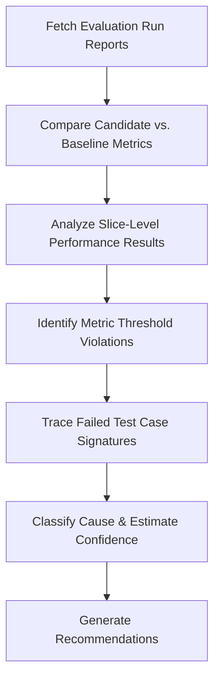

# Evaluation Analysis Skill

## 1. Overview (Why)

### Purpose & Motivation
Before any model candidate is promoted to production, it must undergo offline evaluation against golden test datasets, validation test sets, and system boundaries. If the evaluation pipeline fails, or a candidate fails to meet validation thresholds (e.g. latency, fairness, accuracy), the release must be blocked.

This skill exists to audit and evaluate model verification runs. It allows the `ML Analyst Agent` to inspect offline evaluation metrics, trace failures in regression suites, evaluate bias/fairness scorecards, and determine why a candidate model was blocked during pre-deployment evaluation gates.

### Production Incidents Investigated
*   **Offline Validation Failure**: A model candidate fails to meet the accuracy threshold on the golden test dataset.
*   **Regression Suite Anomaly**: A new model shows regressions on critical test cases that the previous model handled correctly.
*   **Fairness / Bias gate violations**: Candidate model prediction distributions show significant bias across sensitive attributes.

---

## 2. Responsibilities (What)

### What This Skill MUST Do:
*   Retrieve evaluation metrics (Accuracy, ROC-AUC, latency) from pre-production runs.
*   Audit performance on slice-based test sets to identify localized regressions.
*   Compare candidate model validation results against active production baselines.

### What This Skill MUST NOT Do:
*   Promote models to production or reject images in the container registry.
*   Define new golden evaluation datasets or modify test metrics.

---

## 3. When This Skill Is Selected

### Alerts and Triggers

| Alert Type | Symptom / Signal | Selection Relevance |
| :--- | :--- | :--- |
| `EvaluationSuiteFailed` | CI/CD pipeline reports that the model evaluation stage failed. | Critical (Audit validation metrics). |
| `ModelPromotionBlocked` | Deployment engine blocks model swap due to threshold violations. | Critical (Trace metric failure). |

---

## 4. Required Inputs

*   **Evaluation Metrics Source**: Logs containing validation metrics (classification/regression/latency).
*   **Validation Dataset Metadata**: Size, columns, and target tags of the test dataset.
*   **Baseline Performance Metrics**: Metrics of the currently deployed model for comparison.

---

## 5. Expected Evidence

*   **Validation Scorecard**: Detailed matrix of candidate vs. baseline metrics.
*   **Slice-Level Performance**: Recall or RMSE metrics computed per segment (e.g., gender, country) to check for bias or localized drops.

---

## 6. Investigation Workflow (How)

### Steps:
1.  **Retrieve Scorecard**: Fetch the validation scorecard generated by the evaluation runner.
2.  **Compare Metrics**: Compare global accuracy, latency, and resource footprint of the candidate against the baseline.
3.  **Audit Slice Metrics**: Review performance across segments to check for bias or localized regression.
4.  **Identify Failures**: Flag any metric that violates deployment gate thresholds.
5.  **Report**: Compile findings.

---

## 7. Root Cause Heuristics

### Heuristic 1: Latency Threshold Violation
*   **Symptoms**: Accuracy passes, but latency metrics violate SLA limits (e.g., $p95 > 50\text{ms}$).
*   **Supporting Evidence**:
    *   Model size increased by $5\times$.
    *   Latency metric shows a significant increase during load testing.
*   **Confidence Signal**: High confidence.

### Heuristic 2: Subpopulation Regression (Localized Drop)
*   **Symptoms**: Candidate passes global accuracy check, but fails on a critical slice.
*   **Supporting Evidence**:
    *   Recall on `region = EMEA` drops by $20\%$ compared to baseline.
*   **Confidence Signal**: High confidence.

---

## 8. Outputs

Returns a structured dictionary:
*   `investigation_summary`: Human-readable summary of the evaluation run.
*   `candidate_passed`: Boolean flag.
*   `failed_thresholds`: List of metrics violating gates.
*   `possible_root_causes`: Ranked hypotheses.
*   `confidence_score`: Score between $0.0$ and $1.0$.
*   `recommended_actions`: Short-term and long-term actions.

---

## 9. Confidence Scoring

*   **High ($\ge 0.8$)**: Evaluation logs are complete, showing clear, verifiable threshold violations.
*   **Low ($< 0.5$)**: Evaluation metrics or baseline statistics are missing.
