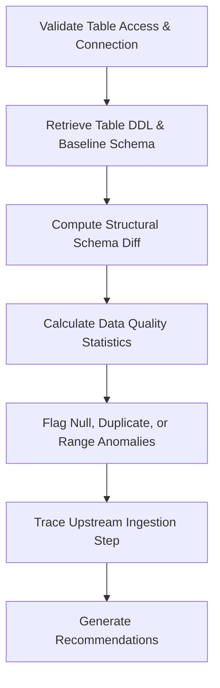

# Feature Pipeline Analysis Skill

## 1. Overview (Why)

### Purpose & Motivation
ML models consume features engineered by upstream processing pipelines. When feature engineering pipelines fail, fail silently, or ingest corrupted data, the resulting tables will contain negative values, duplicate keys, null values, or incorrect formats. If this corrupted data reaches the inference database, it degrades downstream model prediction quality.

This skill exists to audit and analyze feature pipeline outputs. It allows the `ML Analyst Agent` to inspect tabular database tables, feature stores, and transformation steps to identify data quality anomalies (e.g., duplicate values, null spikes, schema alterations, or invalid value ranges) and isolate which upstream ingestion stage caused the corruption.

### Production Incidents Investigated
*   **Feature Null Spikes**: Significant increase in missing values inside a critical model input feature.
*   **Duplicate Features**: Primary key duplication in feature store entries leading to multi-row matches.
*   **Schema Drift**: Alterations in table column counts, names, or datatypes.

---

## 2. Responsibilities (What)

### What This Skill MUST Do:
*   Inspect database tables and feature stores to compute null ratios, duplicate ratios, and min/max ranges.
*   Compare current schemas against baseline DDL definitions to detect columns added, removed, or changed.
*   Isolate the specific features that violate data quality rules.

### What This Skill MUST NOT Do:
*   Compute model accuracy or run drift algorithms — this is delegated to other skills.
*   Modify or write data to the production feature tables.

---

## 3. When This Skill Is Selected

### Alerts and Triggers

| Alert Type | Symptom / Signal | Selection Relevance |
| :--- | :--- | :--- |
| `FeatureNullAlert` | The ratio of nulls in a critical feature exceeds the $1\%$ threshold. | Critical (Verify the null spike). |
| `FeatureSchemaDrift` | Table metadata indicates a modification in the schema of the feature store. | Critical (Verify datatype or column changes). |

---

## 4. Required Inputs

*   **Feature Store / Table Connection**: Access to the active feature database tables.
*   **Baseline Schema Definition**: The expected column names, types, and constraints.
*   **Audit Window**: Start and end timestamps of the batch run.

---

## 5. Expected Evidence

*   **Data Quality Report**: Summary of null rates, duplicate counts, and out-of-range values.
*   **DDL Diff**: Structural schema diff of the target tables.

---

## 6. Investigation Workflow (How)

### Steps:
1.  **Read Table DDL**: Extract active column properties and compare them to the baseline schema.
2.  **Calculate Ratios**: Run queries to compute the ratio of nulls, duplicates, and out-of-bounds rows.
3.  **Identify Failed Columns**: List features violating data constraints.
4.  **Trace Lineage**: Audit pipeline metadata to locate the upstream task responsible for writing the column.
5.  **Report**: Compile findings.

---

## 7. Root Cause Heuristics

### Heuristic 1: Upstream Database Schema Change
*   **Symptoms**: Column names are missing, or datatypes change (e.g. `FLOAT` to `VARCHAR`).
*   **Supporting Evidence**:
    *   DDL Diff shows column `user_age` was changed to type string.
    *   Query fails due to syntax error in downstream mathematical transformations.
*   **Confidence Signal**: High confidence.

### Heuristic 2: Silent Ingestion Failure
*   **Symptoms**: Columns are intact, but null counts spike.
*   **Supporting Evidence**:
    *   Null ratio for `zip_code` spikes from $0\%$ to $95\%$.
    *   Upstream API logs indicate a connection timeout with the location provider service.
*   **Confidence Signal**: High confidence.

---

## 8. Outputs

Returns a structured dictionary:
*   `investigation_summary`: Human-readable summary of the feature pipeline status.
*   `schema_drift_detected`: Boolean flag.
*   `data_quality_anomalies`: List of columns violating constraints.
*   `failed_features`: List of feature names showing quality drops.
*   `possible_root_causes`: Ranked hypotheses.
*   `confidence_score`: Score between $0.0$ and $1.0$.
*   `recommended_actions`: Short-term and long-term actions.

---

## 9. Confidence Scoring

*   **High ($\ge 0.8$)**: Statistical metrics show clear, unambiguous data quality failures (e.g. null ratios $>10\%$ or schema differences).
*   **Low ($< 0.5$)**: Database is unreachable, or table contains no records.

---

## 10. Recommended Actions

*   **Immediate Remediation**:
    *   Apply fallback imputation (e.g. median/mode values) for null features.
    *   Block pipeline execution to prevent corrupt data from reaching the model.
*   **Long-Term Prevention**:
    *   Add Pydantic schema validation steps to the ingestion endpoint.
