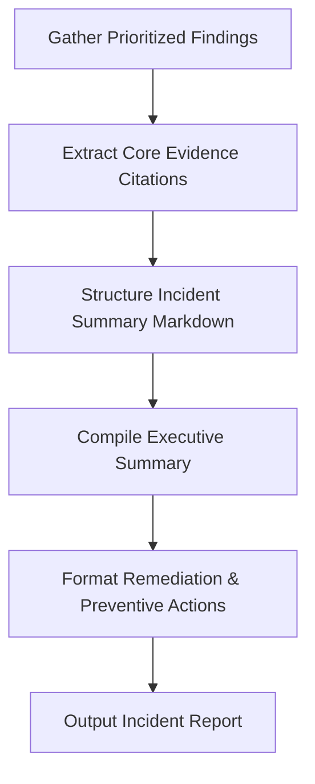

# Incident Summary Skill

## 1. Overview (Why)

### Purpose & Motivation
When an incident is resolved, SRE teams require a clean, structured post-mortem or incident summary for audit logs, retrospectives, and compliance. Generating these summaries manually takes hours of developer time and results in inconsistent, unstructured reports.

This skill exists to compile evidence, diagnostics, and root cause findings into a standardized executive incident summary. It consumes all collected outputs from the `ML Analyst Agent` and generates a clear post-mortem report (Overview, Symptoms, Root Cause, Remediation Actions, and Preventative Actions) following Google SRE best practices.

### Production Incidents Investigated
*   **Post-Mortem Generation**: Automated generation of incident summary reports at session completion.
*   **Executive Logging**: Writing incident records to long-term databases.

---

## 2. Responsibilities (What)

### What This Skill MUST Do:
*   Collect the outputs of all active skills and root cause prioritization results.
*   Compile an executive summary in plain engineering language.
*   Format the report into structured Markdown conforming to Google SRE templates.

### What This Skill MUST NOT Do:
*   Perform raw diagnostics, statistics, or log analysis.
*   Close tickets or update status fields in JIRA/PagerDuty directly.

---

## 3. When This Skill Is Selected

### Alerts and Triggers
*   **Orchestration Finalization**: Invoked automatically by the `ML Analyst Agent` at the end of the execution run.

---

## 4. Required Inputs

*   **Prioritized Findings**: The outputs of the `root_cause_prioritization` skill.
*   **Evidence List**: Map of all collected metrics and logs.

---

## 5. Expected Evidence

*   **Resolution State**: Details of whether remediation was successfully executed, pending approval, or rejected.

---

## 6. Investigation Workflow (How)

### Steps:
1.  **Read Inputs**: Ingest all prioritized findings and evidence citations.
2.  **Draft Executive Summary**: Write a concise paragraph explaining the incident, impact, and root cause.
3.  **Structure Details**: Populate sections: Observed Symptoms, Evidence, Root Cause, Actions Taken, and Preventative Suggestions.
4.  **Validate Output**: Ensure no placeholders or empty templates are returned.
5.  **Output**: Return the generated Markdown text.

---

## 7. Root Cause Heuristics

Not applicable. This is a compilation and reporting skill.

---

## 8. Outputs

Returns a structured dictionary:
*   `investigation_summary`: Human-readable summary of the generation run.
*   `incident_report_md`: The formatted Markdown report containing:
    *   Executive Summary
    *   Incident Timeline
    *   Evidence Citations
    *   Root Cause Analysis
    *   Remediation Actions
    *   Preventive Recommendations
*   `confidence_score`: Score between $0.0$ and $1.0$.

---

## 9. Confidence Scoring

*   **High ($\ge 0.8$)**: Structured findings from all upstream analysis stages are present and complete.
*   **Low ($< 0.5$)**: Upstream root cause prioritization was unsuccessful or missing.
---

## 10. Recommended Actions

*   **Immediate Remediation**:
    *   Save the generated report to the PostgreSQL audit store.
*   **Long-Term Prevention**:
    *   Include these post-mortems in quarterly operational reviews to track recurring system weaknesses.
