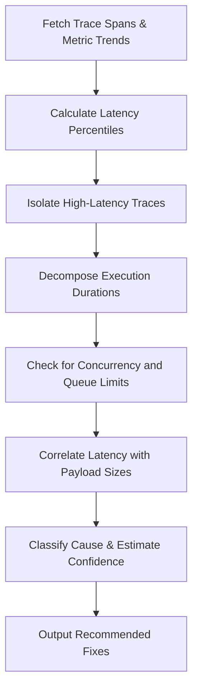

# Latency Analysis Skill

## 1. Overview (Why)

### Purpose & Motivation
Machine Learning inference requests are often part of real-time user-facing flows (e.g., ad recommendations, fraud screening, search autocomplete). If model serving latency exceeds established SLAs (typically sub-100ms), it causes upstream timeouts, system degradation, or poor user experience.

This skill exists to systematically decompose and analyze request-response latency. It parses tracing data and component-level duration metrics to help the `ML Analyst Agent` isolate where latency is occurring (e.g. model execution bottlenecks, network overhead, feature store fetch delays, serialization/deserialization CPU costs) and recommend targeted fixes.

### Production Incidents Investigated
*   **Inference Latency Spike**: High latency on prediction endpoints violating serving SLAs.
*   **Queue Accumulation**: High request arrival rate coupled with slow inference times, causing queue congestion.
*   **Downstream Timeout Errors**: Model gateway timeout alerts occurring upstream of the serving nodes.

### Placement in ML Analyst Workflow
This skill is part of the **Performance Diagnostics** branch. It is dynamically called when latency-related alerts are received to locate the component responsible for the delay.

```
[Latency Alert] ──> [ML Analyst Agent] ──> [Invokes Latency Analysis] ──> [Isolate Bottleneck Component]
```

---

## 2. Responsibilities (What)

### What This Skill MUST Do:
*   Collect and analyze end-to-end tracing metrics (e.g. OpenTelemetry spans) and compute percentiles ($p50$, $p95$, $p99$).
*   Decompose total duration into component-level execution times: Data Fetching, Preprocessing, Model Inference (Forward Pass), Postprocessing, and Serialization.
*   Detect concurrency limits and queue saturation flags.
*   Correlate latency spikes with payload parameters (e.g. batch size, image dimensions).

### What This Skill MUST NOT Do:
*   Inspect database locks or execute query optimizations directly.
*   Alter model execution threads, batch size settings, or scale containers.

---

## 3. When This Skill Is Selected

### Alerts and Triggers

| Alert Type | Symptom / Signal | Selection Relevance |
| :--- | :--- | :--- |
| `InferenceLatencySpike` | Serving latency ($p99$ or $p95$) exceeds SLA thresholds (e.g., $>200\text{ms}$). | Critical (Analyze latency profiles immediately). |
| `GatewayTimeout` | Upstream proxies report timeout exceptions from the model server. | High (Inspect for serving delays). |
| `QueueDepthSpike` | Number of queued requests on serving container exceeds safe limits. | High (Trace execution throughput). |

---

## 4. Required Inputs

*   **Tracing Spans / Logs**: OpenTelemetry trace spans or detailed application logs containing sub-task timings.
*   **Metrics Source**: Endpoint latency percentiles, request count per second (QPS), and CPU/GPU usage metrics.
*   **Operational SLA Limits**: Threshold values for $p95$/$p99$ execution durations.

---

## 5. Expected Evidence

*   **Trace Duration Breakdowns**: Metric spans showing the duration of each sub-task in the inference request cycle.
*   **Throughput & Concurrency Metrics**: Active request counts (QPS) and active execution thread metrics.
*   **Model Input Metrics**: Average batch sizes or raw file sizes of incoming requests.

---

## 6. Investigation Workflow (How)



### Steps of the Workflow:
1.  **Retrieve Telemetry**: Query tracing repositories for spans corresponding to the alert window.
2.  **Calculate Distribution**: Compute $p50$, $p90$, $p95$, and $p99$ latencies.
3.  **Trace Decomposition**: Extract duration metrics for each component:
    *   `feature_fetching_time` (fetching features from cache/database).
    *   `preprocessing_time` (parsing features, tokenization, image resizing).
    *   `model_forward_pass_time` (actual CPU/GPU tensor computation).
    *   `postprocessing_time` (post-inference logic, formatting).
4.  **Check Concurrency**: Review request arrival rates (QPS) against active thread execution counts to detect queuing delay.
5.  **Examine Inputs**: Correlate request batch size with model execution time.
6.  **Evaluate Heuristics & Report**: Identify the dominant bottleneck and compile recommendations.

---

## 7. Root Cause Heuristics

### Heuristic 1: Feature Store Ingestion / Cache Miss Bottleneck
*   **Symptoms**: End-to-end latency is high, but model forward-pass time is extremely fast and stable.
*   **Supporting Evidence**:
    *   `feature_fetching_time` accounts for $>70\%$ of the total request duration.
    *   Cache hit ratio drops from $>99\%$ in baseline to $<50\%$ during the incident.
*   **Conflicting Evidence**: Feature store retrieval durations remain within historical limits ($<15\text{ms}$).
*   **Confidence Signal**: High confidence if trace spans show long blocks on feature-store client calls.

### Heuristic 2: Model Inference Execution Bottleneck (GPU/CPU Saturation)
*   **Symptoms**: The tensor execution stage itself accounts for the majority of the delay.
*   **Supporting Evidence**:
    *   `model_forward_pass_time` is high and increases under load.
    *   Container CPU/GPU VRAM usage is at limits.
*   **Conflicting Evidence**: Model execution times are fast, but network transmission times or serialization times are bloated.
*   **Confidence Signal**: High confidence if tensor runtime execution blocks represent the primary trace duration.

---

## 8. Outputs

Returns a structured dictionary containing:
*   `investigation_summary`: Human-readable summary of the latency incident.
*   `bottleneck_component`: The identified slow component (e.g. `Feature Fetching`, `Model Inference`).
*   `metrics`: Percentiles ($p50$, $p95$, $p99$) and component-level durations.
*   `possible_root_causes`: Ranked hypotheses.
*   `confidence_score`: Score between $0.0$ and $1.0$.
*   `recommended_actions`: Short-term and long-term actions.

---

## 9. Confidence Scoring

| Confidence Level | Criteria |
| :--- | :--- |
| **High ($\ge 0.8$)** | Trace spans are complete, showing a clear, statistically significant duration increase in a single component. |
| **Medium ($0.5$ - $0.79$)** | Latency metrics show overall increase, but trace span coverage is low or inconsistent. |
| **Low ($< 0.5$)** | Tracing data is missing, and conclusions must be drawn solely from high-level endpoint averages. |

---

## 10. Recommended Actions

*   **Immediate Remediation (Short-Term)**:
    *   Enable short-circuit timeouts to reject slow requests early and prevent queue congestion.
    *   Route traffic to lightweight fallback models or static cached responses.
*   **Medium-Term Fixes**:
    *   Add read replicas to the feature cache database.
    *   Enable dynamic request batching on the inference engine to maximize GPU utilization.
*   **Long-Term Prevention**:
    *   Optimize model execution architectures (e.g. compile using TensorRT, ONNX Runtime).
