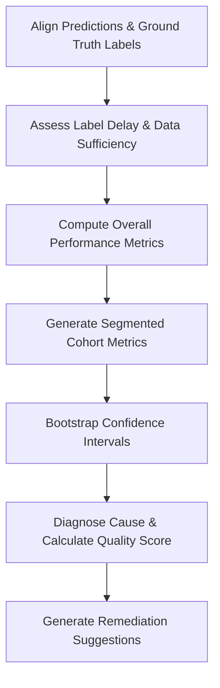

# Model Performance Analysis Skill

## 1. Overview (Why)

### Purpose & Motivation
A deployed Machine Learning model represents a statistical decision boundary. Unlike traditional software whose operational correctness is binary (passes/fails tests), ML models degrade silently over time due to shifts in data distributions or errors in feature parsing. This degradation is often not caught by standard infrastructure monitoring (e.g., HTTP status codes, CPU usage).

This skill exists to evaluate the statistical decision quality of models in production (e.g., tracking Accuracy, Precision, Recall, F1-Score, Mean Absolute Error, False Negative/Positive rates). It compares active production performance metrics against historical training baselines, enabling the `ML Analyst Agent` to quantify the actual business impact of an incident and determine whether the degradation is severe enough to justify failover execution.

### Production Incidents Investigated
*   **Predictive Quality Degradation**: Silent drops in performance metrics (e.g., F1-score or RMSE) below established SLAs.
*   **Label Scarcity & Delay**: Incidents where ground truth labels are delayed, leaving model performance unmeasurable in real-time.
*   **Segment/Cohort Performance Regressions**: The overall performance average looks stable, but a specific cohort (e.g., user region, device OS) has completely collapsed.

### Placement in ML Analyst Workflow
This skill acts as the **Impact Assessment Gate** in the root-cause pipeline. When an alert fires, this skill evaluates the direct predictive cost of the failure to help the `ML Analyst Agent` decide the severity of the incident and determine if immediate remediation (like routing to a fallback model) is required.

```
[Telemetry Trigger] ──> [ML Analyst Agent] ──> [Invokes Model Performance Analysis] ──> [Impact Gate / Severity Level]
```

---

## 2. Responsibilities (What)

### What This Skill MUST Do:
*   Compute standard ML performance metrics (classification, regression, ranking) by pairing model predictions with ground-truth labels.
*   Slice performance metrics by categorical cohorts to identify localized regressions.
*   Flag metric deviations that cross statistical significance boundaries compared to baseline models.
*   Handle delayed feedback (label delay) using estimation techniques like proxy metrics or predicted performance models.

### What This Skill MUST NOT Do:
*   Analyze statistical data drift — this is delegated to the `data_drift_analysis` skill (and, once added, a future concept-drift skill).
*   Alter model parameters, coefficients, or trigger retraining pipelines directly.
*   Clean, filter, or restructure prediction/ground-truth logs on disk.

### Scope
Evaluating prediction-label alignment and slicing predictive quality across operational segments.

---

## 3. When This Skill Is Selected

This skill is selected by the `ML Analyst Agent` when incidents relate to model accuracy, user feedback, or business KPI drops.

### Alerts and Triggers

| Alert Type | Symptom / Signal | Selection Relevance |
| :--- | :--- | :--- |
| `DownstreamAccuracyDrop` | Model precision or recall falls below acceptable operational thresholds. | Critical (Confirm and quantify the regression, run in parallel with `data_drift_analysis`). |
| `ModelAccuracyAlert` | Continuous validation metrics fall below established thresholds. | Critical (Verify the drop across all metrics). |
| `BusinessKPIDrop` | Downstream KPIs (e.g., user click-through rate, fraud loss) shift abruptly. | High (Correlate with model performance degradation). |
| `SegmentQualityAnomaly` | Localized reports from specific customer tiers indicate system errors. | High (Slice performance by customer tier cohort). |
| `ModelRetrainingAudit` | Scheduled pre-deployment evaluation checks on a new model candidate. | Medium (Evaluate performance comparison). |

---

## 4. Required Inputs

The skill requires matched prediction-label pairs and schema definition:

*   **Prediction Logs Path / Source**: Logs containing prediction outputs (`y_pred`), prediction confidence (probabilities), timestamps, and cohort keys.
*   **Ground Truth / Labels Path**: Source containing labels (`y_true`) matched to prediction IDs.
*   **Performance Configuration**:
    *   Target task type: `binary_classification`, `multiclass_classification`, `regression`, or `ranking`.
    *   Primary metrics list: `[accuracy, precision, recall, f1_score, fpr, fnr, rmse, mae]`.
*   **Baseline / Reference Performance**: Saved performance metrics from training or shadow models.
*   **Slicing Features**: Columns (e.g., `user_country`, `client_version`) to group validation performance.

---

## 5. Expected Evidence

Before reaching diagnostic conclusions, the skill collects and analyzes the following evidence:

*   **Dataset Volumes**:
    *   Number of matched prediction-label records.
    *   Label lag distribution (time delta between prediction and label ingestion).
*   **Performance Metrics Matrix**:
    *   Global metrics comparison (baseline vs. active production window).
    *   Per-cohort performance matrices.
*   **Confidence Intervals**:
    *   Confidence intervals ($95\%$) computed via bootstrapping to ensure metric changes are not statistical noise.
*   **Confusion Matrix Details**:
    *   Count of False Positives (FPs) and False Negatives (FNs).

---

## 6. Investigation Workflow (How)



### Steps of the Workflow:
1.  **Prediction-Label Alignment**: Join prediction logs with ground-truth labels using unique request identifiers.
2.  **Verify Label Sufficiency**: Check the ratio of matched labels. If label lag is high (e.g., $<10\%$ matched), use proxy metrics or trigger fallback prediction analysis.
3.  **Compute Global Performance**: Calculate accuracy, recall, precision, F1-score, or regression errors (RMSE, MAE).
4.  **Perform Cohort Slicing**: Slices performance metrics by the designated columns (e.g., `client_version`, `geography`).
5.  **Compute Metric Significance**: Run bootstrap resampling to determine if the performance drop is statistically significant ($p < 0.05$).
6.  **Evaluate Against Baseline**: Compare metrics directly against the model's training card or shadow run baselines.
7.  **Identify Failure Mode**: Differentiate global quality drops from isolated segment failures.
8.  **Output Structured Findings**: Format and return results to the orchestrator.

---

## 7. Root Cause Heuristics

The skill evaluates performance changes against established heuristics:

### Heuristic 1: Localized Client Version Regression (Segmented Drop)
*   **Symptoms**: Severe performance degradation on a single cohort, while the global average drops only slightly.
*   **Supporting Evidence**:
    *   Recall drops from $0.90$ to $0.40$ on `client_version = v2.1.4`, but remains $>0.88$ on other versions.
    *   Data quality checks show a corresponding null rate on a specific input feature for `v2.1.4` users.
*   **Conflicting Evidence**: All version cohorts show a uniform performance drop.
*   **Confidence Signal**: High confidence if specific segment performance falls completely outside the $95\%$ bootstrap confidence interval of other segments.

### Heuristic 2: Label Feedback Loop Issue (False Alert)
*   **Symptoms**: Apparent drop in performance metrics, but data volumes are extremely low.
*   **Supporting Evidence**:
    *   High label lag: only $2\%$ of predictions have matched labels in the active window.
    *   Labels for positive cases are ingested faster than negative cases, skewing the metrics.
*   **Conflicting Evidence**: Ground-truth matching is $>90\%$ complete, and logs indicate stable label ingestion rates.
*   **Confidence Signal**: Low confidence in performance drop metrics when label delay exceeds thresholds.

---

## 8. Outputs

The skill returns a structured dictionary containing:

*   **`investigation_summary`**: Human-readable summary of the model performance change.
*   **`global_metrics`**: Comparison dictionary of current vs. baseline metrics.
*   **`performance_degraded`**: Boolean flag indicating if primary metrics fell below threshold limits.
*   **`degraded_metrics_list`**: List of specific metrics that regressed (e.g., `[recall, f1_score]`).
*   **`worst_performing_segment`**: Name and performance values of the most degraded cohort segment, if any.
*   **`label_completeness_ratio`**: Percentage of predictions successfully matched to labels.
*   **`confidence_score`**: Statistical confidence in the metrics evaluation ($0.0$ to $1.0$).
*   **`recommended_actions`**: Operational remediation recommendations.
*   **`preventive_actions`**: Recommendations to improve future model safety.
*   **`limitations`**: Technical limitations encountered (e.g., high label latency).

---

## 9. Confidence Scoring

Confidence estimation is determined using a deterministic evaluation matrix:

| Confidence Level | Criteria |
| :--- | :--- |
| **High ($\ge 0.8$)** | Label completeness is $>80\%$, sample size is statistically sufficient ($N > 500$), and the performance drop is outside the $95\%$ confidence interval of the baseline. |
| **Medium ($0.5$ - $0.79$)** | Label completeness is $40\% - 80\%$, or sample size is small ($100 < N < 500$), resulting in wider confidence intervals. |
| **Low ($< 0.5$)** | Label completeness is $<40\%$, extreme label lag is present, or sample size is too small ($N < 100$) to confirm a statistical difference. |

---

## 10. Recommended Actions

*   **Immediate Remediation (Short-Term)**:
    *   *If global regression is severe*: Route traffic to fallback models, rule-based systems, or trigger shadow-model swap.
    *   *If localized to a segment (e.g., client version)*: Rollback the client version or bypass model predictions for that cohort.
*   **Medium-Term Fixes**:
    *   Trigger automated model retraining using a training window that includes the newly labeled data.
    *   Re-calibrate classification thresholds to balance precision/recall trade-offs.
*   **Long-Term Prevention**:
    *   Implement shadow deployment pipelines to validate model performance in production before directing live user traffic.

---

## 11. Limitations
*   **Label Lag Dependency**: Performance calculations are completely blocked or highly inaccurate when ground-truth labels are delayed (e.g., credit default predictions which take months to resolve).
*   **Attribution Limit**: Quantifies *what* performance was lost, but cannot isolate *why* (requires data drift or pipeline analysis skills to diagnose).

---

## 12. Collaboration With Other Skills

*   **Invoked Before**: None in the current skill catalog. A future alert-correlation skill, if added, would typically run first to confirm this performance alert is not part of a broader cascading pattern.
*   **Invoked After / In Parallel**:
    *   `data_drift_analysis`: Triggered in parallel to verify if input changes explain the accuracy drop (see [`skill_selection_engine.md §13`](../../docs/specifications/skill_selection_engine.md) for the worked example).
    *   `root_cause_prioritization`: Uses this skill's output, alongside `data_drift_analysis`, to rank candidate causes.

    A future concept-drift skill — triggered when performance drops significantly but `data_drift_analysis` finds no input drift — is not yet part of the catalog; see [`root_cause_analysis.md`](../../docs/specifications/root_cause_analysis.md) for how such an evidence-triggered second wave would work once added.

---

## 13. Example Investigation

### Observed Symptoms
An SRE alert (`ModelAccuracyAlert`) fired for `Recommendation_Engine_v3` serving ecommerce traffic:
*   Conversion rate dropped from $4.2\%$ to $2.1\%$.
*   No infrastructure CPU/memory errors were present.

### Collected Evidence
*   Matched records: $20,000$ prediction logs joined with checkout conversion labels.
*   **Performance Metrics**:
    *   Recall dropped globally from $0.85$ to $0.62$.
    *   Cohort slicing indicated that `user_device = android_v12` showed a drop in recall to $0.15$ (Baseline: $0.86$).
    *   All other device cohorts (iOS, desktop, other Android versions) remained stable ($>0.84$).

### Reasoning
The overall performance degradation is heavily driven by a single cohort segment (`android_v12`). Since other cohorts show no performance regression, the root cause is unlikely to be general model training failures or global user behavior changes. It points to a platform compatibility or localized feature serialization issue on Android 12 client requests.

### Root Cause
Data pipeline issue on the Android app client (v12 API) that sends malformed or default feature values to the model serving endpoint.

### Confidence Score
*   **0.95 (High)**: High label completeness ($>95\%$), large cohort size, and a highly localized, statistically significant segment drop.

### Recommendations
1.  *Immediate*: Fallback to popularity-based recommendations for `android_v12` users.
2.  *Medium-term*: Audit feature serialization code in the Android application client.
3.  *Long-term*: Add integration tests validating feature schemas across all supported client OS versions.

---

## 14. Future Improvements
*   **Unlabeled Performance Estimation**: Integrate statistical techniques (e.g., Density Ratio Estimation or Importance Weighting) to estimate performance degradation in real-time before labels are ingested.
