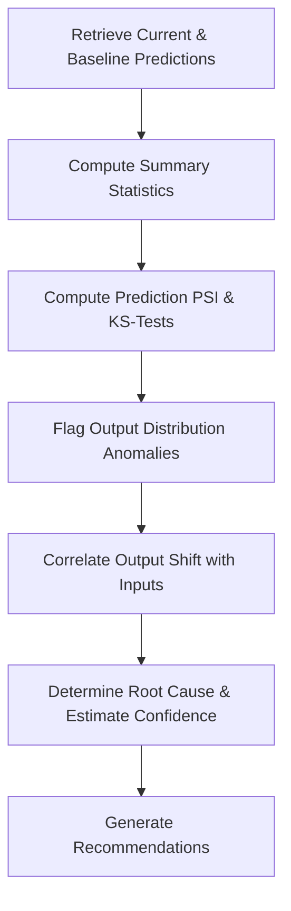

# Prediction Distribution Analysis Skill

## 1. Overview (Why)

### Purpose & Motivation
A production model's decision output distribution should remain within expected limits under stable business conditions. For example, a fraud model should not suddenly flag $80\%$ of transactions as fraud, and a product recommendation system should not suggest the same single item to every user. Sudden shifts in prediction outputs can indicate silent failures, corrupted features, or adversarial exploits.

This skill exists to evaluate the statistical distributions of model outputs. It allows the `ML Analyst Agent` to compare current prediction outputs against historical baselines to identify shifts in class distributions or regression target ranges, helping to isolate if the incident is driven by model degradation, input drift, or upstream data corruption.

### Production Incidents Investigated
*   **Prediction Output Shift**: High-severity changes in prediction distributions (e.g. classification ratio shifts or regression mean shifts).
*   **Predictive Bias**: Disproportionate predictions of a single class across user cohorts.
*   **Output Value Range Anomalies**: Predictions exceeding reasonable business bounds (e.g. negative prices, impossible scores).

---

## 2. Responsibilities (What)

### What This Skill MUST Do:
*   Compute statistical metrics of prediction outputs (means, standard deviations, quantile distributions).
*   Compare current prediction distributions against baseline training distributions using statistical distance tests (e.g. KS-test, Chi-Square, PSI).
*   Flag significant shifts that violate SLA guidelines.

### What This Skill MUST NOT Do:
*   Evaluate ground-truth label performance metrics — this is delegated to the `model_performance_analysis` skill.
*   Retrain models or edit model files.

---

## 3. When This Skill Is Selected

### Alerts and Triggers

| Alert Type | Symptom / Signal | Selection Relevance |
| :--- | :--- | :--- |
| `PredictionShiftAlert` | Output class ratio or mean shifts beyond threshold (e.g., PSI $\ge 0.1$). | Critical (Evaluate prediction distribution). |
| `OutputOutofBounds` | Model predicts values outside predefined business limits. | Critical (Verify prediction values). |

---

## 4. Required Inputs

*   **Prediction Logs Source**: Connection to inference output logs containing prediction values (`y_pred`).
*   **Baseline Output Distribution**: Historical prediction distributions or target training profiles.
*   **Target Task Configuration**: Classification or Regression settings.

---

## 5. Expected Evidence

*   **Prediction PSI Scores**: Population Stability Index calculated on prediction outputs.
*   **Output Summary Stats**: Means, standard deviations, and quantiles (current vs. reference).
*   **Prediction Histograms**: Visual or tabular frequency distributions of predictions.

---

## 6. Investigation Workflow (How)

### Steps:
1.  **Retrieve Predictions**: Fetch prediction logs from the active and reference windows.
2.  **Calculate Statistics**: Compute class ratios (for classification) or mean/variance/quantiles (for regression).
3.  **Run Statistical Distance Tests**: Calculate PSI and KS-tests between current and reference prediction outputs.
4.  **Flag Anomalies**: Identify significant shifts (e.g., $\text{PSI} \ge 0.25$).
5.  **Examine Confounding Factors**: Correlate prediction shifts with incoming feature drift results.
6.  **Report**: Compile findings.

---

## 7. Root Cause Heuristics

### Heuristic 1: Upstream Feature Corruption (Faux Drift)
*   **Symptoms**: Abrupt prediction shift driven by a single corrupted input feature.
*   **Supporting Evidence**:
    *   `prediction_PSI` spikes to $0.45$.
    *   Feature `user_zipcode` has $100\%$ null values.
*   **Confidence Signal**: High confidence.

### Heuristic 2: Organic Behavioral Trend Change
*   **Symptoms**: Gradual shift in prediction output over time.
*   **Supporting Evidence**:
    *   Prediction PSI grows slowly over consecutive days.
    *   No data quality failures detected.
*   **Confidence Signal**: Medium confidence.

---

## 8. Outputs

Returns a structured dictionary:
*   `investigation_summary`: Human-readable summary of the prediction status.
*   `prediction_shift_detected`: Boolean flag.
*   `prediction_psi`: Calculated Population Stability Index.
*   `possible_root_causes`: Ranked hypotheses.
*   `confidence_score`: Score between $0.0$ and $1.0$.
*   `recommended_actions`: Corrective suggestions.

---

## 9. Confidence Scoring

*   **High ($\ge 0.8$)**: Sufficient sample size ($N > 1000$ predictions) and clear statistical distance test violations.
*   **Low ($< 0.5$)**: Small sample sizes ($N < 50$), or missing baseline prediction profiles.

---

## 10. Recommended Actions

*   **Immediate Remediation**:
    *   Modify model decision thresholds to re-balance prediction ratios.
    *   Bypass predictions for anomalous inputs.
*   **Long-Term Prevention**:
    *   Implement real-time prediction distribution monitoring.
