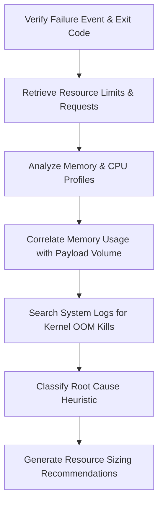

# Resource Exhaustion Skill

## 1. Overview (Why)

### Purpose & Motivation
Machine Learning models (especially deep learning and high-dimensional tabular models) are resource-intensive. During batch prediction runs or high-throughput online serving, feature extraction, tensor operations, and dataset allocation can quickly exhaust available container resources (CPU, Memory, GPU).

This skill exists to identify, diagnose, and localize resource exhaustion events (e.g., Out-Of-Memory (OOM) events, CPU throttling, swap space saturation). It allows the `ML Analyst Agent` to correlate infrastructure telemetry with pipeline failures to determine if container sizing, memory leaks, or data payload spikes caused the incident, recommending optimal resource allocation or scaling.

### Production Incidents Investigated
*   **Out-of-Memory (OOM) Termination**: Container terminated with exit code `137` by the OS kernel or Kubernetes.
*   **CPU Throttling & Latency Spikes**: CPU limits reached, causing requests to queue and latency SLAs to fail.
*   **GPU Memory Saturation**: Out-of-memory errors on CUDA devices during training or inference.

### Placement in ML Analyst Workflow
This skill is part of the **Infrastructure Diagnostics** branch. When a task or container fails, this skill is invoked to audit metrics and events before looking at application-level code errors.

```
[Container Exit / Task Fail] ──> [ML Analyst Agent] ──> [Invokes Resource Exhaustion] ──> [Determine OOM / Resource Limit]
```

---

## 2. Responsibilities (What)

### What This Skill MUST Do:
*   Inspect container and host metrics (RAM, CPU, swap, GPU VRAM) leading up to a failure event.
*   Detect kernel messages (e.g., "Out of memory: Kill process") and Kubernetes events (`OOMKilled`).
*   Correlate memory usage trends with input data payload size or batch volume.
*   Identify memory leaks (gradual memory increase over time) vs. payload-driven spikes (abrupt memory step).

### What This Skill MUST NOT Do:
*   Automatically scale Kubernetes pods or modify resource limits directly.
*   Analyze network routing or API gateway configurations — this is delegated to other infrastructure skills.

### Scope
Monitoring and diagnosing CPU, Memory, and GPU resource constraints on model training and serving containers.

---

## 3. When This Skill Is Selected

This skill is selected by the `ML Analyst Agent` when container terminations or performance degradation alerts indicate infrastructure stress.

### Alerts and Triggers

| Alert Type | Symptom / Signal | Selection Relevance |
| :--- | :--- | :--- |
| `ContainerExit_137` | Container exits abruptly with code `137`. | Critical (Explicit OOM indicator). |
| `CPUUtilizationWarning` | Container CPU usage exceeds $90\%$ of limits for sustained intervals. | High (Investigate resource constraints). |
| `MemoryLeakWarning` | Memory usage exhibits a linear upward trend over multiple days. | High (Identify memory leak patterns). |

---

## 4. Required Inputs

*   **Container Metrics**: CPU usage, memory utilization (RSS/VMS), swap space usage, GPU VRAM utilization.
*   **Host / Node Metrics**: Host memory and load average.
*   **Kubernetes Events / OS Logs**: System logs (`dmesg`, `/var/log/messages`) or Kubernetes events.
*   **Resource Configurations**: Memory limit, memory request, CPU limit, CPU request.
*   **Telemetry Events**: Payload sizes (e.g., number of rows in the batch, file sizes).

---

## 5. Expected Evidence

*   **OOM Kill Events**: Logs containing "OOMKilled", "Killed", "Exit code 137", or "kernel: Out of memory".
*   **Resource Utilization Charts**: Step-change or ramp-up profiles of memory utilization leading to termination.
*   **Data Volume Metrics**: Spikes in incoming batch record counts coinciding with the exhaustion event.

---

## 6. Investigation Workflow (How)



### Steps of the Workflow:
1.  **Examine Exit Status**: Check the container termination details and logs for exit status `137` or explicit "Killed" warnings.
2.  **Review Sizing Limits**: Read the CPU and memory requests/limits defined in the container manifest.
3.  **Trace Metrics Timeline**: Plot CPU, RAM, and GPU usage in the 30-minute window preceding the failure.
4.  **Analyze Memory Curve**:
    *   *Linear Increase*: Gradual growth over hours/days indicating a memory leak.
    *   *Step-Change Spike*: Instantaneous growth indicating a payload spike.
5.  **Check Payload Size**: Correlate feature batch volumes (number of rows, image file sizes) with memory usage.
6.  **Formulate Hypotheses & Confidence**: Output findings and recommended actions.

---

## 7. Root Cause Heuristics

### Heuristic 1: Payload-Induced Memory Spike
*   **Symptoms**: Memory usage spikes to limits instantly upon loading a new data batch.
*   **Supporting Evidence**:
    *   Row counts in the current batch are $3\times$ higher than historical averages.
    *   Memory footprint spikes to limits immediately after the job starts.
*   **Conflicting Evidence**: Memory increases gradually even with empty or standard-sized payloads.
*   **Confidence Signal**: High confidence if payload volume scales linearly with peak memory usage.

### Heuristic 2: Memory Leak in Inference Loop
*   **Symptoms**: Memory grows linearly over days or weeks until a crash occurs, regardless of payload fluctuations.
*   **Supporting Evidence**:
    *   Standard, flat volume of inference requests.
    *   No OOM events occurred during the first 48 hours of service deployment.
*   **Conflicting Evidence**: Memory returns to baseline levels after each batch request completes.
*   **Confidence Signal**: High confidence if memory does not drop back to baseline after GC cycles.

---

## 8. Outputs

Returns a structured dictionary containing:
*   `investigation_summary`: Human-readable summary of the resource exhaustion incident.
*   `oom_killed`: Boolean flag indicating if an OOM event occurred.
*   `resource_type`: Type of resource exhausted (e.g., `Memory`, `CPU`, `GPU_VRAM`).
*   `peak_utilization`: Maximum observed utilization ratio.
*   `possible_root_causes`: Ranked hypotheses (e.g., Payload Volume Spike, Memory Leak).
*   `confidence_score`: Score between $0.0$ and $1.0$.
*   `recommended_actions`: Short-term and long-term mitigation steps.

---

## 9. Confidence Scoring

| Confidence Level | Criteria |
| :--- | :--- |
| **High ($\ge 0.8$)** | Exit code `137` is confirmed, or logs show explicit kernel OOM signatures, and resource metrics show saturation. |
| **Medium ($0.5$ - $0.79$)** | Resource utilization reached limits, but no explicit OOM signature was recorded, or container terminated without an exit code. |
| **Low ($< 0.5$)** | Metric traces are missing, or container terminated with exit code `0` or `1` despite suspected resource pressure. |

---

## 10. Recommended Actions

*   **Immediate Remediation (Short-Term)**:
    *   Restart the failed job or container.
    *   Scale up the container memory limit temporarily to resolve immediate processing blocks.
*   **Medium-Term Fixes**:
    *   Increase worker replica counts to share load across multiple pods.
    *   Optimize Python data frames (e.g., using generator patterns or chunking large pandas DataFrames).
*   **Long-Term Prevention**:
    *   Audit application code for reference leaks (e.g. unclosed file descriptors, global cached lists).
    *   Set up memory-limit alarms at $80\%$ utilization to trigger preventative auto-scaling.

---

## 11. Limitations
*   **Internal Profiling**: Cannot isolate *which* internal Python object or function holds memory leaks without deep profiling tools (e.g., `tracemalloc`), which are not run by default.
*   **Hardware Failures**: Cannot diagnose underlying hardware faults (e.g. broken RAM sectors).

---

## 12. Collaboration With Other Skills

*   **Invoked Before**:
    *   `task_state_monitoring`: Detects failed tasks.
*   **Invoked After**:
    *   `crash_loop_analysis`: Called if resource exhaustion causes container crash loops.

---

## 13. Example Investigation

### Observed Symptoms
A batch prediction container `ml-inference-worker` exited abruptly with exit code `137`:
*   The Airflow DAG task reported failure.
*   No application error trace was logged.

### Collected Evidence
*   Container Limits: Memory Request = 8GB, Memory Limit = 8GB.
*   **Metrics & Logs**:
    *   RAM usage reached 7.99GB immediately before exit.
    *   Kubernetes events showed `OOMKilled` for pod `ml-inference-worker-xyz`.
    *   Inference batch volume was $500,000$ images (Historical average: $50,000$).

### Reasoning
The combination of exit code `137`, `OOMKilled` event, and the $10\times$ payload volume spike confirms a payload-induced memory exhaustion. The container was sized for standard workloads and lacked the memory space to buffer the massive image volume.

### Root Cause
OutOfMemory termination due to an unexpected $10\times$ spike in incoming image payload volume.

### Confidence Score
*   **0.98 (High)**: Clear exit status and metrics correlation.

### Recommendations
1.  *Immediate*: Restart the task with a memory limit of 32GB or split the payload into 10 smaller batches.
2.  *Medium-term*: Configure memory requests/limits dynamically based on input batch size.
3.  *Long-term*: Implement batch chunking logic in the ingestion script.
