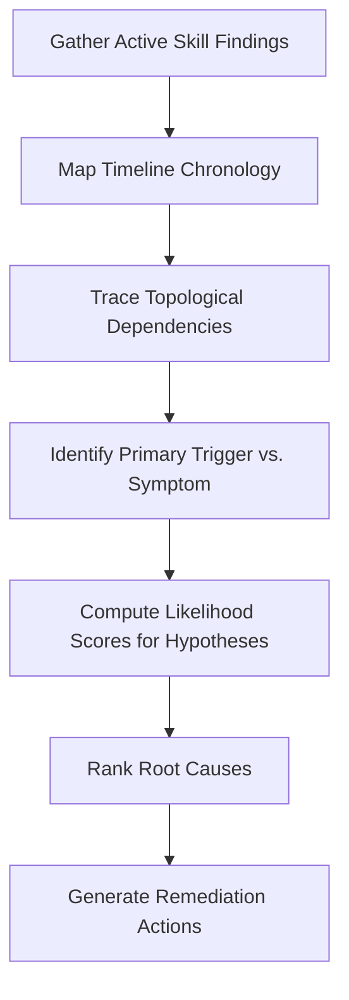

# Root Cause Prioritization Skill

## 1. Overview (Why)

### Purpose & Motivation
During complex incidents, multiple Dynamic Skills can return simultaneous findings (e.g. data quality issues, latency spikes, and container restarts). Simply dumping all these findings into a list leaves the SRE engineer to figure out the actual trigger. We need a systematic way to weigh, correlate, and prioritize these findings.

This skill exists to rank and prioritize candidate root causes. It acts as the **Analytical Engine** of the `ML Analyst Agent`. It consumes the structured findings of all previously executed skills, applies correlation rules and causal topology constraints, and ranks possible root causes by likelihood and business impact, providing a clear path to resolution.

### Production Incidents Investigated
*   **Multi-Component Outages**: Complex incidents where failures cascade across infrastructure and models.
*   **Conflicting Signals**: Situations where one skill indicates a performance drop but another indicates standard operation.
*   **Causal Localization**: Determining if an issue is code-driven, data-driven, or infrastructure-driven.

---

## 2. Responsibilities (What)

### What This Skill MUST Do:
*   Consume structured outputs from other active skills (e.g. `data_drift`, `resource_exhaustion`, `task_state_monitoring`).
*   Apply causal topology heuristics to trace dependencies (e.g., Infrastructure failure causes Pipeline failure which causes Model failure).
*   Rank candidate root causes based on probability and impact.
*   Compute an overall incident confidence score.

### What This Skill MUST NOT Do:
*   Directly run statistical tests on raw log databases or data frames.
*   Execute remediation actions.

---

## 3. When This Skill Is Selected

### Alerts and Triggers
*   **Orchestration Gate**: Invoked automatically by the `ML Analyst Agent` as the final analysis step after collecting evidence from all other active skills.

---

## 4. Required Inputs

*   **Evidence List**: Map of outputs from all executed skills.
*   **Causal Topology Map**: Service dependency definitions.

---

## 5. Expected Evidence

*   **Causal Alignments**: Chronological order matches between infrastructure events and application metrics.
*   **Impact Metrics**: Number of blocked services or size of affected user cohorts.

---

## 6. Investigation Workflow (How)

### Steps:
1.  **Ingest Findings**: Read the outputs of all active skills.
2.  **Order Chronologically**: Sort all observed anomalies and status changes by timestamp.
3.  **Trace Topology**: Map the services to the dependency graph to find the furthest upstream failed component.
4.  **Weigh Hypotheses**: Calculate probability weights based on signal strengths (e.g., OOM is high-probability, organic drift is medium-probability).
5.  **Rank Causes**: Rank candidate root causes by probability and impact.
6.  **Formulate Summary**: Compile the final prioritized report.

---

## 7. Root Cause Heuristics

### Heuristic 1: Upstream Cascade (Infrastructure to Application)
*   **Symptoms**: Simultaneous OOM logs, pipeline failures, and model accuracy drops.
*   **Prioritization Rule**: If an infrastructure OOM occurred before or during the pipeline failure, prioritize the OOM as the root cause, and class the accuracy drop as a secondary symptom.
*   **Confidence Signal**: High confidence.

### Heuristic 2: Data-Driven Performance Degradation
*   **Symptoms**: Upstream pipelines succeeded, but model performance drops, and data drift is detected.
*   **Prioritization Rule**: Prioritize data drift as the root cause of the accuracy drop.
*   **Confidence Signal**: High confidence.

---

## 8. Outputs

Returns a structured dictionary:
*   `investigation_summary`: Human-readable summary of the prioritization.
*   `ranked_root_causes`: List of causes sorted by likelihood.
*   `primary_trigger`: Details of the parent failure component.
*   `confidence_score`: Score between $0.0$ and $1.0$.
*   `recommended_remediations`: Ranked list of remediation actions (immediate vs. long-term).

---

## 9. Confidence Scoring

*   **High ($\ge 0.8$)**: Timeline is clear, topological paths match, and evidence from multiple skills points to a single upstream root cause.
*   **Low ($< 0.5$)**: Evidence is conflicting, or timestamps are missing, making chronological ordering impossible.
