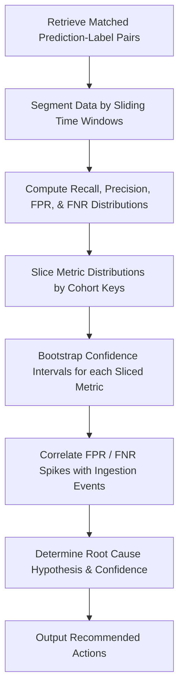

# Safety Metric Distribution Analysis Skill

## 1. Overview (Why)

### Purpose & Motivation
Production Machine Learning models deployed in high-stakes operational domains (e.g. Fraud Detection, Medical Diagnosis, Threat Screening, Autonomous Driving) must adhere to strict safety guarantees. Standard infrastructure monitoring tracks system uptime, but does not verify whether the model is making safe decisions. Furthermore, evaluating only the global average accuracy can mask severe safety failures on specific subpopulations or micro-batches.

This skill exists to evaluate the statistical distributions of **Safety Metrics**—specifically **Recall (Sensitivity)**, **Precision (Positive Predictive Value)**, **False Positive Rate (FPR)**, and **False Negative Rate (FNR)**—across time-series windows and cohort slices. It compares the current distributions of these safety-critical metrics against historical baselines, allowing the `ML Analyst Agent` to identify if a model's safety profile has degraded, flag boundary violations, and determine if failover procedures are required.

### Production Incidents Investigated
*   **False Negative Rate (FNR) Spikes**: A sudden increase in missed critical events (e.g. fraud transactions or malware payloads passing undetected).
*   **Precision (Prediction Quality) Collapse**: A spike in false alarms causing alert fatigue and operational bottlenecks.
*   **Local Cohort Safety Regression**: Safety metrics drop significantly on a specific segment (e.g. particular region, device type, or category) while the global average remains acceptable.

### Placement in ML Analyst Workflow
This skill is a **Primary Safety Validator** in the root-cause diagnostics pipeline. It is invoked when performance alert signatures (such as accuracy warnings or customer complaint rates) are received to determine the precise nature, scale, and distribution of the safety degradation.

```
[Incident Alert] ──> [ML Analyst Agent] ──> [Invokes Safety Metric Distribution Analysis] ──> [Safety Profile Diagnostics]
```

---

## 2. Responsibilities (What)

### What This Skill MUST Do:
*   Compute distributions of core safety metrics: Recall, Precision, False Positive Rate (FPR), and False Negative Rate (FNR) across sliding time windows.
*   Slice safety metric distributions across categorical cohorts to locate localized regressions or bias.
*   Run statistical significance tests (e.g., Bootstrapping, Z-tests) to confirm if a metric shift represents a real regression rather than statistical noise.
*   Identify trade-offs between FPR and FNR shifts (e.g., did an upstream change reduce FPR at the cost of an unacceptable spike in FNR?).

### What This Skill MUST NOT Do:
*   Analyze general dataset-level input feature drift — this is delegated to the `data_drift_analysis` skill.
*   Change model thresholds or parameters automatically in the production serving layer.

### Scope
Evaluating and profiling the statistical distribution of Recall, Precision, FPR, and FNR over time and across feature segments.

---

## 3. When This Skill Is Selected

### Alerts and Triggers

| Alert Type | Symptom / Signal | Selection Relevance |
| :--- | :--- | :--- |
| `SafetyMetricViolation` | Global Recall or Precision falls below safety SLA thresholds (e.g., $\text{Recall} < 0.90$). | Critical (Evaluate safety distribution immediately). |
| `FalseNegativeSpike` | Downstream feedback logs report an increase in undetected fraud or errors (FNR spike). | Critical (Isolate the distribution shift). |
| `AlertFatigueWarning` | Operations teams report high volume of false positives (FPR spike). | High (Determine which feature slices drive the FPR). |

---

## 4. Required Inputs

*   **Prediction Logs Source**: Connection to inference logs containing prediction outputs (`y_pred`), confidence scores, and slice keys.
*   **Ground Truth / Labels Source**: Matched ground-truth label records (`y_true`).
*   **Operational Safety Limits**:
    *   Minimum Recall threshold.
    *   Maximum FNR/FPR limits.
    *   Baseline safety metric distribution parameters from training or validation.

---

## 5. Expected Evidence

*   **Metric Distribution Matrices**: Rolling time-series values of Recall, Precision, FPR, and FNR.
*   **Bootstrap Confidence Intervals**: $95\%$ confidence bounds for each metric per cohort slice.
*   **Confusion Matrix Timeline**: Chronological changes in TP, FP, TN, and FN counts.

---

## 6. Investigation Workflow (How)



### Steps:
1.  **Ingest and Match Data**: Retrieve prediction logs and align them with ground-truth labels for both baseline and active windows.
2.  **Temporal Segmentation**: Group data into sliding time windows (e.g., hourly or daily batches) to construct time-series distributions of the metrics.
3.  **Compute Core Safety Metrics**: Calculate global and rolling distributions for:
    *   $\text{Recall} = \frac{TP}{TP + FN}$
    *   $\text{Precision} = \frac{TP}{TP + FP}$
    *   $\text{FPR} = \frac{FP}{FP + TN}$
    *   $\text{FNR} = \frac{FN}{TP + FN}$
4.  **Cohort Segmentation**: Slice the distributions across designated categorical columns (e.g., `user_region`, `transaction_type`).
5.  **Statistical Validation**: Perform bootstrap resampling (e.g., 1000 iterations) to calculate $95\%$ confidence intervals for each metric. Identify if the current distribution is statistically distinct from the baseline.
6.  **Analyze Trade-offs**: Trace if an increase in FNR correlates with a decrease in FPR (decision boundary shift).
7.  **Report**: Compile findings.

---

## 7. Root Cause Heuristics

### Heuristic 1: Localized Adversarial Shift (FNR Spike)
*   **Symptoms**: FNR spikes significantly on a specific segment, while global accuracy remains stable.
*   **Supporting Evidence**:
    *   FNR on `transaction_type = international` rises from $5\%$ to $35\%$.
    *   Precision on the same cohort remains stable, indicating predictions are still accurate when made, but the model is failing to flag new fraud patterns (misses).
*   **Confidence Signal**: High confidence.

### Heuristic 2: Boundary Skew / Calibrated Threshold Degradation (FPR Spike)
*   **Symptoms**: FPR spikes globally or on specific cohorts, causing alert storms.
*   **Supporting Evidence**:
    *   Global FPR increases from $2\%$ to $15\%$.
    *   The model probability output distribution shifts closer to the decision threshold.
*   **Confidence Signal**: High confidence.

---

## 8. Outputs

Returns a structured dictionary:
*   `investigation_summary`: Human-readable summary of the safety metric distributions.
*   `safety_metrics_degraded`: Boolean flag.
*   `evidence`: Detailed map containing:
    *   `recall_distribution`: values, mean, and confidence intervals.
    *   `precision_distribution`: values, mean, and confidence intervals.
    *   `fpr_distribution`: values, mean, and confidence intervals.
    *   `fnr_distribution`: values, mean, and confidence intervals.
*   `worst_performing_slice`: The segment with the most severe safety metric degradation.
*   `possible_root_causes`: Ranked hypotheses.
*   `confidence_score`: Score between $0.0$ and $1.0$.
*   `recommended_actions`: Short-term and long-term actions.

---

## 9. Confidence Scoring

| Confidence Level | Criteria |
| :--- | :--- |
| **High ($\ge 0.8$)** | High sample size ($N > 1000$ per window), complete label matching, and metric deviations fall entirely outside the baseline $95\%$ confidence intervals. |
| **Low ($< 0.5$)** | Label delay is high (completeness $<30\%$), or sample sizes are too small ($N < 50$) to yield statistical significance. |

---

## 10. Recommended Actions

*   **Immediate Remediation (Short-Term)**:
    *   If FNR spikes (high-risk leaks): Swap to a more conservative fallback decision threshold or enable rule-based security filters.
    *   If FPR spikes (high alarm rate): Temporarily adjust the classification threshold higher to reduce operational overhead.
*   **Medium-Term Fixes**:
    *   Trigger automated model retraining using a balanced dataset that represents the newly drifted patterns.
*   **Long-Term Prevention**:
    *   Add automated slice-level safety testing to the CI/CD deployment pipeline.

---

## 11. Limitations
*   **Label Ingestion Delay**: Completely dependent on receiving ground-truth labels. Cannot detect shifts in real-time if labels are delayed by weeks or months.
