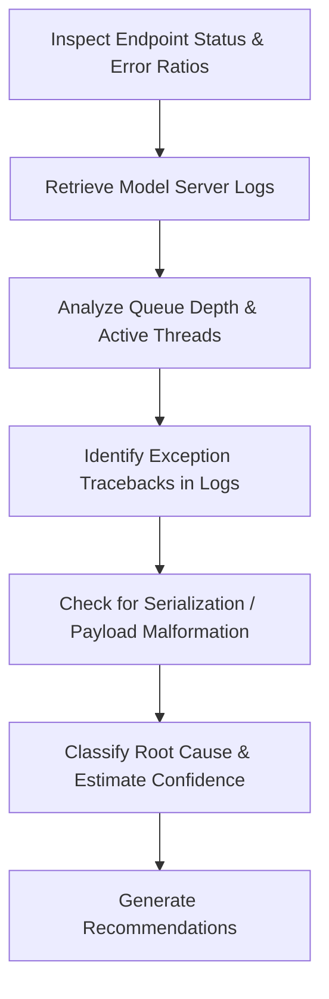

# Serving Analysis Skill

## 1. Overview (Why)

### Purpose & Motivation
Production Machine Learning models are deployed to users via serving infrastructure (e.g. Triton, TF Serving, FastAPI, TorchServe). A failure in this serving layer (e.g. gateway timeouts, threading locks, memory leaks, serialization failures) can take down the prediction endpoint, rendering the model unreachable even if the model itself is healthy.

This skill exists to audit the health and performance of the model serving infrastructure. It allows the `ML Analyst Agent` to inspect serving logs, endpoint response codes, request volumes, queue depths, and threading statistics to identify why inference requests are failing, slow, or returning errors, recommending remediation steps.

### Production Incidents Investigated
*   **Serving Endpoint Outage**: HTTP 5xx or connection refused errors on prediction endpoints.
*   **Queue Saturation / Thread Lock**: Requests accumulate in the serving queue, causing requests to time out.
*   **Serialization Failures**: Model server crashes or returns errors when trying to parse incoming payloads.

---

## 2. Responsibilities (What)

### What This Skill MUST Do:
*   Query model serving logs and check HTTP status code distribution (e.g. ratio of 2xx vs. 5xx).
*   Monitor active execution threads, queue sizes, and memory usage of the model server.
*   Scan serving logs for C++/Python backend errors (e.g. CUDA out of memory, serialization exceptions).

### What This Skill MUST NOT Do:
*   Calculate dataset drift or statistical performance — this is delegated to other skills.
*   Alter model endpoints or deploy new serving configurations.

---

## 3. When This Skill Is Selected

### Alerts and Triggers

| Alert Type | Symptom / Signal | Selection Relevance |
| :--- | :--- | :--- |
| `ServingEndpointFailed` | Model server returns 500/503 errors on inference requests. | Critical (Audit serving logs). |
| `InferenceLatencySpike` | Target request durations exceed SLA limits. | High (Trace server queue depth and threads). |

---

## 4. Required Inputs

*   **Serving Logs Source**: Stdout/stderr logs from the model serving containers.
*   **Serving Metrics**: QPS, HTTP response code ratios, queue depth, active thread counts.
*   **Endpoint Configuration**: API version, concurrency limits.

---

## 5. Expected Evidence

*   **HTTP Error Logs**: Logs showing 5xx status codes and associated stack traces.
*   **Server Concurrency Metrics**: Active request queue depth over time.
*   **Runtime Tracebacks**: CUDA memory exceptions or payload parsing errors.

---

## 6. Investigation Workflow (How)

### Steps:
1.  **Check HTTP Code Ratios**: Verify if the server is returning 5xx or connection refused errors.
2.  **Audit Logs**: Scan serving logs for server-side exceptions.
3.  **Trace Concurrency**: Check if queue depth reached limits, indicating that the server is saturated.
4.  **Validate Payload**: Verify if incoming request formats match the model's signature.
5.  **Report**: Compile findings.

---

## 7. Root Cause Heuristics

### Heuristic 1: CUDA Out of Memory (GPU Saturation)
*   **Symptoms**: Predictions crash with server-side error, and VRAM is saturated.
*   **Supporting Evidence**:
    *   Logs contain `RuntimeError: CUDA out of memory. Tried to allocate ...`.
*   **Confidence Signal**: High confidence.

### Heuristic 2: Payload Serialization Error
*   **Symptoms**: Server returns HTTP 400 or 500 for specific requests.
*   **Supporting Evidence**:
    *   Logs contain `json.decoder.JSONDecodeError` or `ValueError: Cannot reshape array of size ...`.
*   **Confidence Signal**: High confidence.

---

## 8. Outputs

Returns a structured dictionary:
*   `investigation_summary`: Human-readable summary of the serving layer.
*   `endpoint_healthy`: Boolean flag.
*   `http_5xx_count`: Total number of server errors observed.
*   `possible_root_causes`: Ranked hypotheses.
*   `confidence_score`: Score between $0.0$ and $1.0$.
*   `recommended_actions`: Short-term and long-term actions.

---

## 9. Confidence Scoring

*   **High ($\ge 0.8$)**: Serving logs contain explicit CUDA out of memory tracebacks or JSON decode error patterns.
*   **Low ($< 0.5$)**: Serving logs are empty, or the server is completely unreachable.
