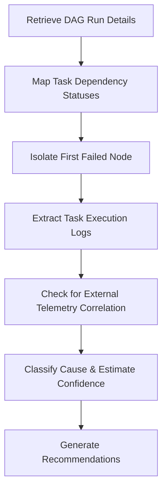

# Task State Monitoring Skill

## 1. Overview (Why)

### Purpose & Motivation
Data pipeline orchestration engines (such as Apache Airflow, Kubeflow, or Prefect) manage the dependency graph of feature engineering, model training, and batch inference workflows. When a task fails, downstream tasks are blocked (e.g., training fails because data preparation failed). Identifying *which* task failed, *how* it failed, and *where* it sits in the dependency chain is the first step in resolving pipeline halts.

This skill exists to inspect the status of tasks within an orchestrator. It allows the `ML Analyst Agent` to monitor DAG execution runs, identify failed nodes, extract specific task error logs, and assess the operational impact on downstream ML steps.

### Production Incidents Investigated
*   **Pipeline Failures**: Airflow/Kubeflow tasks transitioning to a `failed` or `upstream_failed` state.
*   **Stuck Tasks (Hang / Queue Squeeze)**: Tasks stuck in `queued` or `running` state for longer than historical timeouts.
*   **Upstream Blockages**: Downstream ML model updates blocked due to upstream data validation failures.

### Placement in ML Analyst Workflow
This skill is the **Entrypoint Diagnostics** for pipeline incidents. When an alert fires indicating a stale dataset or missing prediction table, this skill is run first to check if the orchestrator DAG has failed.

```
[Stale Data Alert] ──> [ML Analyst Agent] ──> [Invokes Task State Monitoring] ──> [Identify Failed Upstream Task]
```

---

## 2. Responsibilities (What)

### What This Skill MUST Do:
*   Query orchestration engines to retrieve current DAG run states and individual task statuses.
*   Identify the exact failed task node in the dependency graph.
*   Extract the last 100 lines of error logs from the failed task execution logs.
*   Map downstream tasks that are blocked by the failure.

### What This Skill MUST NOT Do:
*   Automatically trigger DAG retries or clear tasks — this is delegated to remediation services.
*   Debug code syntax errors inside the failed Python script itself.

---

## 3. When This Skill Is Selected

### Alerts and Triggers

| Alert Type | Symptom / Signal | Selection Relevance |
| :--- | :--- | :--- |
| `DagRunFailedAlert` | Orchestrator fires an alert indicating a workflow run failed. | Critical (Audit DAG tasks immediately). |
| `DataFreshnessViolation` | Telemetry indicates target tables have not been updated within SLA. | High (Check if ingestion DAG failed). |
| `TaskRetryExhausted` | Task fails repeatedly and exhausts retry settings. | High (Extract failure logs). |

---

## 4. Required Inputs

*   **Orchestrator Connection Metadata**: Airflow/Kubeflow API endpoints or database read access.
*   **Target Identifier**: `dag_id`, `run_id`, or `task_id` associated with the incident.
*   **Audit Window**: The start and end time of the failed DAG run.

---

## 5. Expected Evidence

*   **Task State Map**: Dictionary mapping `task_id` to its state (e.g., `failed`, `running`, `success`, `upstream_failed`).
*   **Log Snippets**: Error tracebacks from orchestrator execution logs.
*   **DAG Run History**: Execution times and statuses of prior runs to determine if the failure is seasonal or recurrent.

---

## 6. Investigation Workflow (How)



### Steps of the Workflow:
1.  **Retrieve DAG State**: Fetch the target `dag_id` execution history and locate the failed `run_id`.
2.  **Isolate Root Node**: Traverse the DAG dependencies to find the *first* task that transitioned to `failed` (ignoring subsequent `upstream_failed` tasks).
3.  **Fetch Logs**: Query the orchestrator's log endpoint to retrieve the execution log of the isolated task.
4.  **Parse Tracebacks**: Scan the logs for Python exceptions, database connection errors, or out-of-memory warnings.
5.  **Calculate Downstream Blockage**: Identify all downstream nodes (e.g., `predict`, `evaluate`) that were skipped or blocked.
6.  **Formulate Output**: Compile findings and pass them to the orchestrator.

---

## 7. Root Cause Heuristics

### Heuristic 1: Upstream Database Connection Failure
*   **Symptoms**: Data extraction task fails immediately upon execution.
*   **Supporting Evidence**:
    *   Logs show `OperationalError: (psycopg2.OperationalError) connection to server at ... failed`.
    *   Connection timeout occurs after multiple retries.
*   **Conflicting Evidence**: Extraction task succeeds but returns zero rows.
*   **Confidence Signal**: High confidence if logs contain explicit database connection timeouts.

### Heuristic 2: Data Validation Failure (Schema / Contract)
*   **Symptoms**: Upstream data extraction task succeeds, but validation task fails.
*   **Supporting Evidence**:
    *   Logs contain `ValueError: Schema validation failed: column 'user_age' expected type INT, got VARCHAR`.
*   **Conflicting Evidence**: Validation task passes but downstream training fails.
*   **Confidence Signal**: High confidence (explicit validation error trace).

---

## 8. Outputs

Returns a structured dictionary containing:
*   `investigation_summary`: Human-readable summary of the pipeline failure.
*   `dag_id`: The ID of the investigated DAG.
*   `failed_tasks`: List of failed task IDs.
*   `first_failure_node`: The task ID that triggered the initial failure.
*   `error_logs`: Captured traceback text from the logs.
*   `blocked_downstream_tasks`: List of skipped/blocked tasks.
*   `possible_root_causes`: Ranked hypotheses.
*   `confidence_score`: Score between $0.0$ and $1.0$.
*   `recommended_actions`: Short-term and long-term actions.

---

## 9. Confidence Scoring

| Confidence Level | Criteria |
| :--- | :--- |
| **High ($\ge 0.8$)** | API returns complete task state mappings, and log files contain clear, unambiguous stack traces or connection errors. |
| **Medium ($0.5$ - $0.79$)** | Task is in a failed state, but log files are missing or incomplete. |
| **Low ($< 0.5$)** | Orchestrator API is unreachable, or task is stuck in `running`/`queued` without log updates. |

---

## 10. Recommended Actions

*   **Immediate Remediation (Short-Term)**:
    *   If failure was due to transient database timeout: Clear the failed task to trigger a retry.
    *   If failure was due to upstream missing data: Impute default data or wait for upstream sync.
*   **Medium-Term Fixes**:
    *   Increase task retries and set exponential backoff in the DAG definition.
    *   Add alerting on individual task durations.
*   **Long-Term Prevention**:
    *   Decouple feature generation into independent, resilient pipelines.

---

## 11. Limitations
*   **Orchestrator Reachability**: Completely dependent on orchestrator API availability.
*   **Code Debugging**: Can capture *what* error was raised, but cannot inspect or repair the Python script files.

---

## 12. Collaboration With Other Skills

*   **Invoked Before**:
    *   `dag_execution_analysis`: Analyzes overall DAG runtime trends.
    *   `resource_exhaustion`: Called if logs indicate a container was killed with code `137`.

---

## 13. Example Investigation

### Observed Symptoms
An alert (`DataFreshnessViolation`) fired for the `Daily_Recommendations_Table`:
*   The table has not been updated in 28 hours.
*   No database write alerts are present.

### Collected Evidence
*   DAG ID: `recommendation_inference_pipeline`.
*   **State Map**:
    *   `extract_user_features`: `success`
    *   `validate_features`: `failed`
    *   `generate_recommendations`: `upstream_failed`
*   **Logs (`validate_features`)**:
    *   `ValueError: Column 'item_price' contains negative values (e.g. -15.00).`

### Reasoning
Traversing the DAG indicates that `validate_features` failed, blocking `generate_recommendations`. The logs explicitly show a data quality contract violation (negative prices).

### Root Cause
Data quality validation failure due to invalid pricing values in upstream transactional tables.

### Confidence Score
*   **0.98 (High)**: Clear validation failure node and explicit log evidence.

### Recommendations
1.  *Immediate*: Fix negative values in the source transactional table and clear `validate_features`.
2.  *Medium-term*: Add constraints in the pricing API to reject negative prices.
