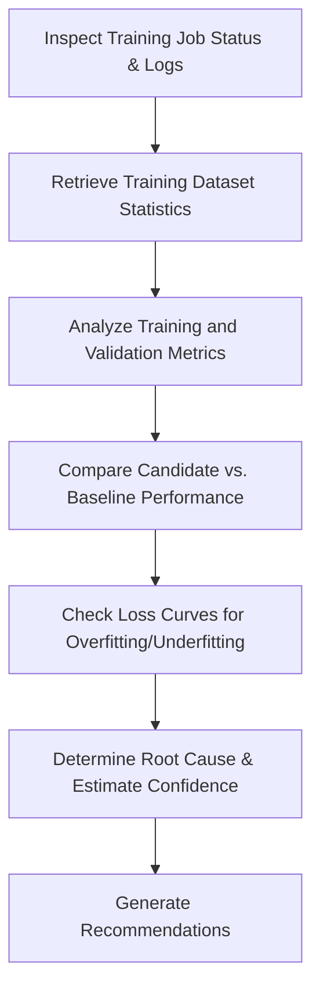

# Training Pipeline Analysis Skill

## 1. Overview (Why)

### Purpose & Motivation
Model retraining is the standard solution to resolve data and concept drift. However, retraining runs can fail or introduce regressions. For example, a retraining pipeline might complete successfully but train the model on a skewed dataset, use incorrect parameters, or output a model that has lower accuracy than the active version.

This skill exists to audit and evaluate model training runs and training pipeline health. It allows the `ML Analyst Agent` to inspect training logs, dataset volumes, feature distributions, and training metrics (loss curves, validation accuracy) to identify why a training job failed or why a newly retrained model candidate performs poorly.

### Production Incidents Investigated
*   **Retraining Job Failure**: Model training scripts crashing or exiting with errors.
*   **Training Data Corruption**: Retraining data containing missing values, duplicates, or class imbalances.
*   **Validation Metric Regression**: A newly trained model performs worse on validation data than the current production model.

---

## 2. Responsibilities (What)

### What This Skill MUST Do:
*   Retrieve training logs and validation metrics from the model training system.
*   Check the distributions and row counts of the training dataset.
*   Compare the validation metrics of the new candidate model against the current baseline model.

### What This Skill MUST NOT Do:
*   Automatically swap model versions in production — this is managed by deployment services.
*   Modify model architecture or hyperparameters directly.

---

## 3. When This Skill Is Selected

### Alerts and Triggers

| Alert Type | Symptom / Signal | Selection Relevance |
| :--- | :--- | :--- |
| `TrainingFailedAlert` | The orchestrator reports that the model training task failed. | Critical (Inspect training logs). |
| `ValidationFailure` | The newly trained model fails to pass pre-deployment evaluation gates. | Critical (Compare candidate vs. baseline). |

---

## 4. Required Inputs

*   **Training Logs Path**: Logs containing stderr/stdout of the training task.
*   **Training Metrics Metadata**: Loss curves, training accuracy, validation accuracy, F1-scores.
*   **Training Dataset Path**: Information about the dataset used for training (volume, source).

---

## 5. Expected Evidence

*   **Metric Comparison Sheet**: Side-by-side performance values of the new candidate vs. the baseline.
*   **Loss Curves**: Epoch-by-epoch loss metrics to identify underfitting or overfitting.
*   **Training Dataset Statistics**: Row counts, null ratios, and class balance of the training data.

---

## 6. Investigation Workflow (How)

### Steps:
1.  **Read Logs**: Check if the training job succeeded or crashed, and extract any exception logs.
2.  **Audit Data**: Verify that the training dataset size and class balance are correct.
3.  **Evaluate Metrics**: Check validation performance metrics and compare them to baseline metrics.
4.  **Analyze Loss Curves**: Check if the model failed to converge (flat loss curve) or overfitted (validation loss rises while training loss drops).
5.  **Report**: Compile findings.

---

## 7. Root Cause Heuristics

### Heuristic 1: Training Data Starvation (Underfitting)
*   **Symptoms**: Validation and training accuracies are low, and loss values do not decrease.
*   **Supporting Evidence**:
    *   Training dataset size is $90\%$ smaller than the baseline dataset.
    *   Loss curve is flat.
*   **Confidence Signal**: High confidence.

### Heuristic 2: Model Candidate Regression
*   **Symptoms**: Training succeeds, but validation metrics fail pre-deployment gates.
*   **Supporting Evidence**:
    *   Candidate F1-score is $0.72$, while the production model is $0.84$.
*   **Confidence Signal**: High confidence.

---

## 8. Outputs

Returns a structured dictionary:
*   `investigation_summary`: Human-readable summary of the training run.
*   `training_succeeded`: Boolean flag.
*   `validation_passed`: Boolean flag.
*   `metrics_comparison`: Metrics of candidate vs. baseline.
*   `possible_root_causes`: Ranked hypotheses.
*   `confidence_score`: Score between $0.0$ and $1.0$.
*   `recommended_actions`: Short-term and long-term actions.

---

## 9. Confidence Scoring

*   **High ($\ge 0.8$)**: Log tracebacks are complete, and metrics show clear validation or convergence failures.
*   **Low ($< 0.5$)**: Training logs or metrics metadata are missing.
